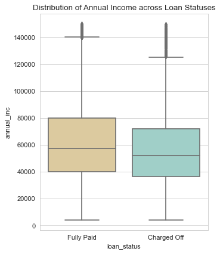
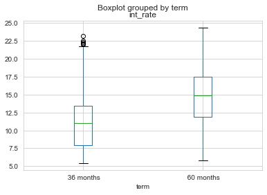
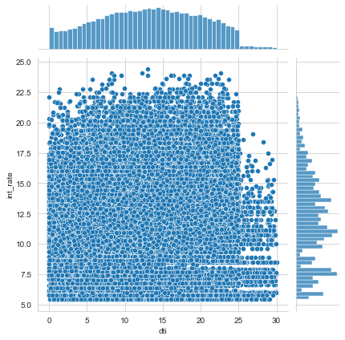

# Data Sourcing


```python
# Importing packages for analysis
import numpy as np
import pandas as pd
from datetime import datetime as dt
import matplotlib.pyplot as plt
import seaborn as sns
```


```python
#Importing the dataset for analysis
loan = pd.read_csv('loan.csv')
loan.head(5)
```

    D:\HP\Anaconda3\envs\AI\lib\site-packages\IPython\core\interactiveshell.py:3146: DtypeWarning: Columns (47) have mixed types.Specify dtype option on import or set low_memory=False.
      interactivity=interactivity, compiler=compiler, result=result)
    


<div>
<style scoped>
    .dataframe tbody tr th:only-of-type {
        vertical-align: middle;
    }

    .dataframe tbody tr th {
        vertical-align: top;
    }

    .dataframe thead th {
        text-align: right;
    }
</style>
<table border="1" class="dataframe">
  <thead>
    <tr style="text-align: right;">
      <th></th>
      <th>id</th>
      <th>member_id</th>
      <th>loan_amnt</th>
      <th>funded_amnt</th>
      <th>funded_amnt_inv</th>
      <th>term</th>
      <th>int_rate</th>
      <th>installment</th>
      <th>grade</th>
      <th>sub_grade</th>
      <th>...</th>
      <th>num_tl_90g_dpd_24m</th>
      <th>num_tl_op_past_12m</th>
      <th>pct_tl_nvr_dlq</th>
      <th>percent_bc_gt_75</th>
      <th>pub_rec_bankruptcies</th>
      <th>tax_liens</th>
      <th>tot_hi_cred_lim</th>
      <th>total_bal_ex_mort</th>
      <th>total_bc_limit</th>
      <th>total_il_high_credit_limit</th>
    </tr>
  </thead>
  <tbody>
    <tr>
      <th>0</th>
      <td>1077501</td>
      <td>1296599</td>
      <td>5000</td>
      <td>5000</td>
      <td>4975.0</td>
      <td>36 months</td>
      <td>10.65%</td>
      <td>162.87</td>
      <td>B</td>
      <td>B2</td>
      <td>...</td>
      <td>NaN</td>
      <td>NaN</td>
      <td>NaN</td>
      <td>NaN</td>
      <td>0.0</td>
      <td>0.0</td>
      <td>NaN</td>
      <td>NaN</td>
      <td>NaN</td>
      <td>NaN</td>
    </tr>
    <tr>
      <th>1</th>
      <td>1077430</td>
      <td>1314167</td>
      <td>2500</td>
      <td>2500</td>
      <td>2500.0</td>
      <td>60 months</td>
      <td>15.27%</td>
      <td>59.83</td>
      <td>C</td>
      <td>C4</td>
      <td>...</td>
      <td>NaN</td>
      <td>NaN</td>
      <td>NaN</td>
      <td>NaN</td>
      <td>0.0</td>
      <td>0.0</td>
      <td>NaN</td>
      <td>NaN</td>
      <td>NaN</td>
      <td>NaN</td>
    </tr>
    <tr>
      <th>2</th>
      <td>1077175</td>
      <td>1313524</td>
      <td>2400</td>
      <td>2400</td>
      <td>2400.0</td>
      <td>36 months</td>
      <td>15.96%</td>
      <td>84.33</td>
      <td>C</td>
      <td>C5</td>
      <td>...</td>
      <td>NaN</td>
      <td>NaN</td>
      <td>NaN</td>
      <td>NaN</td>
      <td>0.0</td>
      <td>0.0</td>
      <td>NaN</td>
      <td>NaN</td>
      <td>NaN</td>
      <td>NaN</td>
    </tr>
    <tr>
      <th>3</th>
      <td>1076863</td>
      <td>1277178</td>
      <td>10000</td>
      <td>10000</td>
      <td>10000.0</td>
      <td>36 months</td>
      <td>13.49%</td>
      <td>339.31</td>
      <td>C</td>
      <td>C1</td>
      <td>...</td>
      <td>NaN</td>
      <td>NaN</td>
      <td>NaN</td>
      <td>NaN</td>
      <td>0.0</td>
      <td>0.0</td>
      <td>NaN</td>
      <td>NaN</td>
      <td>NaN</td>
      <td>NaN</td>
    </tr>
    <tr>
      <th>4</th>
      <td>1075358</td>
      <td>1311748</td>
      <td>3000</td>
      <td>3000</td>
      <td>3000.0</td>
      <td>60 months</td>
      <td>12.69%</td>
      <td>67.79</td>
      <td>B</td>
      <td>B5</td>
      <td>...</td>
      <td>NaN</td>
      <td>NaN</td>
      <td>NaN</td>
      <td>NaN</td>
      <td>0.0</td>
      <td>0.0</td>
      <td>NaN</td>
      <td>NaN</td>
      <td>NaN</td>
      <td>NaN</td>
    </tr>
  </tbody>
</table>
<p>5 rows × 111 columns</p>
</div>


# Structure of data: Size, Shape, Data Types..


```python
# Size of the dataframe
loan.shape
```


    (39717, 111)


```python
# Datatypes of all the columns
pd.set_option('display.max_columns', 200)
pd.set_option('display.max_rows', 200)
loan.dtypes
```


    id                                  int64
    member_id                           int64
    loan_amnt                           int64
    funded_amnt                         int64
    funded_amnt_inv                   float64
    term                               object
    int_rate                           object
    installment                       float64
    grade                              object
    sub_grade                          object
    emp_title                          object
    emp_length                         object
    home_ownership                     object
    annual_inc                        float64
    verification_status                object
    issue_d                            object
    loan_status                        object
    pymnt_plan                         object
    url                                object
    desc                               object
    purpose                            object
    title                              object
    zip_code                           object
    addr_state                         object
    dti                               float64
    delinq_2yrs                         int64
    earliest_cr_line                   object
    inq_last_6mths                      int64
    mths_since_last_delinq            float64
    mths_since_last_record            float64
    open_acc                            int64
    pub_rec                             int64
    revol_bal                           int64
    revol_util                         object
    total_acc                           int64
    initial_list_status                object
    out_prncp                         float64
    out_prncp_inv                     float64
    total_pymnt                       float64
    total_pymnt_inv                   float64
    total_rec_prncp                   float64
    total_rec_int                     float64
    total_rec_late_fee                float64
    recoveries                        float64
    collection_recovery_fee           float64
    last_pymnt_d                       object
    last_pymnt_amnt                   float64
    next_pymnt_d                       object
    last_credit_pull_d                 object
    collections_12_mths_ex_med        float64
    mths_since_last_major_derog       float64
    policy_code                         int64
    application_type                   object
    annual_inc_joint                  float64
    dti_joint                         float64
    verification_status_joint         float64
    acc_now_delinq                      int64
    tot_coll_amt                      float64
    tot_cur_bal                       float64
    open_acc_6m                       float64
    open_il_6m                        float64
    open_il_12m                       float64
    open_il_24m                       float64
    mths_since_rcnt_il                float64
    total_bal_il                      float64
    il_util                           float64
    open_rv_12m                       float64
    open_rv_24m                       float64
    max_bal_bc                        float64
    all_util                          float64
    total_rev_hi_lim                  float64
    inq_fi                            float64
    total_cu_tl                       float64
    inq_last_12m                      float64
    acc_open_past_24mths              float64
    avg_cur_bal                       float64
    bc_open_to_buy                    float64
    bc_util                           float64
    chargeoff_within_12_mths          float64
    delinq_amnt                         int64
    mo_sin_old_il_acct                float64
    mo_sin_old_rev_tl_op              float64
    mo_sin_rcnt_rev_tl_op             float64
    mo_sin_rcnt_tl                    float64
    mort_acc                          float64
    mths_since_recent_bc              float64
    mths_since_recent_bc_dlq          float64
    mths_since_recent_inq             float64
    mths_since_recent_revol_delinq    float64
    num_accts_ever_120_pd             float64
    num_actv_bc_tl                    float64
    num_actv_rev_tl                   float64
    num_bc_sats                       float64
    num_bc_tl                         float64
    num_il_tl                         float64
    num_op_rev_tl                     float64
    num_rev_accts                     float64
    num_rev_tl_bal_gt_0               float64
    num_sats                          float64
    num_tl_120dpd_2m                  float64
    num_tl_30dpd                      float64
    num_tl_90g_dpd_24m                float64
    num_tl_op_past_12m                float64
    pct_tl_nvr_dlq                    float64
    percent_bc_gt_75                  float64
    pub_rec_bankruptcies              float64
    tax_liens                         float64
    tot_hi_cred_lim                   float64
    total_bal_ex_mort                 float64
    total_bc_limit                    float64
    total_il_high_credit_limit        float64
    dtype: object


```python
#Summary of data
loan.describe(include = 'all')
```


<div>
<style scoped>
    .dataframe tbody tr th:only-of-type {
        vertical-align: middle;
    }

    .dataframe tbody tr th {
        vertical-align: top;
    }

    .dataframe thead th {
        text-align: right;
    }
</style>
<table border="1" class="dataframe">
  <thead>
    <tr style="text-align: right;">
      <th></th>
      <th>id</th>
      <th>member_id</th>
      <th>loan_amnt</th>
      <th>funded_amnt</th>
      <th>funded_amnt_inv</th>
      <th>term</th>
      <th>int_rate</th>
      <th>installment</th>
      <th>grade</th>
      <th>sub_grade</th>
      <th>emp_title</th>
      <th>emp_length</th>
      <th>home_ownership</th>
      <th>annual_inc</th>
      <th>verification_status</th>
      <th>issue_d</th>
      <th>loan_status</th>
      <th>pymnt_plan</th>
      <th>url</th>
      <th>desc</th>
      <th>purpose</th>
      <th>title</th>
      <th>zip_code</th>
      <th>addr_state</th>
      <th>dti</th>
      <th>delinq_2yrs</th>
      <th>earliest_cr_line</th>
      <th>inq_last_6mths</th>
      <th>mths_since_last_delinq</th>
      <th>mths_since_last_record</th>
      <th>open_acc</th>
      <th>pub_rec</th>
      <th>revol_bal</th>
      <th>revol_util</th>
      <th>total_acc</th>
      <th>initial_list_status</th>
      <th>out_prncp</th>
      <th>out_prncp_inv</th>
      <th>total_pymnt</th>
      <th>total_pymnt_inv</th>
      <th>total_rec_prncp</th>
      <th>total_rec_int</th>
      <th>total_rec_late_fee</th>
      <th>recoveries</th>
      <th>collection_recovery_fee</th>
      <th>last_pymnt_d</th>
      <th>last_pymnt_amnt</th>
      <th>next_pymnt_d</th>
      <th>last_credit_pull_d</th>
      <th>collections_12_mths_ex_med</th>
      <th>mths_since_last_major_derog</th>
      <th>policy_code</th>
      <th>application_type</th>
      <th>annual_inc_joint</th>
      <th>dti_joint</th>
      <th>verification_status_joint</th>
      <th>acc_now_delinq</th>
      <th>tot_coll_amt</th>
      <th>tot_cur_bal</th>
      <th>open_acc_6m</th>
      <th>open_il_6m</th>
      <th>open_il_12m</th>
      <th>open_il_24m</th>
      <th>mths_since_rcnt_il</th>
      <th>total_bal_il</th>
      <th>il_util</th>
      <th>open_rv_12m</th>
      <th>open_rv_24m</th>
      <th>max_bal_bc</th>
      <th>all_util</th>
      <th>total_rev_hi_lim</th>
      <th>inq_fi</th>
      <th>total_cu_tl</th>
      <th>inq_last_12m</th>
      <th>acc_open_past_24mths</th>
      <th>avg_cur_bal</th>
      <th>bc_open_to_buy</th>
      <th>bc_util</th>
      <th>chargeoff_within_12_mths</th>
      <th>delinq_amnt</th>
      <th>mo_sin_old_il_acct</th>
      <th>mo_sin_old_rev_tl_op</th>
      <th>mo_sin_rcnt_rev_tl_op</th>
      <th>mo_sin_rcnt_tl</th>
      <th>mort_acc</th>
      <th>mths_since_recent_bc</th>
      <th>mths_since_recent_bc_dlq</th>
      <th>mths_since_recent_inq</th>
      <th>mths_since_recent_revol_delinq</th>
      <th>num_accts_ever_120_pd</th>
      <th>num_actv_bc_tl</th>
      <th>num_actv_rev_tl</th>
      <th>num_bc_sats</th>
      <th>num_bc_tl</th>
      <th>num_il_tl</th>
      <th>num_op_rev_tl</th>
      <th>num_rev_accts</th>
      <th>num_rev_tl_bal_gt_0</th>
      <th>num_sats</th>
      <th>num_tl_120dpd_2m</th>
      <th>num_tl_30dpd</th>
      <th>num_tl_90g_dpd_24m</th>
      <th>num_tl_op_past_12m</th>
      <th>pct_tl_nvr_dlq</th>
      <th>percent_bc_gt_75</th>
      <th>pub_rec_bankruptcies</th>
      <th>tax_liens</th>
      <th>tot_hi_cred_lim</th>
      <th>total_bal_ex_mort</th>
      <th>total_bc_limit</th>
      <th>total_il_high_credit_limit</th>
    </tr>
  </thead>
  <tbody>
    <tr>
      <th>count</th>
      <td>3.971700e+04</td>
      <td>3.971700e+04</td>
      <td>39717.000000</td>
      <td>39717.000000</td>
      <td>39717.000000</td>
      <td>39717</td>
      <td>39717</td>
      <td>39717.000000</td>
      <td>39717</td>
      <td>39717</td>
      <td>37258</td>
      <td>38642</td>
      <td>39717</td>
      <td>3.971700e+04</td>
      <td>39717</td>
      <td>39717</td>
      <td>39717</td>
      <td>39717</td>
      <td>39717</td>
      <td>26777</td>
      <td>39717</td>
      <td>39706</td>
      <td>39717</td>
      <td>39717</td>
      <td>39717.000000</td>
      <td>39717.000000</td>
      <td>39717</td>
      <td>39717.000000</td>
      <td>14035.000000</td>
      <td>2786.000000</td>
      <td>39717.000000</td>
      <td>39717.000000</td>
      <td>39717.000000</td>
      <td>39667</td>
      <td>39717.000000</td>
      <td>39717</td>
      <td>39717.000000</td>
      <td>39717.000000</td>
      <td>39717.000000</td>
      <td>39717.000000</td>
      <td>39717.000000</td>
      <td>39717.000000</td>
      <td>39717.000000</td>
      <td>39717.000000</td>
      <td>39717.000000</td>
      <td>39646</td>
      <td>39717.000000</td>
      <td>1140</td>
      <td>39715</td>
      <td>39661.0</td>
      <td>0.0</td>
      <td>39717.0</td>
      <td>39717</td>
      <td>0.0</td>
      <td>0.0</td>
      <td>0.0</td>
      <td>39717.0</td>
      <td>0.0</td>
      <td>0.0</td>
      <td>0.0</td>
      <td>0.0</td>
      <td>0.0</td>
      <td>0.0</td>
      <td>0.0</td>
      <td>0.0</td>
      <td>0.0</td>
      <td>0.0</td>
      <td>0.0</td>
      <td>0.0</td>
      <td>0.0</td>
      <td>0.0</td>
      <td>0.0</td>
      <td>0.0</td>
      <td>0.0</td>
      <td>0.0</td>
      <td>0.0</td>
      <td>0.0</td>
      <td>0.0</td>
      <td>39661.0</td>
      <td>39717.0</td>
      <td>0.0</td>
      <td>0.0</td>
      <td>0.0</td>
      <td>0.0</td>
      <td>0.0</td>
      <td>0.0</td>
      <td>0.0</td>
      <td>0.0</td>
      <td>0.0</td>
      <td>0.0</td>
      <td>0.0</td>
      <td>0.0</td>
      <td>0.0</td>
      <td>0.0</td>
      <td>0.0</td>
      <td>0.0</td>
      <td>0.0</td>
      <td>0.0</td>
      <td>0.0</td>
      <td>0.0</td>
      <td>0.0</td>
      <td>0.0</td>
      <td>0.0</td>
      <td>0.0</td>
      <td>0.0</td>
      <td>39020.000000</td>
      <td>39678.0</td>
      <td>0.0</td>
      <td>0.0</td>
      <td>0.0</td>
      <td>0.0</td>
    </tr>
    <tr>
      <th>unique</th>
      <td>NaN</td>
      <td>NaN</td>
      <td>NaN</td>
      <td>NaN</td>
      <td>NaN</td>
      <td>2</td>
      <td>371</td>
      <td>NaN</td>
      <td>7</td>
      <td>35</td>
      <td>28820</td>
      <td>11</td>
      <td>5</td>
      <td>NaN</td>
      <td>3</td>
      <td>55</td>
      <td>3</td>
      <td>1</td>
      <td>39717</td>
      <td>26527</td>
      <td>14</td>
      <td>19615</td>
      <td>823</td>
      <td>50</td>
      <td>NaN</td>
      <td>NaN</td>
      <td>526</td>
      <td>NaN</td>
      <td>NaN</td>
      <td>NaN</td>
      <td>NaN</td>
      <td>NaN</td>
      <td>NaN</td>
      <td>1089</td>
      <td>NaN</td>
      <td>1</td>
      <td>NaN</td>
      <td>NaN</td>
      <td>NaN</td>
      <td>NaN</td>
      <td>NaN</td>
      <td>NaN</td>
      <td>NaN</td>
      <td>NaN</td>
      <td>NaN</td>
      <td>101</td>
      <td>NaN</td>
      <td>2</td>
      <td>106</td>
      <td>NaN</td>
      <td>NaN</td>
      <td>NaN</td>
      <td>1</td>
      <td>NaN</td>
      <td>NaN</td>
      <td>NaN</td>
      <td>NaN</td>
      <td>NaN</td>
      <td>NaN</td>
      <td>NaN</td>
      <td>NaN</td>
      <td>NaN</td>
      <td>NaN</td>
      <td>NaN</td>
      <td>NaN</td>
      <td>NaN</td>
      <td>NaN</td>
      <td>NaN</td>
      <td>NaN</td>
      <td>NaN</td>
      <td>NaN</td>
      <td>NaN</td>
      <td>NaN</td>
      <td>NaN</td>
      <td>NaN</td>
      <td>NaN</td>
      <td>NaN</td>
      <td>NaN</td>
      <td>NaN</td>
      <td>NaN</td>
      <td>NaN</td>
      <td>NaN</td>
      <td>NaN</td>
      <td>NaN</td>
      <td>NaN</td>
      <td>NaN</td>
      <td>NaN</td>
      <td>NaN</td>
      <td>NaN</td>
      <td>NaN</td>
      <td>NaN</td>
      <td>NaN</td>
      <td>NaN</td>
      <td>NaN</td>
      <td>NaN</td>
      <td>NaN</td>
      <td>NaN</td>
      <td>NaN</td>
      <td>NaN</td>
      <td>NaN</td>
      <td>NaN</td>
      <td>NaN</td>
      <td>NaN</td>
      <td>NaN</td>
      <td>NaN</td>
      <td>NaN</td>
      <td>NaN</td>
      <td>NaN</td>
      <td>NaN</td>
      <td>NaN</td>
      <td>NaN</td>
    </tr>
    <tr>
      <th>top</th>
      <td>NaN</td>
      <td>NaN</td>
      <td>NaN</td>
      <td>NaN</td>
      <td>NaN</td>
      <td>36 months</td>
      <td>10.99%</td>
      <td>NaN</td>
      <td>B</td>
      <td>B3</td>
      <td>US Army</td>
      <td>10+ years</td>
      <td>RENT</td>
      <td>NaN</td>
      <td>Not Verified</td>
      <td>Dec-11</td>
      <td>Fully Paid</td>
      <td>n</td>
      <td>https://lendingclub.com/browse/loanDetail.acti...</td>
      <td></td>
      <td>debt_consolidation</td>
      <td>Debt Consolidation</td>
      <td>100xx</td>
      <td>CA</td>
      <td>NaN</td>
      <td>NaN</td>
      <td>Nov-98</td>
      <td>NaN</td>
      <td>NaN</td>
      <td>NaN</td>
      <td>NaN</td>
      <td>NaN</td>
      <td>NaN</td>
      <td>0%</td>
      <td>NaN</td>
      <td>f</td>
      <td>NaN</td>
      <td>NaN</td>
      <td>NaN</td>
      <td>NaN</td>
      <td>NaN</td>
      <td>NaN</td>
      <td>NaN</td>
      <td>NaN</td>
      <td>NaN</td>
      <td>May-16</td>
      <td>NaN</td>
      <td>Jun-16</td>
      <td>May-16</td>
      <td>NaN</td>
      <td>NaN</td>
      <td>NaN</td>
      <td>INDIVIDUAL</td>
      <td>NaN</td>
      <td>NaN</td>
      <td>NaN</td>
      <td>NaN</td>
      <td>NaN</td>
      <td>NaN</td>
      <td>NaN</td>
      <td>NaN</td>
      <td>NaN</td>
      <td>NaN</td>
      <td>NaN</td>
      <td>NaN</td>
      <td>NaN</td>
      <td>NaN</td>
      <td>NaN</td>
      <td>NaN</td>
      <td>NaN</td>
      <td>NaN</td>
      <td>NaN</td>
      <td>NaN</td>
      <td>NaN</td>
      <td>NaN</td>
      <td>NaN</td>
      <td>NaN</td>
      <td>NaN</td>
      <td>NaN</td>
      <td>NaN</td>
      <td>NaN</td>
      <td>NaN</td>
      <td>NaN</td>
      <td>NaN</td>
      <td>NaN</td>
      <td>NaN</td>
      <td>NaN</td>
      <td>NaN</td>
      <td>NaN</td>
      <td>NaN</td>
      <td>NaN</td>
      <td>NaN</td>
      <td>NaN</td>
      <td>NaN</td>
      <td>NaN</td>
      <td>NaN</td>
      <td>NaN</td>
      <td>NaN</td>
      <td>NaN</td>
      <td>NaN</td>
      <td>NaN</td>
      <td>NaN</td>
      <td>NaN</td>
      <td>NaN</td>
      <td>NaN</td>
      <td>NaN</td>
      <td>NaN</td>
      <td>NaN</td>
      <td>NaN</td>
      <td>NaN</td>
      <td>NaN</td>
    </tr>
    <tr>
      <th>freq</th>
      <td>NaN</td>
      <td>NaN</td>
      <td>NaN</td>
      <td>NaN</td>
      <td>NaN</td>
      <td>29096</td>
      <td>956</td>
      <td>NaN</td>
      <td>12020</td>
      <td>2917</td>
      <td>134</td>
      <td>8879</td>
      <td>18899</td>
      <td>NaN</td>
      <td>16921</td>
      <td>2260</td>
      <td>32950</td>
      <td>39717</td>
      <td>1</td>
      <td>210</td>
      <td>18641</td>
      <td>2184</td>
      <td>597</td>
      <td>7099</td>
      <td>NaN</td>
      <td>NaN</td>
      <td>370</td>
      <td>NaN</td>
      <td>NaN</td>
      <td>NaN</td>
      <td>NaN</td>
      <td>NaN</td>
      <td>NaN</td>
      <td>977</td>
      <td>NaN</td>
      <td>39717</td>
      <td>NaN</td>
      <td>NaN</td>
      <td>NaN</td>
      <td>NaN</td>
      <td>NaN</td>
      <td>NaN</td>
      <td>NaN</td>
      <td>NaN</td>
      <td>NaN</td>
      <td>1256</td>
      <td>NaN</td>
      <td>1125</td>
      <td>10308</td>
      <td>NaN</td>
      <td>NaN</td>
      <td>NaN</td>
      <td>39717</td>
      <td>NaN</td>
      <td>NaN</td>
      <td>NaN</td>
      <td>NaN</td>
      <td>NaN</td>
      <td>NaN</td>
      <td>NaN</td>
      <td>NaN</td>
      <td>NaN</td>
      <td>NaN</td>
      <td>NaN</td>
      <td>NaN</td>
      <td>NaN</td>
      <td>NaN</td>
      <td>NaN</td>
      <td>NaN</td>
      <td>NaN</td>
      <td>NaN</td>
      <td>NaN</td>
      <td>NaN</td>
      <td>NaN</td>
      <td>NaN</td>
      <td>NaN</td>
      <td>NaN</td>
      <td>NaN</td>
      <td>NaN</td>
      <td>NaN</td>
      <td>NaN</td>
      <td>NaN</td>
      <td>NaN</td>
      <td>NaN</td>
      <td>NaN</td>
      <td>NaN</td>
      <td>NaN</td>
      <td>NaN</td>
      <td>NaN</td>
      <td>NaN</td>
      <td>NaN</td>
      <td>NaN</td>
      <td>NaN</td>
      <td>NaN</td>
      <td>NaN</td>
      <td>NaN</td>
      <td>NaN</td>
      <td>NaN</td>
      <td>NaN</td>
      <td>NaN</td>
      <td>NaN</td>
      <td>NaN</td>
      <td>NaN</td>
      <td>NaN</td>
      <td>NaN</td>
      <td>NaN</td>
      <td>NaN</td>
      <td>NaN</td>
      <td>NaN</td>
      <td>NaN</td>
      <td>NaN</td>
    </tr>
    <tr>
      <th>mean</th>
      <td>6.831319e+05</td>
      <td>8.504636e+05</td>
      <td>11219.443815</td>
      <td>10947.713196</td>
      <td>10397.448868</td>
      <td>NaN</td>
      <td>NaN</td>
      <td>324.561922</td>
      <td>NaN</td>
      <td>NaN</td>
      <td>NaN</td>
      <td>NaN</td>
      <td>NaN</td>
      <td>6.896893e+04</td>
      <td>NaN</td>
      <td>NaN</td>
      <td>NaN</td>
      <td>NaN</td>
      <td>NaN</td>
      <td>NaN</td>
      <td>NaN</td>
      <td>NaN</td>
      <td>NaN</td>
      <td>NaN</td>
      <td>13.315130</td>
      <td>0.146512</td>
      <td>NaN</td>
      <td>0.869200</td>
      <td>35.900962</td>
      <td>69.698134</td>
      <td>9.294408</td>
      <td>0.055065</td>
      <td>13382.528086</td>
      <td>NaN</td>
      <td>22.088828</td>
      <td>NaN</td>
      <td>51.227887</td>
      <td>50.989768</td>
      <td>12153.596544</td>
      <td>11567.149118</td>
      <td>9793.348813</td>
      <td>2263.663172</td>
      <td>1.363015</td>
      <td>95.221624</td>
      <td>12.406112</td>
      <td>NaN</td>
      <td>2678.826162</td>
      <td>NaN</td>
      <td>NaN</td>
      <td>0.0</td>
      <td>NaN</td>
      <td>1.0</td>
      <td>NaN</td>
      <td>NaN</td>
      <td>NaN</td>
      <td>NaN</td>
      <td>0.0</td>
      <td>NaN</td>
      <td>NaN</td>
      <td>NaN</td>
      <td>NaN</td>
      <td>NaN</td>
      <td>NaN</td>
      <td>NaN</td>
      <td>NaN</td>
      <td>NaN</td>
      <td>NaN</td>
      <td>NaN</td>
      <td>NaN</td>
      <td>NaN</td>
      <td>NaN</td>
      <td>NaN</td>
      <td>NaN</td>
      <td>NaN</td>
      <td>NaN</td>
      <td>NaN</td>
      <td>NaN</td>
      <td>NaN</td>
      <td>0.0</td>
      <td>0.0</td>
      <td>NaN</td>
      <td>NaN</td>
      <td>NaN</td>
      <td>NaN</td>
      <td>NaN</td>
      <td>NaN</td>
      <td>NaN</td>
      <td>NaN</td>
      <td>NaN</td>
      <td>NaN</td>
      <td>NaN</td>
      <td>NaN</td>
      <td>NaN</td>
      <td>NaN</td>
      <td>NaN</td>
      <td>NaN</td>
      <td>NaN</td>
      <td>NaN</td>
      <td>NaN</td>
      <td>NaN</td>
      <td>NaN</td>
      <td>NaN</td>
      <td>NaN</td>
      <td>NaN</td>
      <td>NaN</td>
      <td>0.043260</td>
      <td>0.0</td>
      <td>NaN</td>
      <td>NaN</td>
      <td>NaN</td>
      <td>NaN</td>
    </tr>
    <tr>
      <th>std</th>
      <td>2.106941e+05</td>
      <td>2.656783e+05</td>
      <td>7456.670694</td>
      <td>7187.238670</td>
      <td>7128.450439</td>
      <td>NaN</td>
      <td>NaN</td>
      <td>208.874874</td>
      <td>NaN</td>
      <td>NaN</td>
      <td>NaN</td>
      <td>NaN</td>
      <td>NaN</td>
      <td>6.379377e+04</td>
      <td>NaN</td>
      <td>NaN</td>
      <td>NaN</td>
      <td>NaN</td>
      <td>NaN</td>
      <td>NaN</td>
      <td>NaN</td>
      <td>NaN</td>
      <td>NaN</td>
      <td>NaN</td>
      <td>6.678594</td>
      <td>0.491812</td>
      <td>NaN</td>
      <td>1.070219</td>
      <td>22.020060</td>
      <td>43.822529</td>
      <td>4.400282</td>
      <td>0.237200</td>
      <td>15885.016641</td>
      <td>NaN</td>
      <td>11.401709</td>
      <td>NaN</td>
      <td>375.172839</td>
      <td>373.824457</td>
      <td>9042.040766</td>
      <td>8942.672613</td>
      <td>7065.522127</td>
      <td>2608.111964</td>
      <td>7.289979</td>
      <td>688.744771</td>
      <td>148.671593</td>
      <td>NaN</td>
      <td>4447.136012</td>
      <td>NaN</td>
      <td>NaN</td>
      <td>0.0</td>
      <td>NaN</td>
      <td>0.0</td>
      <td>NaN</td>
      <td>NaN</td>
      <td>NaN</td>
      <td>NaN</td>
      <td>0.0</td>
      <td>NaN</td>
      <td>NaN</td>
      <td>NaN</td>
      <td>NaN</td>
      <td>NaN</td>
      <td>NaN</td>
      <td>NaN</td>
      <td>NaN</td>
      <td>NaN</td>
      <td>NaN</td>
      <td>NaN</td>
      <td>NaN</td>
      <td>NaN</td>
      <td>NaN</td>
      <td>NaN</td>
      <td>NaN</td>
      <td>NaN</td>
      <td>NaN</td>
      <td>NaN</td>
      <td>NaN</td>
      <td>NaN</td>
      <td>0.0</td>
      <td>0.0</td>
      <td>NaN</td>
      <td>NaN</td>
      <td>NaN</td>
      <td>NaN</td>
      <td>NaN</td>
      <td>NaN</td>
      <td>NaN</td>
      <td>NaN</td>
      <td>NaN</td>
      <td>NaN</td>
      <td>NaN</td>
      <td>NaN</td>
      <td>NaN</td>
      <td>NaN</td>
      <td>NaN</td>
      <td>NaN</td>
      <td>NaN</td>
      <td>NaN</td>
      <td>NaN</td>
      <td>NaN</td>
      <td>NaN</td>
      <td>NaN</td>
      <td>NaN</td>
      <td>NaN</td>
      <td>NaN</td>
      <td>0.204324</td>
      <td>0.0</td>
      <td>NaN</td>
      <td>NaN</td>
      <td>NaN</td>
      <td>NaN</td>
    </tr>
    <tr>
      <th>min</th>
      <td>5.473400e+04</td>
      <td>7.069900e+04</td>
      <td>500.000000</td>
      <td>500.000000</td>
      <td>0.000000</td>
      <td>NaN</td>
      <td>NaN</td>
      <td>15.690000</td>
      <td>NaN</td>
      <td>NaN</td>
      <td>NaN</td>
      <td>NaN</td>
      <td>NaN</td>
      <td>4.000000e+03</td>
      <td>NaN</td>
      <td>NaN</td>
      <td>NaN</td>
      <td>NaN</td>
      <td>NaN</td>
      <td>NaN</td>
      <td>NaN</td>
      <td>NaN</td>
      <td>NaN</td>
      <td>NaN</td>
      <td>0.000000</td>
      <td>0.000000</td>
      <td>NaN</td>
      <td>0.000000</td>
      <td>0.000000</td>
      <td>0.000000</td>
      <td>2.000000</td>
      <td>0.000000</td>
      <td>0.000000</td>
      <td>NaN</td>
      <td>2.000000</td>
      <td>NaN</td>
      <td>0.000000</td>
      <td>0.000000</td>
      <td>0.000000</td>
      <td>0.000000</td>
      <td>0.000000</td>
      <td>0.000000</td>
      <td>0.000000</td>
      <td>0.000000</td>
      <td>0.000000</td>
      <td>NaN</td>
      <td>0.000000</td>
      <td>NaN</td>
      <td>NaN</td>
      <td>0.0</td>
      <td>NaN</td>
      <td>1.0</td>
      <td>NaN</td>
      <td>NaN</td>
      <td>NaN</td>
      <td>NaN</td>
      <td>0.0</td>
      <td>NaN</td>
      <td>NaN</td>
      <td>NaN</td>
      <td>NaN</td>
      <td>NaN</td>
      <td>NaN</td>
      <td>NaN</td>
      <td>NaN</td>
      <td>NaN</td>
      <td>NaN</td>
      <td>NaN</td>
      <td>NaN</td>
      <td>NaN</td>
      <td>NaN</td>
      <td>NaN</td>
      <td>NaN</td>
      <td>NaN</td>
      <td>NaN</td>
      <td>NaN</td>
      <td>NaN</td>
      <td>NaN</td>
      <td>0.0</td>
      <td>0.0</td>
      <td>NaN</td>
      <td>NaN</td>
      <td>NaN</td>
      <td>NaN</td>
      <td>NaN</td>
      <td>NaN</td>
      <td>NaN</td>
      <td>NaN</td>
      <td>NaN</td>
      <td>NaN</td>
      <td>NaN</td>
      <td>NaN</td>
      <td>NaN</td>
      <td>NaN</td>
      <td>NaN</td>
      <td>NaN</td>
      <td>NaN</td>
      <td>NaN</td>
      <td>NaN</td>
      <td>NaN</td>
      <td>NaN</td>
      <td>NaN</td>
      <td>NaN</td>
      <td>NaN</td>
      <td>NaN</td>
      <td>0.000000</td>
      <td>0.0</td>
      <td>NaN</td>
      <td>NaN</td>
      <td>NaN</td>
      <td>NaN</td>
    </tr>
    <tr>
      <th>25%</th>
      <td>5.162210e+05</td>
      <td>6.667800e+05</td>
      <td>5500.000000</td>
      <td>5400.000000</td>
      <td>5000.000000</td>
      <td>NaN</td>
      <td>NaN</td>
      <td>167.020000</td>
      <td>NaN</td>
      <td>NaN</td>
      <td>NaN</td>
      <td>NaN</td>
      <td>NaN</td>
      <td>4.040400e+04</td>
      <td>NaN</td>
      <td>NaN</td>
      <td>NaN</td>
      <td>NaN</td>
      <td>NaN</td>
      <td>NaN</td>
      <td>NaN</td>
      <td>NaN</td>
      <td>NaN</td>
      <td>NaN</td>
      <td>8.170000</td>
      <td>0.000000</td>
      <td>NaN</td>
      <td>0.000000</td>
      <td>18.000000</td>
      <td>22.000000</td>
      <td>6.000000</td>
      <td>0.000000</td>
      <td>3703.000000</td>
      <td>NaN</td>
      <td>13.000000</td>
      <td>NaN</td>
      <td>0.000000</td>
      <td>0.000000</td>
      <td>5576.930000</td>
      <td>5112.310000</td>
      <td>4600.000000</td>
      <td>662.180000</td>
      <td>0.000000</td>
      <td>0.000000</td>
      <td>0.000000</td>
      <td>NaN</td>
      <td>218.680000</td>
      <td>NaN</td>
      <td>NaN</td>
      <td>0.0</td>
      <td>NaN</td>
      <td>1.0</td>
      <td>NaN</td>
      <td>NaN</td>
      <td>NaN</td>
      <td>NaN</td>
      <td>0.0</td>
      <td>NaN</td>
      <td>NaN</td>
      <td>NaN</td>
      <td>NaN</td>
      <td>NaN</td>
      <td>NaN</td>
      <td>NaN</td>
      <td>NaN</td>
      <td>NaN</td>
      <td>NaN</td>
      <td>NaN</td>
      <td>NaN</td>
      <td>NaN</td>
      <td>NaN</td>
      <td>NaN</td>
      <td>NaN</td>
      <td>NaN</td>
      <td>NaN</td>
      <td>NaN</td>
      <td>NaN</td>
      <td>NaN</td>
      <td>0.0</td>
      <td>0.0</td>
      <td>NaN</td>
      <td>NaN</td>
      <td>NaN</td>
      <td>NaN</td>
      <td>NaN</td>
      <td>NaN</td>
      <td>NaN</td>
      <td>NaN</td>
      <td>NaN</td>
      <td>NaN</td>
      <td>NaN</td>
      <td>NaN</td>
      <td>NaN</td>
      <td>NaN</td>
      <td>NaN</td>
      <td>NaN</td>
      <td>NaN</td>
      <td>NaN</td>
      <td>NaN</td>
      <td>NaN</td>
      <td>NaN</td>
      <td>NaN</td>
      <td>NaN</td>
      <td>NaN</td>
      <td>NaN</td>
      <td>0.000000</td>
      <td>0.0</td>
      <td>NaN</td>
      <td>NaN</td>
      <td>NaN</td>
      <td>NaN</td>
    </tr>
    <tr>
      <th>50%</th>
      <td>6.656650e+05</td>
      <td>8.508120e+05</td>
      <td>10000.000000</td>
      <td>9600.000000</td>
      <td>8975.000000</td>
      <td>NaN</td>
      <td>NaN</td>
      <td>280.220000</td>
      <td>NaN</td>
      <td>NaN</td>
      <td>NaN</td>
      <td>NaN</td>
      <td>NaN</td>
      <td>5.900000e+04</td>
      <td>NaN</td>
      <td>NaN</td>
      <td>NaN</td>
      <td>NaN</td>
      <td>NaN</td>
      <td>NaN</td>
      <td>NaN</td>
      <td>NaN</td>
      <td>NaN</td>
      <td>NaN</td>
      <td>13.400000</td>
      <td>0.000000</td>
      <td>NaN</td>
      <td>1.000000</td>
      <td>34.000000</td>
      <td>90.000000</td>
      <td>9.000000</td>
      <td>0.000000</td>
      <td>8850.000000</td>
      <td>NaN</td>
      <td>20.000000</td>
      <td>NaN</td>
      <td>0.000000</td>
      <td>0.000000</td>
      <td>9899.640319</td>
      <td>9287.150000</td>
      <td>8000.000000</td>
      <td>1348.910000</td>
      <td>0.000000</td>
      <td>0.000000</td>
      <td>0.000000</td>
      <td>NaN</td>
      <td>546.140000</td>
      <td>NaN</td>
      <td>NaN</td>
      <td>0.0</td>
      <td>NaN</td>
      <td>1.0</td>
      <td>NaN</td>
      <td>NaN</td>
      <td>NaN</td>
      <td>NaN</td>
      <td>0.0</td>
      <td>NaN</td>
      <td>NaN</td>
      <td>NaN</td>
      <td>NaN</td>
      <td>NaN</td>
      <td>NaN</td>
      <td>NaN</td>
      <td>NaN</td>
      <td>NaN</td>
      <td>NaN</td>
      <td>NaN</td>
      <td>NaN</td>
      <td>NaN</td>
      <td>NaN</td>
      <td>NaN</td>
      <td>NaN</td>
      <td>NaN</td>
      <td>NaN</td>
      <td>NaN</td>
      <td>NaN</td>
      <td>NaN</td>
      <td>0.0</td>
      <td>0.0</td>
      <td>NaN</td>
      <td>NaN</td>
      <td>NaN</td>
      <td>NaN</td>
      <td>NaN</td>
      <td>NaN</td>
      <td>NaN</td>
      <td>NaN</td>
      <td>NaN</td>
      <td>NaN</td>
      <td>NaN</td>
      <td>NaN</td>
      <td>NaN</td>
      <td>NaN</td>
      <td>NaN</td>
      <td>NaN</td>
      <td>NaN</td>
      <td>NaN</td>
      <td>NaN</td>
      <td>NaN</td>
      <td>NaN</td>
      <td>NaN</td>
      <td>NaN</td>
      <td>NaN</td>
      <td>NaN</td>
      <td>0.000000</td>
      <td>0.0</td>
      <td>NaN</td>
      <td>NaN</td>
      <td>NaN</td>
      <td>NaN</td>
    </tr>
    <tr>
      <th>75%</th>
      <td>8.377550e+05</td>
      <td>1.047339e+06</td>
      <td>15000.000000</td>
      <td>15000.000000</td>
      <td>14400.000000</td>
      <td>NaN</td>
      <td>NaN</td>
      <td>430.780000</td>
      <td>NaN</td>
      <td>NaN</td>
      <td>NaN</td>
      <td>NaN</td>
      <td>NaN</td>
      <td>8.230000e+04</td>
      <td>NaN</td>
      <td>NaN</td>
      <td>NaN</td>
      <td>NaN</td>
      <td>NaN</td>
      <td>NaN</td>
      <td>NaN</td>
      <td>NaN</td>
      <td>NaN</td>
      <td>NaN</td>
      <td>18.600000</td>
      <td>0.000000</td>
      <td>NaN</td>
      <td>1.000000</td>
      <td>52.000000</td>
      <td>104.000000</td>
      <td>12.000000</td>
      <td>0.000000</td>
      <td>17058.000000</td>
      <td>NaN</td>
      <td>29.000000</td>
      <td>NaN</td>
      <td>0.000000</td>
      <td>0.000000</td>
      <td>16534.433040</td>
      <td>15798.810000</td>
      <td>13653.260000</td>
      <td>2833.400000</td>
      <td>0.000000</td>
      <td>0.000000</td>
      <td>0.000000</td>
      <td>NaN</td>
      <td>3293.160000</td>
      <td>NaN</td>
      <td>NaN</td>
      <td>0.0</td>
      <td>NaN</td>
      <td>1.0</td>
      <td>NaN</td>
      <td>NaN</td>
      <td>NaN</td>
      <td>NaN</td>
      <td>0.0</td>
      <td>NaN</td>
      <td>NaN</td>
      <td>NaN</td>
      <td>NaN</td>
      <td>NaN</td>
      <td>NaN</td>
      <td>NaN</td>
      <td>NaN</td>
      <td>NaN</td>
      <td>NaN</td>
      <td>NaN</td>
      <td>NaN</td>
      <td>NaN</td>
      <td>NaN</td>
      <td>NaN</td>
      <td>NaN</td>
      <td>NaN</td>
      <td>NaN</td>
      <td>NaN</td>
      <td>NaN</td>
      <td>NaN</td>
      <td>0.0</td>
      <td>0.0</td>
      <td>NaN</td>
      <td>NaN</td>
      <td>NaN</td>
      <td>NaN</td>
      <td>NaN</td>
      <td>NaN</td>
      <td>NaN</td>
      <td>NaN</td>
      <td>NaN</td>
      <td>NaN</td>
      <td>NaN</td>
      <td>NaN</td>
      <td>NaN</td>
      <td>NaN</td>
      <td>NaN</td>
      <td>NaN</td>
      <td>NaN</td>
      <td>NaN</td>
      <td>NaN</td>
      <td>NaN</td>
      <td>NaN</td>
      <td>NaN</td>
      <td>NaN</td>
      <td>NaN</td>
      <td>NaN</td>
      <td>0.000000</td>
      <td>0.0</td>
      <td>NaN</td>
      <td>NaN</td>
      <td>NaN</td>
      <td>NaN</td>
    </tr>
    <tr>
      <th>max</th>
      <td>1.077501e+06</td>
      <td>1.314167e+06</td>
      <td>35000.000000</td>
      <td>35000.000000</td>
      <td>35000.000000</td>
      <td>NaN</td>
      <td>NaN</td>
      <td>1305.190000</td>
      <td>NaN</td>
      <td>NaN</td>
      <td>NaN</td>
      <td>NaN</td>
      <td>NaN</td>
      <td>6.000000e+06</td>
      <td>NaN</td>
      <td>NaN</td>
      <td>NaN</td>
      <td>NaN</td>
      <td>NaN</td>
      <td>NaN</td>
      <td>NaN</td>
      <td>NaN</td>
      <td>NaN</td>
      <td>NaN</td>
      <td>29.990000</td>
      <td>11.000000</td>
      <td>NaN</td>
      <td>8.000000</td>
      <td>120.000000</td>
      <td>129.000000</td>
      <td>44.000000</td>
      <td>4.000000</td>
      <td>149588.000000</td>
      <td>NaN</td>
      <td>90.000000</td>
      <td>NaN</td>
      <td>6311.470000</td>
      <td>6307.370000</td>
      <td>58563.679930</td>
      <td>58563.680000</td>
      <td>35000.020000</td>
      <td>23563.680000</td>
      <td>180.200000</td>
      <td>29623.350000</td>
      <td>7002.190000</td>
      <td>NaN</td>
      <td>36115.200000</td>
      <td>NaN</td>
      <td>NaN</td>
      <td>0.0</td>
      <td>NaN</td>
      <td>1.0</td>
      <td>NaN</td>
      <td>NaN</td>
      <td>NaN</td>
      <td>NaN</td>
      <td>0.0</td>
      <td>NaN</td>
      <td>NaN</td>
      <td>NaN</td>
      <td>NaN</td>
      <td>NaN</td>
      <td>NaN</td>
      <td>NaN</td>
      <td>NaN</td>
      <td>NaN</td>
      <td>NaN</td>
      <td>NaN</td>
      <td>NaN</td>
      <td>NaN</td>
      <td>NaN</td>
      <td>NaN</td>
      <td>NaN</td>
      <td>NaN</td>
      <td>NaN</td>
      <td>NaN</td>
      <td>NaN</td>
      <td>NaN</td>
      <td>0.0</td>
      <td>0.0</td>
      <td>NaN</td>
      <td>NaN</td>
      <td>NaN</td>
      <td>NaN</td>
      <td>NaN</td>
      <td>NaN</td>
      <td>NaN</td>
      <td>NaN</td>
      <td>NaN</td>
      <td>NaN</td>
      <td>NaN</td>
      <td>NaN</td>
      <td>NaN</td>
      <td>NaN</td>
      <td>NaN</td>
      <td>NaN</td>
      <td>NaN</td>
      <td>NaN</td>
      <td>NaN</td>
      <td>NaN</td>
      <td>NaN</td>
      <td>NaN</td>
      <td>NaN</td>
      <td>NaN</td>
      <td>NaN</td>
      <td>2.000000</td>
      <td>0.0</td>
      <td>NaN</td>
      <td>NaN</td>
      <td>NaN</td>
      <td>NaN</td>
    </tr>
  </tbody>
</table>
</div>


# Data Cleansing


```python
# Lets check for duplicate records in our data.
loan.drop_duplicates()
loan.shape
# seeems like there are none.
```


    (39717, 111)


```python
# As we are interested to figure out if a borrower is defaulter or not, the loan_status of interest is FULLY PAID and CHARGED OFF
# Lets remove all loans with statuses = "CURRENT" as its uncertain as to know if they will repay the loan or not
loan = loan.loc[loan['loan_status']!='Current']
loan.shape
```


    (38577, 111)


```python
# Percentage of null values in  columns
total = pd.DataFrame(loan.isnull().sum().sort_values(ascending=False), columns=['Total'])
percentage = pd.DataFrame(round(100*(loan.isnull().sum()/loan.shape[0]),2).sort_values(ascending=False),columns=['Percentage'])
pd.concat([total, percentage], axis = 1)
```


<div>
<style scoped>
    .dataframe tbody tr th:only-of-type {
        vertical-align: middle;
    }

    .dataframe tbody tr th {
        vertical-align: top;
    }

    .dataframe thead th {
        text-align: right;
    }
</style>
<table border="1" class="dataframe">
  <thead>
    <tr style="text-align: right;">
      <th></th>
      <th>Total</th>
      <th>Percentage</th>
    </tr>
  </thead>
  <tbody>
    <tr>
      <th>total_il_high_credit_limit</th>
      <td>38577</td>
      <td>100.00</td>
    </tr>
    <tr>
      <th>il_util</th>
      <td>38577</td>
      <td>100.00</td>
    </tr>
    <tr>
      <th>bc_util</th>
      <td>38577</td>
      <td>100.00</td>
    </tr>
    <tr>
      <th>bc_open_to_buy</th>
      <td>38577</td>
      <td>100.00</td>
    </tr>
    <tr>
      <th>avg_cur_bal</th>
      <td>38577</td>
      <td>100.00</td>
    </tr>
    <tr>
      <th>acc_open_past_24mths</th>
      <td>38577</td>
      <td>100.00</td>
    </tr>
    <tr>
      <th>inq_last_12m</th>
      <td>38577</td>
      <td>100.00</td>
    </tr>
    <tr>
      <th>total_cu_tl</th>
      <td>38577</td>
      <td>100.00</td>
    </tr>
    <tr>
      <th>inq_fi</th>
      <td>38577</td>
      <td>100.00</td>
    </tr>
    <tr>
      <th>total_rev_hi_lim</th>
      <td>38577</td>
      <td>100.00</td>
    </tr>
    <tr>
      <th>all_util</th>
      <td>38577</td>
      <td>100.00</td>
    </tr>
    <tr>
      <th>max_bal_bc</th>
      <td>38577</td>
      <td>100.00</td>
    </tr>
    <tr>
      <th>open_rv_24m</th>
      <td>38577</td>
      <td>100.00</td>
    </tr>
    <tr>
      <th>open_rv_12m</th>
      <td>38577</td>
      <td>100.00</td>
    </tr>
    <tr>
      <th>total_bal_il</th>
      <td>38577</td>
      <td>100.00</td>
    </tr>
    <tr>
      <th>mo_sin_old_rev_tl_op</th>
      <td>38577</td>
      <td>100.00</td>
    </tr>
    <tr>
      <th>mths_since_rcnt_il</th>
      <td>38577</td>
      <td>100.00</td>
    </tr>
    <tr>
      <th>open_il_24m</th>
      <td>38577</td>
      <td>100.00</td>
    </tr>
    <tr>
      <th>open_il_12m</th>
      <td>38577</td>
      <td>100.00</td>
    </tr>
    <tr>
      <th>open_il_6m</th>
      <td>38577</td>
      <td>100.00</td>
    </tr>
    <tr>
      <th>open_acc_6m</th>
      <td>38577</td>
      <td>100.00</td>
    </tr>
    <tr>
      <th>tot_cur_bal</th>
      <td>38577</td>
      <td>100.00</td>
    </tr>
    <tr>
      <th>tot_coll_amt</th>
      <td>38577</td>
      <td>100.00</td>
    </tr>
    <tr>
      <th>total_bc_limit</th>
      <td>38577</td>
      <td>100.00</td>
    </tr>
    <tr>
      <th>dti_joint</th>
      <td>38577</td>
      <td>100.00</td>
    </tr>
    <tr>
      <th>annual_inc_joint</th>
      <td>38577</td>
      <td>100.00</td>
    </tr>
    <tr>
      <th>mths_since_last_major_derog</th>
      <td>38577</td>
      <td>100.00</td>
    </tr>
    <tr>
      <th>next_pymnt_d</th>
      <td>38577</td>
      <td>100.00</td>
    </tr>
    <tr>
      <th>mo_sin_old_il_acct</th>
      <td>38577</td>
      <td>100.00</td>
    </tr>
    <tr>
      <th>verification_status_joint</th>
      <td>38577</td>
      <td>100.00</td>
    </tr>
    <tr>
      <th>mo_sin_rcnt_rev_tl_op</th>
      <td>38577</td>
      <td>100.00</td>
    </tr>
    <tr>
      <th>num_il_tl</th>
      <td>38577</td>
      <td>100.00</td>
    </tr>
    <tr>
      <th>total_bal_ex_mort</th>
      <td>38577</td>
      <td>100.00</td>
    </tr>
    <tr>
      <th>tot_hi_cred_lim</th>
      <td>38577</td>
      <td>100.00</td>
    </tr>
    <tr>
      <th>percent_bc_gt_75</th>
      <td>38577</td>
      <td>100.00</td>
    </tr>
    <tr>
      <th>pct_tl_nvr_dlq</th>
      <td>38577</td>
      <td>100.00</td>
    </tr>
    <tr>
      <th>num_tl_90g_dpd_24m</th>
      <td>38577</td>
      <td>100.00</td>
    </tr>
    <tr>
      <th>num_tl_30dpd</th>
      <td>38577</td>
      <td>100.00</td>
    </tr>
    <tr>
      <th>num_tl_120dpd_2m</th>
      <td>38577</td>
      <td>100.00</td>
    </tr>
    <tr>
      <th>num_sats</th>
      <td>38577</td>
      <td>100.00</td>
    </tr>
    <tr>
      <th>num_rev_tl_bal_gt_0</th>
      <td>38577</td>
      <td>100.00</td>
    </tr>
    <tr>
      <th>num_rev_accts</th>
      <td>38577</td>
      <td>100.00</td>
    </tr>
    <tr>
      <th>num_op_rev_tl</th>
      <td>38577</td>
      <td>100.00</td>
    </tr>
    <tr>
      <th>num_tl_op_past_12m</th>
      <td>38577</td>
      <td>100.00</td>
    </tr>
    <tr>
      <th>num_bc_tl</th>
      <td>38577</td>
      <td>100.00</td>
    </tr>
    <tr>
      <th>num_bc_sats</th>
      <td>38577</td>
      <td>100.00</td>
    </tr>
    <tr>
      <th>num_actv_rev_tl</th>
      <td>38577</td>
      <td>100.00</td>
    </tr>
    <tr>
      <th>num_actv_bc_tl</th>
      <td>38577</td>
      <td>100.00</td>
    </tr>
    <tr>
      <th>num_accts_ever_120_pd</th>
      <td>38577</td>
      <td>100.00</td>
    </tr>
    <tr>
      <th>mths_since_recent_revol_delinq</th>
      <td>38577</td>
      <td>100.00</td>
    </tr>
    <tr>
      <th>mths_since_recent_inq</th>
      <td>38577</td>
      <td>100.00</td>
    </tr>
    <tr>
      <th>mths_since_recent_bc_dlq</th>
      <td>38577</td>
      <td>100.00</td>
    </tr>
    <tr>
      <th>mths_since_recent_bc</th>
      <td>38577</td>
      <td>100.00</td>
    </tr>
    <tr>
      <th>mort_acc</th>
      <td>38577</td>
      <td>100.00</td>
    </tr>
    <tr>
      <th>mo_sin_rcnt_tl</th>
      <td>38577</td>
      <td>100.00</td>
    </tr>
    <tr>
      <th>mths_since_last_record</th>
      <td>35837</td>
      <td>92.90</td>
    </tr>
    <tr>
      <th>mths_since_last_delinq</th>
      <td>24905</td>
      <td>64.56</td>
    </tr>
    <tr>
      <th>desc</th>
      <td>12527</td>
      <td>32.47</td>
    </tr>
    <tr>
      <th>emp_title</th>
      <td>2386</td>
      <td>6.19</td>
    </tr>
    <tr>
      <th>emp_length</th>
      <td>1033</td>
      <td>2.68</td>
    </tr>
    <tr>
      <th>pub_rec_bankruptcies</th>
      <td>697</td>
      <td>1.81</td>
    </tr>
    <tr>
      <th>last_pymnt_d</th>
      <td>71</td>
      <td>0.18</td>
    </tr>
    <tr>
      <th>collections_12_mths_ex_med</th>
      <td>56</td>
      <td>0.15</td>
    </tr>
    <tr>
      <th>chargeoff_within_12_mths</th>
      <td>56</td>
      <td>0.15</td>
    </tr>
    <tr>
      <th>revol_util</th>
      <td>50</td>
      <td>0.13</td>
    </tr>
    <tr>
      <th>tax_liens</th>
      <td>39</td>
      <td>0.10</td>
    </tr>
    <tr>
      <th>title</th>
      <td>11</td>
      <td>0.03</td>
    </tr>
    <tr>
      <th>last_credit_pull_d</th>
      <td>2</td>
      <td>0.01</td>
    </tr>
    <tr>
      <th>purpose</th>
      <td>0</td>
      <td>0.00</td>
    </tr>
    <tr>
      <th>verification_status</th>
      <td>0</td>
      <td>0.00</td>
    </tr>
    <tr>
      <th>url</th>
      <td>0</td>
      <td>0.00</td>
    </tr>
    <tr>
      <th>pymnt_plan</th>
      <td>0</td>
      <td>0.00</td>
    </tr>
    <tr>
      <th>loan_status</th>
      <td>0</td>
      <td>0.00</td>
    </tr>
    <tr>
      <th>issue_d</th>
      <td>0</td>
      <td>0.00</td>
    </tr>
    <tr>
      <th>loan_amnt</th>
      <td>0</td>
      <td>0.00</td>
    </tr>
    <tr>
      <th>annual_inc</th>
      <td>0</td>
      <td>0.00</td>
    </tr>
    <tr>
      <th>home_ownership</th>
      <td>0</td>
      <td>0.00</td>
    </tr>
    <tr>
      <th>sub_grade</th>
      <td>0</td>
      <td>0.00</td>
    </tr>
    <tr>
      <th>grade</th>
      <td>0</td>
      <td>0.00</td>
    </tr>
    <tr>
      <th>installment</th>
      <td>0</td>
      <td>0.00</td>
    </tr>
    <tr>
      <th>int_rate</th>
      <td>0</td>
      <td>0.00</td>
    </tr>
    <tr>
      <th>term</th>
      <td>0</td>
      <td>0.00</td>
    </tr>
    <tr>
      <th>funded_amnt_inv</th>
      <td>0</td>
      <td>0.00</td>
    </tr>
    <tr>
      <th>funded_amnt</th>
      <td>0</td>
      <td>0.00</td>
    </tr>
    <tr>
      <th>addr_state</th>
      <td>0</td>
      <td>0.00</td>
    </tr>
    <tr>
      <th>member_id</th>
      <td>0</td>
      <td>0.00</td>
    </tr>
    <tr>
      <th>zip_code</th>
      <td>0</td>
      <td>0.00</td>
    </tr>
    <tr>
      <th>total_rec_prncp</th>
      <td>0</td>
      <td>0.00</td>
    </tr>
    <tr>
      <th>dti</th>
      <td>0</td>
      <td>0.00</td>
    </tr>
    <tr>
      <th>total_pymnt_inv</th>
      <td>0</td>
      <td>0.00</td>
    </tr>
    <tr>
      <th>acc_now_delinq</th>
      <td>0</td>
      <td>0.00</td>
    </tr>
    <tr>
      <th>application_type</th>
      <td>0</td>
      <td>0.00</td>
    </tr>
    <tr>
      <th>policy_code</th>
      <td>0</td>
      <td>0.00</td>
    </tr>
    <tr>
      <th>last_pymnt_amnt</th>
      <td>0</td>
      <td>0.00</td>
    </tr>
    <tr>
      <th>collection_recovery_fee</th>
      <td>0</td>
      <td>0.00</td>
    </tr>
    <tr>
      <th>recoveries</th>
      <td>0</td>
      <td>0.00</td>
    </tr>
    <tr>
      <th>total_rec_late_fee</th>
      <td>0</td>
      <td>0.00</td>
    </tr>
    <tr>
      <th>total_rec_int</th>
      <td>0</td>
      <td>0.00</td>
    </tr>
    <tr>
      <th>delinq_amnt</th>
      <td>0</td>
      <td>0.00</td>
    </tr>
    <tr>
      <th>total_pymnt</th>
      <td>0</td>
      <td>0.00</td>
    </tr>
    <tr>
      <th>delinq_2yrs</th>
      <td>0</td>
      <td>0.00</td>
    </tr>
    <tr>
      <th>out_prncp_inv</th>
      <td>0</td>
      <td>0.00</td>
    </tr>
    <tr>
      <th>out_prncp</th>
      <td>0</td>
      <td>0.00</td>
    </tr>
    <tr>
      <th>initial_list_status</th>
      <td>0</td>
      <td>0.00</td>
    </tr>
    <tr>
      <th>total_acc</th>
      <td>0</td>
      <td>0.00</td>
    </tr>
    <tr>
      <th>revol_bal</th>
      <td>0</td>
      <td>0.00</td>
    </tr>
    <tr>
      <th>pub_rec</th>
      <td>0</td>
      <td>0.00</td>
    </tr>
    <tr>
      <th>open_acc</th>
      <td>0</td>
      <td>0.00</td>
    </tr>
    <tr>
      <th>inq_last_6mths</th>
      <td>0</td>
      <td>0.00</td>
    </tr>
    <tr>
      <th>earliest_cr_line</th>
      <td>0</td>
      <td>0.00</td>
    </tr>
    <tr>
      <th>id</th>
      <td>0</td>
      <td>0.00</td>
    </tr>
  </tbody>
</table>
</div>


```python
# Dropping all columns with only null values
loan=loan.dropna(axis=1,how='all')
loan.shape
```


    (38577, 56)


#### Checkout some of the categorical variables


```python
loan.emp_length.unique()
```


    array(['10+ years', '< 1 year', '3 years', '8 years', '9 years',
           '4 years', '5 years', '1 year', '6 years', '2 years', '7 years',
           nan], dtype=object)


```python
loan.collections_12_mths_ex_med.unique()
```


    array([ 0., nan])


```python
loan.chargeoff_within_12_mths.unique()
```


    array([ 0., nan])


```python
loan.pub_rec_bankruptcies.unique()
```


    array([ 0.,  1.,  2., nan])


```python
loan.tax_liens.unique()
```


    array([ 0., nan])


##### The columns collections_12_mths_ex_med, chargeoff_within_12_mths and tax_liens has either value of 0 or nan. The range of values that these categorical columns can take is not of any significant impact to the analysis.
#### We can decide to drop these columns for analysis.


```python
# Removing columns that is not of interest for our analysis along with columns that has many null values
drop_columns = ['desc','title','url','mths_since_last_record','mths_since_last_delinq','collections_12_mths_ex_med',
                'last_pymnt_d','revol_util','collections_12_mths_ex_med','chargeoff_within_12_mths','tax_liens',
               'pymnt_plan','zip_code','initial_list_status','policy_code','application_type','acc_now_delinq','delinq_amnt',]
loan = loan.drop(drop_columns, axis=1)
loan.shape
```


    (38577, 39)


```python
# Percentage of null values in columns
total = pd.DataFrame(loan.isnull().sum().sort_values(ascending=False), columns=['Total'])
percentage = pd.DataFrame(round(100*(loan.isnull().sum()/loan.shape[0]),2).sort_values(ascending=False),columns=['Percentage'])
pd.concat([total, percentage], axis = 1)
```


<div>
<style scoped>
    .dataframe tbody tr th:only-of-type {
        vertical-align: middle;
    }

    .dataframe tbody tr th {
        vertical-align: top;
    }

    .dataframe thead th {
        text-align: right;
    }
</style>
<table border="1" class="dataframe">
  <thead>
    <tr style="text-align: right;">
      <th></th>
      <th>Total</th>
      <th>Percentage</th>
    </tr>
  </thead>
  <tbody>
    <tr>
      <th>emp_title</th>
      <td>2386</td>
      <td>6.19</td>
    </tr>
    <tr>
      <th>emp_length</th>
      <td>1033</td>
      <td>2.68</td>
    </tr>
    <tr>
      <th>pub_rec_bankruptcies</th>
      <td>697</td>
      <td>1.81</td>
    </tr>
    <tr>
      <th>last_credit_pull_d</th>
      <td>2</td>
      <td>0.01</td>
    </tr>
    <tr>
      <th>funded_amnt</th>
      <td>0</td>
      <td>0.00</td>
    </tr>
    <tr>
      <th>funded_amnt_inv</th>
      <td>0</td>
      <td>0.00</td>
    </tr>
    <tr>
      <th>term</th>
      <td>0</td>
      <td>0.00</td>
    </tr>
    <tr>
      <th>int_rate</th>
      <td>0</td>
      <td>0.00</td>
    </tr>
    <tr>
      <th>installment</th>
      <td>0</td>
      <td>0.00</td>
    </tr>
    <tr>
      <th>grade</th>
      <td>0</td>
      <td>0.00</td>
    </tr>
    <tr>
      <th>addr_state</th>
      <td>0</td>
      <td>0.00</td>
    </tr>
    <tr>
      <th>loan_amnt</th>
      <td>0</td>
      <td>0.00</td>
    </tr>
    <tr>
      <th>member_id</th>
      <td>0</td>
      <td>0.00</td>
    </tr>
    <tr>
      <th>home_ownership</th>
      <td>0</td>
      <td>0.00</td>
    </tr>
    <tr>
      <th>annual_inc</th>
      <td>0</td>
      <td>0.00</td>
    </tr>
    <tr>
      <th>verification_status</th>
      <td>0</td>
      <td>0.00</td>
    </tr>
    <tr>
      <th>issue_d</th>
      <td>0</td>
      <td>0.00</td>
    </tr>
    <tr>
      <th>loan_status</th>
      <td>0</td>
      <td>0.00</td>
    </tr>
    <tr>
      <th>purpose</th>
      <td>0</td>
      <td>0.00</td>
    </tr>
    <tr>
      <th>sub_grade</th>
      <td>0</td>
      <td>0.00</td>
    </tr>
    <tr>
      <th>dti</th>
      <td>0</td>
      <td>0.00</td>
    </tr>
    <tr>
      <th>delinq_2yrs</th>
      <td>0</td>
      <td>0.00</td>
    </tr>
    <tr>
      <th>earliest_cr_line</th>
      <td>0</td>
      <td>0.00</td>
    </tr>
    <tr>
      <th>last_pymnt_amnt</th>
      <td>0</td>
      <td>0.00</td>
    </tr>
    <tr>
      <th>collection_recovery_fee</th>
      <td>0</td>
      <td>0.00</td>
    </tr>
    <tr>
      <th>recoveries</th>
      <td>0</td>
      <td>0.00</td>
    </tr>
    <tr>
      <th>total_rec_late_fee</th>
      <td>0</td>
      <td>0.00</td>
    </tr>
    <tr>
      <th>total_rec_int</th>
      <td>0</td>
      <td>0.00</td>
    </tr>
    <tr>
      <th>total_rec_prncp</th>
      <td>0</td>
      <td>0.00</td>
    </tr>
    <tr>
      <th>total_pymnt_inv</th>
      <td>0</td>
      <td>0.00</td>
    </tr>
    <tr>
      <th>total_pymnt</th>
      <td>0</td>
      <td>0.00</td>
    </tr>
    <tr>
      <th>out_prncp_inv</th>
      <td>0</td>
      <td>0.00</td>
    </tr>
    <tr>
      <th>out_prncp</th>
      <td>0</td>
      <td>0.00</td>
    </tr>
    <tr>
      <th>total_acc</th>
      <td>0</td>
      <td>0.00</td>
    </tr>
    <tr>
      <th>revol_bal</th>
      <td>0</td>
      <td>0.00</td>
    </tr>
    <tr>
      <th>pub_rec</th>
      <td>0</td>
      <td>0.00</td>
    </tr>
    <tr>
      <th>open_acc</th>
      <td>0</td>
      <td>0.00</td>
    </tr>
    <tr>
      <th>inq_last_6mths</th>
      <td>0</td>
      <td>0.00</td>
    </tr>
    <tr>
      <th>id</th>
      <td>0</td>
      <td>0.00</td>
    </tr>
  </tbody>
</table>
</div>


##### The columns emp_title, emp_length and pub_rec_bankruptcies have 6.19%, 2.68% and 1.81% missing value respectively. These columns have information about the customer/borrower like their job title and their employment length in years.Lets treat the missing value as it is for our analysis as we do not want to add bias to data by imputing


```python
#loan=loan[~loan.emp_title.isnull()]
#loan=loan[~loan.emp_length.isnull()]
#loan=loan[~loan.pub_rec_bankruptcies.isnull()]
```


```python
loan.shape
```


    (38577, 39)


```python
# Percentage of null values in columns
total = pd.DataFrame(loan.isnull().sum().sort_values(ascending=False), columns=['Total'])
percentage = pd.DataFrame(round(100*(loan.isnull().sum()/loan.shape[0]),2).sort_values(ascending=False),columns=['Percentage'])
pd.concat([total, percentage], axis = 1)
```


<div>
<style scoped>
    .dataframe tbody tr th:only-of-type {
        vertical-align: middle;
    }

    .dataframe tbody tr th {
        vertical-align: top;
    }

    .dataframe thead th {
        text-align: right;
    }
</style>
<table border="1" class="dataframe">
  <thead>
    <tr style="text-align: right;">
      <th></th>
      <th>Total</th>
      <th>Percentage</th>
    </tr>
  </thead>
  <tbody>
    <tr>
      <th>emp_title</th>
      <td>2386</td>
      <td>6.19</td>
    </tr>
    <tr>
      <th>emp_length</th>
      <td>1033</td>
      <td>2.68</td>
    </tr>
    <tr>
      <th>pub_rec_bankruptcies</th>
      <td>697</td>
      <td>1.81</td>
    </tr>
    <tr>
      <th>last_credit_pull_d</th>
      <td>2</td>
      <td>0.01</td>
    </tr>
    <tr>
      <th>funded_amnt</th>
      <td>0</td>
      <td>0.00</td>
    </tr>
    <tr>
      <th>funded_amnt_inv</th>
      <td>0</td>
      <td>0.00</td>
    </tr>
    <tr>
      <th>term</th>
      <td>0</td>
      <td>0.00</td>
    </tr>
    <tr>
      <th>int_rate</th>
      <td>0</td>
      <td>0.00</td>
    </tr>
    <tr>
      <th>installment</th>
      <td>0</td>
      <td>0.00</td>
    </tr>
    <tr>
      <th>grade</th>
      <td>0</td>
      <td>0.00</td>
    </tr>
    <tr>
      <th>addr_state</th>
      <td>0</td>
      <td>0.00</td>
    </tr>
    <tr>
      <th>loan_amnt</th>
      <td>0</td>
      <td>0.00</td>
    </tr>
    <tr>
      <th>member_id</th>
      <td>0</td>
      <td>0.00</td>
    </tr>
    <tr>
      <th>home_ownership</th>
      <td>0</td>
      <td>0.00</td>
    </tr>
    <tr>
      <th>annual_inc</th>
      <td>0</td>
      <td>0.00</td>
    </tr>
    <tr>
      <th>verification_status</th>
      <td>0</td>
      <td>0.00</td>
    </tr>
    <tr>
      <th>issue_d</th>
      <td>0</td>
      <td>0.00</td>
    </tr>
    <tr>
      <th>loan_status</th>
      <td>0</td>
      <td>0.00</td>
    </tr>
    <tr>
      <th>purpose</th>
      <td>0</td>
      <td>0.00</td>
    </tr>
    <tr>
      <th>sub_grade</th>
      <td>0</td>
      <td>0.00</td>
    </tr>
    <tr>
      <th>dti</th>
      <td>0</td>
      <td>0.00</td>
    </tr>
    <tr>
      <th>delinq_2yrs</th>
      <td>0</td>
      <td>0.00</td>
    </tr>
    <tr>
      <th>earliest_cr_line</th>
      <td>0</td>
      <td>0.00</td>
    </tr>
    <tr>
      <th>last_pymnt_amnt</th>
      <td>0</td>
      <td>0.00</td>
    </tr>
    <tr>
      <th>collection_recovery_fee</th>
      <td>0</td>
      <td>0.00</td>
    </tr>
    <tr>
      <th>recoveries</th>
      <td>0</td>
      <td>0.00</td>
    </tr>
    <tr>
      <th>total_rec_late_fee</th>
      <td>0</td>
      <td>0.00</td>
    </tr>
    <tr>
      <th>total_rec_int</th>
      <td>0</td>
      <td>0.00</td>
    </tr>
    <tr>
      <th>total_rec_prncp</th>
      <td>0</td>
      <td>0.00</td>
    </tr>
    <tr>
      <th>total_pymnt_inv</th>
      <td>0</td>
      <td>0.00</td>
    </tr>
    <tr>
      <th>total_pymnt</th>
      <td>0</td>
      <td>0.00</td>
    </tr>
    <tr>
      <th>out_prncp_inv</th>
      <td>0</td>
      <td>0.00</td>
    </tr>
    <tr>
      <th>out_prncp</th>
      <td>0</td>
      <td>0.00</td>
    </tr>
    <tr>
      <th>total_acc</th>
      <td>0</td>
      <td>0.00</td>
    </tr>
    <tr>
      <th>revol_bal</th>
      <td>0</td>
      <td>0.00</td>
    </tr>
    <tr>
      <th>pub_rec</th>
      <td>0</td>
      <td>0.00</td>
    </tr>
    <tr>
      <th>open_acc</th>
      <td>0</td>
      <td>0.00</td>
    </tr>
    <tr>
      <th>inq_last_6mths</th>
      <td>0</td>
      <td>0.00</td>
    </tr>
    <tr>
      <th>id</th>
      <td>0</td>
      <td>0.00</td>
    </tr>
  </tbody>
</table>
</div>


```python
#Standardise columns
loan.int_rate = loan.int_rate.apply(lambda x: x[:-1]).astype('float64')
```


```python
#Lets have two columns 'Charged Off' and 'Fully Paid'
# Based on Loan status CHARGED_OFF column will have the value 1 if Loan status = 'Charged Off', else 0
# and FULLY_PAID column will have the value 1 if Loan status = 'Fully Paid', else 0
loan['fully_paid'] = loan['loan_status'].apply(lambda x: 1 if x=='Fully Paid' else 0)
loan['charged_off'] = loan['loan_status'].apply(lambda x: 1 if x=='Charged Off' else 0)
loan
```


<div>
<style scoped>
    .dataframe tbody tr th:only-of-type {
        vertical-align: middle;
    }

    .dataframe tbody tr th {
        vertical-align: top;
    }

    .dataframe thead th {
        text-align: right;
    }
</style>
<table border="1" class="dataframe">
  <thead>
    <tr style="text-align: right;">
      <th></th>
      <th>id</th>
      <th>member_id</th>
      <th>loan_amnt</th>
      <th>funded_amnt</th>
      <th>funded_amnt_inv</th>
      <th>term</th>
      <th>int_rate</th>
      <th>installment</th>
      <th>grade</th>
      <th>sub_grade</th>
      <th>emp_title</th>
      <th>emp_length</th>
      <th>home_ownership</th>
      <th>annual_inc</th>
      <th>verification_status</th>
      <th>issue_d</th>
      <th>loan_status</th>
      <th>purpose</th>
      <th>addr_state</th>
      <th>dti</th>
      <th>delinq_2yrs</th>
      <th>earliest_cr_line</th>
      <th>inq_last_6mths</th>
      <th>open_acc</th>
      <th>pub_rec</th>
      <th>revol_bal</th>
      <th>total_acc</th>
      <th>out_prncp</th>
      <th>out_prncp_inv</th>
      <th>total_pymnt</th>
      <th>total_pymnt_inv</th>
      <th>total_rec_prncp</th>
      <th>total_rec_int</th>
      <th>total_rec_late_fee</th>
      <th>recoveries</th>
      <th>collection_recovery_fee</th>
      <th>last_pymnt_amnt</th>
      <th>last_credit_pull_d</th>
      <th>pub_rec_bankruptcies</th>
      <th>fully_paid</th>
      <th>charged_off</th>
    </tr>
  </thead>
  <tbody>
    <tr>
      <th>0</th>
      <td>1077501</td>
      <td>1296599</td>
      <td>5000</td>
      <td>5000</td>
      <td>4975.0</td>
      <td>36 months</td>
      <td>10.65</td>
      <td>162.87</td>
      <td>B</td>
      <td>B2</td>
      <td>NaN</td>
      <td>10+ years</td>
      <td>RENT</td>
      <td>24000.0</td>
      <td>Verified</td>
      <td>Dec-11</td>
      <td>Fully Paid</td>
      <td>credit_card</td>
      <td>AZ</td>
      <td>27.65</td>
      <td>0</td>
      <td>Jan-85</td>
      <td>1</td>
      <td>3</td>
      <td>0</td>
      <td>13648</td>
      <td>9</td>
      <td>0.0</td>
      <td>0.0</td>
      <td>5863.155187</td>
      <td>5833.84</td>
      <td>5000.00</td>
      <td>863.16</td>
      <td>0.00</td>
      <td>0.00</td>
      <td>0.00</td>
      <td>171.62</td>
      <td>May-16</td>
      <td>0.0</td>
      <td>1</td>
      <td>0</td>
    </tr>
    <tr>
      <th>1</th>
      <td>1077430</td>
      <td>1314167</td>
      <td>2500</td>
      <td>2500</td>
      <td>2500.0</td>
      <td>60 months</td>
      <td>15.27</td>
      <td>59.83</td>
      <td>C</td>
      <td>C4</td>
      <td>Ryder</td>
      <td>&lt; 1 year</td>
      <td>RENT</td>
      <td>30000.0</td>
      <td>Source Verified</td>
      <td>Dec-11</td>
      <td>Charged Off</td>
      <td>car</td>
      <td>GA</td>
      <td>1.00</td>
      <td>0</td>
      <td>Apr-99</td>
      <td>5</td>
      <td>3</td>
      <td>0</td>
      <td>1687</td>
      <td>4</td>
      <td>0.0</td>
      <td>0.0</td>
      <td>1008.710000</td>
      <td>1008.71</td>
      <td>456.46</td>
      <td>435.17</td>
      <td>0.00</td>
      <td>117.08</td>
      <td>1.11</td>
      <td>119.66</td>
      <td>Sep-13</td>
      <td>0.0</td>
      <td>0</td>
      <td>1</td>
    </tr>
    <tr>
      <th>2</th>
      <td>1077175</td>
      <td>1313524</td>
      <td>2400</td>
      <td>2400</td>
      <td>2400.0</td>
      <td>36 months</td>
      <td>15.96</td>
      <td>84.33</td>
      <td>C</td>
      <td>C5</td>
      <td>NaN</td>
      <td>10+ years</td>
      <td>RENT</td>
      <td>12252.0</td>
      <td>Not Verified</td>
      <td>Dec-11</td>
      <td>Fully Paid</td>
      <td>small_business</td>
      <td>IL</td>
      <td>8.72</td>
      <td>0</td>
      <td>Nov-01</td>
      <td>2</td>
      <td>2</td>
      <td>0</td>
      <td>2956</td>
      <td>10</td>
      <td>0.0</td>
      <td>0.0</td>
      <td>3005.666844</td>
      <td>3005.67</td>
      <td>2400.00</td>
      <td>605.67</td>
      <td>0.00</td>
      <td>0.00</td>
      <td>0.00</td>
      <td>649.91</td>
      <td>May-16</td>
      <td>0.0</td>
      <td>1</td>
      <td>0</td>
    </tr>
    <tr>
      <th>3</th>
      <td>1076863</td>
      <td>1277178</td>
      <td>10000</td>
      <td>10000</td>
      <td>10000.0</td>
      <td>36 months</td>
      <td>13.49</td>
      <td>339.31</td>
      <td>C</td>
      <td>C1</td>
      <td>AIR RESOURCES BOARD</td>
      <td>10+ years</td>
      <td>RENT</td>
      <td>49200.0</td>
      <td>Source Verified</td>
      <td>Dec-11</td>
      <td>Fully Paid</td>
      <td>other</td>
      <td>CA</td>
      <td>20.00</td>
      <td>0</td>
      <td>Feb-96</td>
      <td>1</td>
      <td>10</td>
      <td>0</td>
      <td>5598</td>
      <td>37</td>
      <td>0.0</td>
      <td>0.0</td>
      <td>12231.890000</td>
      <td>12231.89</td>
      <td>10000.00</td>
      <td>2214.92</td>
      <td>16.97</td>
      <td>0.00</td>
      <td>0.00</td>
      <td>357.48</td>
      <td>Apr-16</td>
      <td>0.0</td>
      <td>1</td>
      <td>0</td>
    </tr>
    <tr>
      <th>5</th>
      <td>1075269</td>
      <td>1311441</td>
      <td>5000</td>
      <td>5000</td>
      <td>5000.0</td>
      <td>36 months</td>
      <td>7.90</td>
      <td>156.46</td>
      <td>A</td>
      <td>A4</td>
      <td>Veolia Transportaton</td>
      <td>3 years</td>
      <td>RENT</td>
      <td>36000.0</td>
      <td>Source Verified</td>
      <td>Dec-11</td>
      <td>Fully Paid</td>
      <td>wedding</td>
      <td>AZ</td>
      <td>11.20</td>
      <td>0</td>
      <td>Nov-04</td>
      <td>3</td>
      <td>9</td>
      <td>0</td>
      <td>7963</td>
      <td>12</td>
      <td>0.0</td>
      <td>0.0</td>
      <td>5632.210000</td>
      <td>5632.21</td>
      <td>5000.00</td>
      <td>632.21</td>
      <td>0.00</td>
      <td>0.00</td>
      <td>0.00</td>
      <td>161.03</td>
      <td>Jan-16</td>
      <td>0.0</td>
      <td>1</td>
      <td>0</td>
    </tr>
    <tr>
      <th>...</th>
      <td>...</td>
      <td>...</td>
      <td>...</td>
      <td>...</td>
      <td>...</td>
      <td>...</td>
      <td>...</td>
      <td>...</td>
      <td>...</td>
      <td>...</td>
      <td>...</td>
      <td>...</td>
      <td>...</td>
      <td>...</td>
      <td>...</td>
      <td>...</td>
      <td>...</td>
      <td>...</td>
      <td>...</td>
      <td>...</td>
      <td>...</td>
      <td>...</td>
      <td>...</td>
      <td>...</td>
      <td>...</td>
      <td>...</td>
      <td>...</td>
      <td>...</td>
      <td>...</td>
      <td>...</td>
      <td>...</td>
      <td>...</td>
      <td>...</td>
      <td>...</td>
      <td>...</td>
      <td>...</td>
      <td>...</td>
      <td>...</td>
      <td>...</td>
      <td>...</td>
      <td>...</td>
    </tr>
    <tr>
      <th>39712</th>
      <td>92187</td>
      <td>92174</td>
      <td>2500</td>
      <td>2500</td>
      <td>1075.0</td>
      <td>36 months</td>
      <td>8.07</td>
      <td>78.42</td>
      <td>A</td>
      <td>A4</td>
      <td>FiSite Research</td>
      <td>4 years</td>
      <td>MORTGAGE</td>
      <td>110000.0</td>
      <td>Not Verified</td>
      <td>Jul-07</td>
      <td>Fully Paid</td>
      <td>home_improvement</td>
      <td>CO</td>
      <td>11.33</td>
      <td>0</td>
      <td>Nov-90</td>
      <td>0</td>
      <td>13</td>
      <td>0</td>
      <td>7274</td>
      <td>40</td>
      <td>0.0</td>
      <td>0.0</td>
      <td>2822.969293</td>
      <td>1213.88</td>
      <td>2500.00</td>
      <td>322.97</td>
      <td>0.00</td>
      <td>0.00</td>
      <td>0.00</td>
      <td>80.90</td>
      <td>Jun-10</td>
      <td>NaN</td>
      <td>1</td>
      <td>0</td>
    </tr>
    <tr>
      <th>39713</th>
      <td>90665</td>
      <td>90607</td>
      <td>8500</td>
      <td>8500</td>
      <td>875.0</td>
      <td>36 months</td>
      <td>10.28</td>
      <td>275.38</td>
      <td>C</td>
      <td>C1</td>
      <td>Squarewave Solutions, Ltd.</td>
      <td>3 years</td>
      <td>RENT</td>
      <td>18000.0</td>
      <td>Not Verified</td>
      <td>Jul-07</td>
      <td>Fully Paid</td>
      <td>credit_card</td>
      <td>NC</td>
      <td>6.40</td>
      <td>1</td>
      <td>Dec-86</td>
      <td>1</td>
      <td>6</td>
      <td>0</td>
      <td>8847</td>
      <td>9</td>
      <td>0.0</td>
      <td>0.0</td>
      <td>9913.491822</td>
      <td>1020.51</td>
      <td>8500.00</td>
      <td>1413.49</td>
      <td>0.00</td>
      <td>0.00</td>
      <td>0.00</td>
      <td>281.94</td>
      <td>Jul-10</td>
      <td>NaN</td>
      <td>1</td>
      <td>0</td>
    </tr>
    <tr>
      <th>39714</th>
      <td>90395</td>
      <td>90390</td>
      <td>5000</td>
      <td>5000</td>
      <td>1325.0</td>
      <td>36 months</td>
      <td>8.07</td>
      <td>156.84</td>
      <td>A</td>
      <td>A4</td>
      <td>NaN</td>
      <td>&lt; 1 year</td>
      <td>MORTGAGE</td>
      <td>100000.0</td>
      <td>Not Verified</td>
      <td>Jul-07</td>
      <td>Fully Paid</td>
      <td>debt_consolidation</td>
      <td>MA</td>
      <td>2.30</td>
      <td>0</td>
      <td>Oct-98</td>
      <td>0</td>
      <td>11</td>
      <td>0</td>
      <td>9698</td>
      <td>20</td>
      <td>0.0</td>
      <td>0.0</td>
      <td>5272.161128</td>
      <td>1397.12</td>
      <td>5000.00</td>
      <td>272.16</td>
      <td>0.00</td>
      <td>0.00</td>
      <td>0.00</td>
      <td>0.00</td>
      <td>Jun-07</td>
      <td>NaN</td>
      <td>1</td>
      <td>0</td>
    </tr>
    <tr>
      <th>39715</th>
      <td>90376</td>
      <td>89243</td>
      <td>5000</td>
      <td>5000</td>
      <td>650.0</td>
      <td>36 months</td>
      <td>7.43</td>
      <td>155.38</td>
      <td>A</td>
      <td>A2</td>
      <td>NaN</td>
      <td>&lt; 1 year</td>
      <td>MORTGAGE</td>
      <td>200000.0</td>
      <td>Not Verified</td>
      <td>Jul-07</td>
      <td>Fully Paid</td>
      <td>other</td>
      <td>MD</td>
      <td>3.72</td>
      <td>0</td>
      <td>Nov-88</td>
      <td>0</td>
      <td>17</td>
      <td>0</td>
      <td>85607</td>
      <td>26</td>
      <td>0.0</td>
      <td>0.0</td>
      <td>5174.198551</td>
      <td>672.66</td>
      <td>5000.00</td>
      <td>174.20</td>
      <td>0.00</td>
      <td>0.00</td>
      <td>0.00</td>
      <td>0.00</td>
      <td>Jun-07</td>
      <td>NaN</td>
      <td>1</td>
      <td>0</td>
    </tr>
    <tr>
      <th>39716</th>
      <td>87023</td>
      <td>86999</td>
      <td>7500</td>
      <td>7500</td>
      <td>800.0</td>
      <td>36 months</td>
      <td>13.75</td>
      <td>255.43</td>
      <td>E</td>
      <td>E2</td>
      <td>Evergreen Center</td>
      <td>&lt; 1 year</td>
      <td>OWN</td>
      <td>22000.0</td>
      <td>Not Verified</td>
      <td>Jun-07</td>
      <td>Fully Paid</td>
      <td>debt_consolidation</td>
      <td>MA</td>
      <td>14.29</td>
      <td>1</td>
      <td>Oct-03</td>
      <td>0</td>
      <td>7</td>
      <td>0</td>
      <td>4175</td>
      <td>8</td>
      <td>0.0</td>
      <td>0.0</td>
      <td>9195.263334</td>
      <td>980.83</td>
      <td>7500.00</td>
      <td>1695.26</td>
      <td>0.00</td>
      <td>0.00</td>
      <td>0.00</td>
      <td>256.59</td>
      <td>Jun-10</td>
      <td>NaN</td>
      <td>1</td>
      <td>0</td>
    </tr>
  </tbody>
</table>
<p>38577 rows × 41 columns</p>
</div>


```python
#emp_lenght is a categorical variable and the values are as such seems to be fine and self explanatory 
#As their value doesnt affect the analysis we need not modify it and lets make use of it as it is
loan.emp_length.value_counts()
```


    10+ years    8488
    < 1 year     4508
    2 years      4291
    3 years      4012
    4 years      3342
    5 years      3194
    1 year       3169
    6 years      2168
    7 years      1711
    8 years      1435
    9 years      1226
    Name: emp_length, dtype: int64


```python
#Converting the dtype of issue date to datetime
loan.issue_d = pd.to_datetime(loan.issue_d, format='%b-%y')
loan.issue_d 
```


    0       2011-12-01
    1       2011-12-01
    2       2011-12-01
    3       2011-12-01
    5       2011-12-01
               ...    
    39712   2007-07-01
    39713   2007-07-01
    39714   2007-07-01
    39715   2007-07-01
    39716   2007-06-01
    Name: issue_d, Length: 38577, dtype: datetime64[ns]


```python
#split the available date into month and year column
loan['issue_d_month'] = loan['issue_d'].dt.month
loan['issue_d_year'] = loan['issue_d'].dt.year
```


```python
#Master Data
loan
```


<div>
<style scoped>
    .dataframe tbody tr th:only-of-type {
        vertical-align: middle;
    }

    .dataframe tbody tr th {
        vertical-align: top;
    }

    .dataframe thead th {
        text-align: right;
    }
</style>
<table border="1" class="dataframe">
  <thead>
    <tr style="text-align: right;">
      <th></th>
      <th>id</th>
      <th>member_id</th>
      <th>loan_amnt</th>
      <th>funded_amnt</th>
      <th>funded_amnt_inv</th>
      <th>term</th>
      <th>int_rate</th>
      <th>installment</th>
      <th>grade</th>
      <th>sub_grade</th>
      <th>emp_title</th>
      <th>emp_length</th>
      <th>home_ownership</th>
      <th>annual_inc</th>
      <th>verification_status</th>
      <th>issue_d</th>
      <th>loan_status</th>
      <th>purpose</th>
      <th>addr_state</th>
      <th>dti</th>
      <th>delinq_2yrs</th>
      <th>earliest_cr_line</th>
      <th>inq_last_6mths</th>
      <th>open_acc</th>
      <th>pub_rec</th>
      <th>revol_bal</th>
      <th>total_acc</th>
      <th>out_prncp</th>
      <th>out_prncp_inv</th>
      <th>total_pymnt</th>
      <th>total_pymnt_inv</th>
      <th>total_rec_prncp</th>
      <th>total_rec_int</th>
      <th>total_rec_late_fee</th>
      <th>recoveries</th>
      <th>collection_recovery_fee</th>
      <th>last_pymnt_amnt</th>
      <th>last_credit_pull_d</th>
      <th>pub_rec_bankruptcies</th>
      <th>fully_paid</th>
      <th>charged_off</th>
      <th>issue_d_month</th>
      <th>issue_d_year</th>
    </tr>
  </thead>
  <tbody>
    <tr>
      <th>0</th>
      <td>1077501</td>
      <td>1296599</td>
      <td>5000</td>
      <td>5000</td>
      <td>4975.0</td>
      <td>36 months</td>
      <td>10.65</td>
      <td>162.87</td>
      <td>B</td>
      <td>B2</td>
      <td>NaN</td>
      <td>10+ years</td>
      <td>RENT</td>
      <td>24000.0</td>
      <td>Verified</td>
      <td>2011-12-01</td>
      <td>Fully Paid</td>
      <td>credit_card</td>
      <td>AZ</td>
      <td>27.65</td>
      <td>0</td>
      <td>Jan-85</td>
      <td>1</td>
      <td>3</td>
      <td>0</td>
      <td>13648</td>
      <td>9</td>
      <td>0.0</td>
      <td>0.0</td>
      <td>5863.155187</td>
      <td>5833.84</td>
      <td>5000.00</td>
      <td>863.16</td>
      <td>0.00</td>
      <td>0.00</td>
      <td>0.00</td>
      <td>171.62</td>
      <td>May-16</td>
      <td>0.0</td>
      <td>1</td>
      <td>0</td>
      <td>12</td>
      <td>2011</td>
    </tr>
    <tr>
      <th>1</th>
      <td>1077430</td>
      <td>1314167</td>
      <td>2500</td>
      <td>2500</td>
      <td>2500.0</td>
      <td>60 months</td>
      <td>15.27</td>
      <td>59.83</td>
      <td>C</td>
      <td>C4</td>
      <td>Ryder</td>
      <td>&lt; 1 year</td>
      <td>RENT</td>
      <td>30000.0</td>
      <td>Source Verified</td>
      <td>2011-12-01</td>
      <td>Charged Off</td>
      <td>car</td>
      <td>GA</td>
      <td>1.00</td>
      <td>0</td>
      <td>Apr-99</td>
      <td>5</td>
      <td>3</td>
      <td>0</td>
      <td>1687</td>
      <td>4</td>
      <td>0.0</td>
      <td>0.0</td>
      <td>1008.710000</td>
      <td>1008.71</td>
      <td>456.46</td>
      <td>435.17</td>
      <td>0.00</td>
      <td>117.08</td>
      <td>1.11</td>
      <td>119.66</td>
      <td>Sep-13</td>
      <td>0.0</td>
      <td>0</td>
      <td>1</td>
      <td>12</td>
      <td>2011</td>
    </tr>
    <tr>
      <th>2</th>
      <td>1077175</td>
      <td>1313524</td>
      <td>2400</td>
      <td>2400</td>
      <td>2400.0</td>
      <td>36 months</td>
      <td>15.96</td>
      <td>84.33</td>
      <td>C</td>
      <td>C5</td>
      <td>NaN</td>
      <td>10+ years</td>
      <td>RENT</td>
      <td>12252.0</td>
      <td>Not Verified</td>
      <td>2011-12-01</td>
      <td>Fully Paid</td>
      <td>small_business</td>
      <td>IL</td>
      <td>8.72</td>
      <td>0</td>
      <td>Nov-01</td>
      <td>2</td>
      <td>2</td>
      <td>0</td>
      <td>2956</td>
      <td>10</td>
      <td>0.0</td>
      <td>0.0</td>
      <td>3005.666844</td>
      <td>3005.67</td>
      <td>2400.00</td>
      <td>605.67</td>
      <td>0.00</td>
      <td>0.00</td>
      <td>0.00</td>
      <td>649.91</td>
      <td>May-16</td>
      <td>0.0</td>
      <td>1</td>
      <td>0</td>
      <td>12</td>
      <td>2011</td>
    </tr>
    <tr>
      <th>3</th>
      <td>1076863</td>
      <td>1277178</td>
      <td>10000</td>
      <td>10000</td>
      <td>10000.0</td>
      <td>36 months</td>
      <td>13.49</td>
      <td>339.31</td>
      <td>C</td>
      <td>C1</td>
      <td>AIR RESOURCES BOARD</td>
      <td>10+ years</td>
      <td>RENT</td>
      <td>49200.0</td>
      <td>Source Verified</td>
      <td>2011-12-01</td>
      <td>Fully Paid</td>
      <td>other</td>
      <td>CA</td>
      <td>20.00</td>
      <td>0</td>
      <td>Feb-96</td>
      <td>1</td>
      <td>10</td>
      <td>0</td>
      <td>5598</td>
      <td>37</td>
      <td>0.0</td>
      <td>0.0</td>
      <td>12231.890000</td>
      <td>12231.89</td>
      <td>10000.00</td>
      <td>2214.92</td>
      <td>16.97</td>
      <td>0.00</td>
      <td>0.00</td>
      <td>357.48</td>
      <td>Apr-16</td>
      <td>0.0</td>
      <td>1</td>
      <td>0</td>
      <td>12</td>
      <td>2011</td>
    </tr>
    <tr>
      <th>5</th>
      <td>1075269</td>
      <td>1311441</td>
      <td>5000</td>
      <td>5000</td>
      <td>5000.0</td>
      <td>36 months</td>
      <td>7.90</td>
      <td>156.46</td>
      <td>A</td>
      <td>A4</td>
      <td>Veolia Transportaton</td>
      <td>3 years</td>
      <td>RENT</td>
      <td>36000.0</td>
      <td>Source Verified</td>
      <td>2011-12-01</td>
      <td>Fully Paid</td>
      <td>wedding</td>
      <td>AZ</td>
      <td>11.20</td>
      <td>0</td>
      <td>Nov-04</td>
      <td>3</td>
      <td>9</td>
      <td>0</td>
      <td>7963</td>
      <td>12</td>
      <td>0.0</td>
      <td>0.0</td>
      <td>5632.210000</td>
      <td>5632.21</td>
      <td>5000.00</td>
      <td>632.21</td>
      <td>0.00</td>
      <td>0.00</td>
      <td>0.00</td>
      <td>161.03</td>
      <td>Jan-16</td>
      <td>0.0</td>
      <td>1</td>
      <td>0</td>
      <td>12</td>
      <td>2011</td>
    </tr>
    <tr>
      <th>...</th>
      <td>...</td>
      <td>...</td>
      <td>...</td>
      <td>...</td>
      <td>...</td>
      <td>...</td>
      <td>...</td>
      <td>...</td>
      <td>...</td>
      <td>...</td>
      <td>...</td>
      <td>...</td>
      <td>...</td>
      <td>...</td>
      <td>...</td>
      <td>...</td>
      <td>...</td>
      <td>...</td>
      <td>...</td>
      <td>...</td>
      <td>...</td>
      <td>...</td>
      <td>...</td>
      <td>...</td>
      <td>...</td>
      <td>...</td>
      <td>...</td>
      <td>...</td>
      <td>...</td>
      <td>...</td>
      <td>...</td>
      <td>...</td>
      <td>...</td>
      <td>...</td>
      <td>...</td>
      <td>...</td>
      <td>...</td>
      <td>...</td>
      <td>...</td>
      <td>...</td>
      <td>...</td>
      <td>...</td>
      <td>...</td>
    </tr>
    <tr>
      <th>39712</th>
      <td>92187</td>
      <td>92174</td>
      <td>2500</td>
      <td>2500</td>
      <td>1075.0</td>
      <td>36 months</td>
      <td>8.07</td>
      <td>78.42</td>
      <td>A</td>
      <td>A4</td>
      <td>FiSite Research</td>
      <td>4 years</td>
      <td>MORTGAGE</td>
      <td>110000.0</td>
      <td>Not Verified</td>
      <td>2007-07-01</td>
      <td>Fully Paid</td>
      <td>home_improvement</td>
      <td>CO</td>
      <td>11.33</td>
      <td>0</td>
      <td>Nov-90</td>
      <td>0</td>
      <td>13</td>
      <td>0</td>
      <td>7274</td>
      <td>40</td>
      <td>0.0</td>
      <td>0.0</td>
      <td>2822.969293</td>
      <td>1213.88</td>
      <td>2500.00</td>
      <td>322.97</td>
      <td>0.00</td>
      <td>0.00</td>
      <td>0.00</td>
      <td>80.90</td>
      <td>Jun-10</td>
      <td>NaN</td>
      <td>1</td>
      <td>0</td>
      <td>7</td>
      <td>2007</td>
    </tr>
    <tr>
      <th>39713</th>
      <td>90665</td>
      <td>90607</td>
      <td>8500</td>
      <td>8500</td>
      <td>875.0</td>
      <td>36 months</td>
      <td>10.28</td>
      <td>275.38</td>
      <td>C</td>
      <td>C1</td>
      <td>Squarewave Solutions, Ltd.</td>
      <td>3 years</td>
      <td>RENT</td>
      <td>18000.0</td>
      <td>Not Verified</td>
      <td>2007-07-01</td>
      <td>Fully Paid</td>
      <td>credit_card</td>
      <td>NC</td>
      <td>6.40</td>
      <td>1</td>
      <td>Dec-86</td>
      <td>1</td>
      <td>6</td>
      <td>0</td>
      <td>8847</td>
      <td>9</td>
      <td>0.0</td>
      <td>0.0</td>
      <td>9913.491822</td>
      <td>1020.51</td>
      <td>8500.00</td>
      <td>1413.49</td>
      <td>0.00</td>
      <td>0.00</td>
      <td>0.00</td>
      <td>281.94</td>
      <td>Jul-10</td>
      <td>NaN</td>
      <td>1</td>
      <td>0</td>
      <td>7</td>
      <td>2007</td>
    </tr>
    <tr>
      <th>39714</th>
      <td>90395</td>
      <td>90390</td>
      <td>5000</td>
      <td>5000</td>
      <td>1325.0</td>
      <td>36 months</td>
      <td>8.07</td>
      <td>156.84</td>
      <td>A</td>
      <td>A4</td>
      <td>NaN</td>
      <td>&lt; 1 year</td>
      <td>MORTGAGE</td>
      <td>100000.0</td>
      <td>Not Verified</td>
      <td>2007-07-01</td>
      <td>Fully Paid</td>
      <td>debt_consolidation</td>
      <td>MA</td>
      <td>2.30</td>
      <td>0</td>
      <td>Oct-98</td>
      <td>0</td>
      <td>11</td>
      <td>0</td>
      <td>9698</td>
      <td>20</td>
      <td>0.0</td>
      <td>0.0</td>
      <td>5272.161128</td>
      <td>1397.12</td>
      <td>5000.00</td>
      <td>272.16</td>
      <td>0.00</td>
      <td>0.00</td>
      <td>0.00</td>
      <td>0.00</td>
      <td>Jun-07</td>
      <td>NaN</td>
      <td>1</td>
      <td>0</td>
      <td>7</td>
      <td>2007</td>
    </tr>
    <tr>
      <th>39715</th>
      <td>90376</td>
      <td>89243</td>
      <td>5000</td>
      <td>5000</td>
      <td>650.0</td>
      <td>36 months</td>
      <td>7.43</td>
      <td>155.38</td>
      <td>A</td>
      <td>A2</td>
      <td>NaN</td>
      <td>&lt; 1 year</td>
      <td>MORTGAGE</td>
      <td>200000.0</td>
      <td>Not Verified</td>
      <td>2007-07-01</td>
      <td>Fully Paid</td>
      <td>other</td>
      <td>MD</td>
      <td>3.72</td>
      <td>0</td>
      <td>Nov-88</td>
      <td>0</td>
      <td>17</td>
      <td>0</td>
      <td>85607</td>
      <td>26</td>
      <td>0.0</td>
      <td>0.0</td>
      <td>5174.198551</td>
      <td>672.66</td>
      <td>5000.00</td>
      <td>174.20</td>
      <td>0.00</td>
      <td>0.00</td>
      <td>0.00</td>
      <td>0.00</td>
      <td>Jun-07</td>
      <td>NaN</td>
      <td>1</td>
      <td>0</td>
      <td>7</td>
      <td>2007</td>
    </tr>
    <tr>
      <th>39716</th>
      <td>87023</td>
      <td>86999</td>
      <td>7500</td>
      <td>7500</td>
      <td>800.0</td>
      <td>36 months</td>
      <td>13.75</td>
      <td>255.43</td>
      <td>E</td>
      <td>E2</td>
      <td>Evergreen Center</td>
      <td>&lt; 1 year</td>
      <td>OWN</td>
      <td>22000.0</td>
      <td>Not Verified</td>
      <td>2007-06-01</td>
      <td>Fully Paid</td>
      <td>debt_consolidation</td>
      <td>MA</td>
      <td>14.29</td>
      <td>1</td>
      <td>Oct-03</td>
      <td>0</td>
      <td>7</td>
      <td>0</td>
      <td>4175</td>
      <td>8</td>
      <td>0.0</td>
      <td>0.0</td>
      <td>9195.263334</td>
      <td>980.83</td>
      <td>7500.00</td>
      <td>1695.26</td>
      <td>0.00</td>
      <td>0.00</td>
      <td>0.00</td>
      <td>256.59</td>
      <td>Jun-10</td>
      <td>NaN</td>
      <td>1</td>
      <td>0</td>
      <td>6</td>
      <td>2007</td>
    </tr>
  </tbody>
</table>
<p>38577 rows × 43 columns</p>
</div>


## Derived Metrics for our analysis


```python
loan.int_rate.describe()
```


    count    38577.000000
    mean        11.932219
    std          3.691327
    min          5.420000
    25%          8.940000
    50%         11.710000
    75%         14.380000
    max         24.400000
    Name: int_rate, dtype: float64


```python
# Binning the interest rates into different slots

def interest_rate_slot(loan,cut_points,label_names):
    column_index = loan.columns.get_loc('int_rate') + 1
    loan.insert(loc=column_index,column='interest_rate_bins',value=pd.cut(loan['int_rate'],cut_points,labels=label_names, include_lowest=True))
    return loan

cut_points = [5,10,15,25]
label_names = ["Low","Medium","High"]

loan = interest_rate_slot(loan,cut_points,label_names)
loan.head()
```


<div>
<style scoped>
    .dataframe tbody tr th:only-of-type {
        vertical-align: middle;
    }

    .dataframe tbody tr th {
        vertical-align: top;
    }

    .dataframe thead th {
        text-align: right;
    }
</style>
<table border="1" class="dataframe">
  <thead>
    <tr style="text-align: right;">
      <th></th>
      <th>id</th>
      <th>member_id</th>
      <th>loan_amnt</th>
      <th>funded_amnt</th>
      <th>funded_amnt_inv</th>
      <th>term</th>
      <th>int_rate</th>
      <th>interest_rate_bins</th>
      <th>installment</th>
      <th>grade</th>
      <th>sub_grade</th>
      <th>emp_title</th>
      <th>emp_length</th>
      <th>home_ownership</th>
      <th>annual_inc</th>
      <th>verification_status</th>
      <th>issue_d</th>
      <th>loan_status</th>
      <th>purpose</th>
      <th>addr_state</th>
      <th>dti</th>
      <th>delinq_2yrs</th>
      <th>earliest_cr_line</th>
      <th>inq_last_6mths</th>
      <th>open_acc</th>
      <th>pub_rec</th>
      <th>revol_bal</th>
      <th>total_acc</th>
      <th>out_prncp</th>
      <th>out_prncp_inv</th>
      <th>total_pymnt</th>
      <th>total_pymnt_inv</th>
      <th>total_rec_prncp</th>
      <th>total_rec_int</th>
      <th>total_rec_late_fee</th>
      <th>recoveries</th>
      <th>collection_recovery_fee</th>
      <th>last_pymnt_amnt</th>
      <th>last_credit_pull_d</th>
      <th>pub_rec_bankruptcies</th>
      <th>fully_paid</th>
      <th>charged_off</th>
      <th>issue_d_month</th>
      <th>issue_d_year</th>
    </tr>
  </thead>
  <tbody>
    <tr>
      <th>0</th>
      <td>1077501</td>
      <td>1296599</td>
      <td>5000</td>
      <td>5000</td>
      <td>4975.0</td>
      <td>36 months</td>
      <td>10.65</td>
      <td>Medium</td>
      <td>162.87</td>
      <td>B</td>
      <td>B2</td>
      <td>NaN</td>
      <td>10+ years</td>
      <td>RENT</td>
      <td>24000.0</td>
      <td>Verified</td>
      <td>2011-12-01</td>
      <td>Fully Paid</td>
      <td>credit_card</td>
      <td>AZ</td>
      <td>27.65</td>
      <td>0</td>
      <td>Jan-85</td>
      <td>1</td>
      <td>3</td>
      <td>0</td>
      <td>13648</td>
      <td>9</td>
      <td>0.0</td>
      <td>0.0</td>
      <td>5863.155187</td>
      <td>5833.84</td>
      <td>5000.00</td>
      <td>863.16</td>
      <td>0.00</td>
      <td>0.00</td>
      <td>0.00</td>
      <td>171.62</td>
      <td>May-16</td>
      <td>0.0</td>
      <td>1</td>
      <td>0</td>
      <td>12</td>
      <td>2011</td>
    </tr>
    <tr>
      <th>1</th>
      <td>1077430</td>
      <td>1314167</td>
      <td>2500</td>
      <td>2500</td>
      <td>2500.0</td>
      <td>60 months</td>
      <td>15.27</td>
      <td>High</td>
      <td>59.83</td>
      <td>C</td>
      <td>C4</td>
      <td>Ryder</td>
      <td>&lt; 1 year</td>
      <td>RENT</td>
      <td>30000.0</td>
      <td>Source Verified</td>
      <td>2011-12-01</td>
      <td>Charged Off</td>
      <td>car</td>
      <td>GA</td>
      <td>1.00</td>
      <td>0</td>
      <td>Apr-99</td>
      <td>5</td>
      <td>3</td>
      <td>0</td>
      <td>1687</td>
      <td>4</td>
      <td>0.0</td>
      <td>0.0</td>
      <td>1008.710000</td>
      <td>1008.71</td>
      <td>456.46</td>
      <td>435.17</td>
      <td>0.00</td>
      <td>117.08</td>
      <td>1.11</td>
      <td>119.66</td>
      <td>Sep-13</td>
      <td>0.0</td>
      <td>0</td>
      <td>1</td>
      <td>12</td>
      <td>2011</td>
    </tr>
    <tr>
      <th>2</th>
      <td>1077175</td>
      <td>1313524</td>
      <td>2400</td>
      <td>2400</td>
      <td>2400.0</td>
      <td>36 months</td>
      <td>15.96</td>
      <td>High</td>
      <td>84.33</td>
      <td>C</td>
      <td>C5</td>
      <td>NaN</td>
      <td>10+ years</td>
      <td>RENT</td>
      <td>12252.0</td>
      <td>Not Verified</td>
      <td>2011-12-01</td>
      <td>Fully Paid</td>
      <td>small_business</td>
      <td>IL</td>
      <td>8.72</td>
      <td>0</td>
      <td>Nov-01</td>
      <td>2</td>
      <td>2</td>
      <td>0</td>
      <td>2956</td>
      <td>10</td>
      <td>0.0</td>
      <td>0.0</td>
      <td>3005.666844</td>
      <td>3005.67</td>
      <td>2400.00</td>
      <td>605.67</td>
      <td>0.00</td>
      <td>0.00</td>
      <td>0.00</td>
      <td>649.91</td>
      <td>May-16</td>
      <td>0.0</td>
      <td>1</td>
      <td>0</td>
      <td>12</td>
      <td>2011</td>
    </tr>
    <tr>
      <th>3</th>
      <td>1076863</td>
      <td>1277178</td>
      <td>10000</td>
      <td>10000</td>
      <td>10000.0</td>
      <td>36 months</td>
      <td>13.49</td>
      <td>Medium</td>
      <td>339.31</td>
      <td>C</td>
      <td>C1</td>
      <td>AIR RESOURCES BOARD</td>
      <td>10+ years</td>
      <td>RENT</td>
      <td>49200.0</td>
      <td>Source Verified</td>
      <td>2011-12-01</td>
      <td>Fully Paid</td>
      <td>other</td>
      <td>CA</td>
      <td>20.00</td>
      <td>0</td>
      <td>Feb-96</td>
      <td>1</td>
      <td>10</td>
      <td>0</td>
      <td>5598</td>
      <td>37</td>
      <td>0.0</td>
      <td>0.0</td>
      <td>12231.890000</td>
      <td>12231.89</td>
      <td>10000.00</td>
      <td>2214.92</td>
      <td>16.97</td>
      <td>0.00</td>
      <td>0.00</td>
      <td>357.48</td>
      <td>Apr-16</td>
      <td>0.0</td>
      <td>1</td>
      <td>0</td>
      <td>12</td>
      <td>2011</td>
    </tr>
    <tr>
      <th>5</th>
      <td>1075269</td>
      <td>1311441</td>
      <td>5000</td>
      <td>5000</td>
      <td>5000.0</td>
      <td>36 months</td>
      <td>7.90</td>
      <td>Low</td>
      <td>156.46</td>
      <td>A</td>
      <td>A4</td>
      <td>Veolia Transportaton</td>
      <td>3 years</td>
      <td>RENT</td>
      <td>36000.0</td>
      <td>Source Verified</td>
      <td>2011-12-01</td>
      <td>Fully Paid</td>
      <td>wedding</td>
      <td>AZ</td>
      <td>11.20</td>
      <td>0</td>
      <td>Nov-04</td>
      <td>3</td>
      <td>9</td>
      <td>0</td>
      <td>7963</td>
      <td>12</td>
      <td>0.0</td>
      <td>0.0</td>
      <td>5632.210000</td>
      <td>5632.21</td>
      <td>5000.00</td>
      <td>632.21</td>
      <td>0.00</td>
      <td>0.00</td>
      <td>0.00</td>
      <td>161.03</td>
      <td>Jan-16</td>
      <td>0.0</td>
      <td>1</td>
      <td>0</td>
      <td>12</td>
      <td>2011</td>
    </tr>
  </tbody>
</table>
</div>


```python
# Binning the dti values 

def dti_slot(loan,cut_points,label_names):
    column_index = loan.columns.get_loc('dti') + 1
    loan.insert(loc=column_index,column='dti_bins',value=pd.cut(loan['dti'],cut_points,labels=label_names, include_lowest=True))
    return loan

cut_points = [0,5,10,15,20,25,30]
label_names = ["Less Than 5","Btwn 5 & 10","Btwn 10 & 15","Btwn 15 & 20","Btwn 20 & 25","Btwn 25 & 30"]

loan = dti_slot(loan,cut_points,label_names)
loan.head()
```


<div>
<style scoped>
    .dataframe tbody tr th:only-of-type {
        vertical-align: middle;
    }

    .dataframe tbody tr th {
        vertical-align: top;
    }

    .dataframe thead th {
        text-align: right;
    }
</style>
<table border="1" class="dataframe">
  <thead>
    <tr style="text-align: right;">
      <th></th>
      <th>id</th>
      <th>member_id</th>
      <th>loan_amnt</th>
      <th>funded_amnt</th>
      <th>funded_amnt_inv</th>
      <th>term</th>
      <th>int_rate</th>
      <th>interest_rate_bins</th>
      <th>installment</th>
      <th>grade</th>
      <th>sub_grade</th>
      <th>emp_title</th>
      <th>emp_length</th>
      <th>home_ownership</th>
      <th>annual_inc</th>
      <th>verification_status</th>
      <th>issue_d</th>
      <th>loan_status</th>
      <th>purpose</th>
      <th>addr_state</th>
      <th>dti</th>
      <th>dti_bins</th>
      <th>delinq_2yrs</th>
      <th>earliest_cr_line</th>
      <th>inq_last_6mths</th>
      <th>open_acc</th>
      <th>pub_rec</th>
      <th>revol_bal</th>
      <th>total_acc</th>
      <th>out_prncp</th>
      <th>out_prncp_inv</th>
      <th>total_pymnt</th>
      <th>total_pymnt_inv</th>
      <th>total_rec_prncp</th>
      <th>total_rec_int</th>
      <th>total_rec_late_fee</th>
      <th>recoveries</th>
      <th>collection_recovery_fee</th>
      <th>last_pymnt_amnt</th>
      <th>last_credit_pull_d</th>
      <th>pub_rec_bankruptcies</th>
      <th>fully_paid</th>
      <th>charged_off</th>
      <th>issue_d_month</th>
      <th>issue_d_year</th>
    </tr>
  </thead>
  <tbody>
    <tr>
      <th>0</th>
      <td>1077501</td>
      <td>1296599</td>
      <td>5000</td>
      <td>5000</td>
      <td>4975.0</td>
      <td>36 months</td>
      <td>10.65</td>
      <td>Medium</td>
      <td>162.87</td>
      <td>B</td>
      <td>B2</td>
      <td>NaN</td>
      <td>10+ years</td>
      <td>RENT</td>
      <td>24000.0</td>
      <td>Verified</td>
      <td>2011-12-01</td>
      <td>Fully Paid</td>
      <td>credit_card</td>
      <td>AZ</td>
      <td>27.65</td>
      <td>Btwn 25 &amp; 30</td>
      <td>0</td>
      <td>Jan-85</td>
      <td>1</td>
      <td>3</td>
      <td>0</td>
      <td>13648</td>
      <td>9</td>
      <td>0.0</td>
      <td>0.0</td>
      <td>5863.155187</td>
      <td>5833.84</td>
      <td>5000.00</td>
      <td>863.16</td>
      <td>0.00</td>
      <td>0.00</td>
      <td>0.00</td>
      <td>171.62</td>
      <td>May-16</td>
      <td>0.0</td>
      <td>1</td>
      <td>0</td>
      <td>12</td>
      <td>2011</td>
    </tr>
    <tr>
      <th>1</th>
      <td>1077430</td>
      <td>1314167</td>
      <td>2500</td>
      <td>2500</td>
      <td>2500.0</td>
      <td>60 months</td>
      <td>15.27</td>
      <td>High</td>
      <td>59.83</td>
      <td>C</td>
      <td>C4</td>
      <td>Ryder</td>
      <td>&lt; 1 year</td>
      <td>RENT</td>
      <td>30000.0</td>
      <td>Source Verified</td>
      <td>2011-12-01</td>
      <td>Charged Off</td>
      <td>car</td>
      <td>GA</td>
      <td>1.00</td>
      <td>Less Than 5</td>
      <td>0</td>
      <td>Apr-99</td>
      <td>5</td>
      <td>3</td>
      <td>0</td>
      <td>1687</td>
      <td>4</td>
      <td>0.0</td>
      <td>0.0</td>
      <td>1008.710000</td>
      <td>1008.71</td>
      <td>456.46</td>
      <td>435.17</td>
      <td>0.00</td>
      <td>117.08</td>
      <td>1.11</td>
      <td>119.66</td>
      <td>Sep-13</td>
      <td>0.0</td>
      <td>0</td>
      <td>1</td>
      <td>12</td>
      <td>2011</td>
    </tr>
    <tr>
      <th>2</th>
      <td>1077175</td>
      <td>1313524</td>
      <td>2400</td>
      <td>2400</td>
      <td>2400.0</td>
      <td>36 months</td>
      <td>15.96</td>
      <td>High</td>
      <td>84.33</td>
      <td>C</td>
      <td>C5</td>
      <td>NaN</td>
      <td>10+ years</td>
      <td>RENT</td>
      <td>12252.0</td>
      <td>Not Verified</td>
      <td>2011-12-01</td>
      <td>Fully Paid</td>
      <td>small_business</td>
      <td>IL</td>
      <td>8.72</td>
      <td>Btwn 5 &amp; 10</td>
      <td>0</td>
      <td>Nov-01</td>
      <td>2</td>
      <td>2</td>
      <td>0</td>
      <td>2956</td>
      <td>10</td>
      <td>0.0</td>
      <td>0.0</td>
      <td>3005.666844</td>
      <td>3005.67</td>
      <td>2400.00</td>
      <td>605.67</td>
      <td>0.00</td>
      <td>0.00</td>
      <td>0.00</td>
      <td>649.91</td>
      <td>May-16</td>
      <td>0.0</td>
      <td>1</td>
      <td>0</td>
      <td>12</td>
      <td>2011</td>
    </tr>
    <tr>
      <th>3</th>
      <td>1076863</td>
      <td>1277178</td>
      <td>10000</td>
      <td>10000</td>
      <td>10000.0</td>
      <td>36 months</td>
      <td>13.49</td>
      <td>Medium</td>
      <td>339.31</td>
      <td>C</td>
      <td>C1</td>
      <td>AIR RESOURCES BOARD</td>
      <td>10+ years</td>
      <td>RENT</td>
      <td>49200.0</td>
      <td>Source Verified</td>
      <td>2011-12-01</td>
      <td>Fully Paid</td>
      <td>other</td>
      <td>CA</td>
      <td>20.00</td>
      <td>Btwn 15 &amp; 20</td>
      <td>0</td>
      <td>Feb-96</td>
      <td>1</td>
      <td>10</td>
      <td>0</td>
      <td>5598</td>
      <td>37</td>
      <td>0.0</td>
      <td>0.0</td>
      <td>12231.890000</td>
      <td>12231.89</td>
      <td>10000.00</td>
      <td>2214.92</td>
      <td>16.97</td>
      <td>0.00</td>
      <td>0.00</td>
      <td>357.48</td>
      <td>Apr-16</td>
      <td>0.0</td>
      <td>1</td>
      <td>0</td>
      <td>12</td>
      <td>2011</td>
    </tr>
    <tr>
      <th>5</th>
      <td>1075269</td>
      <td>1311441</td>
      <td>5000</td>
      <td>5000</td>
      <td>5000.0</td>
      <td>36 months</td>
      <td>7.90</td>
      <td>Low</td>
      <td>156.46</td>
      <td>A</td>
      <td>A4</td>
      <td>Veolia Transportaton</td>
      <td>3 years</td>
      <td>RENT</td>
      <td>36000.0</td>
      <td>Source Verified</td>
      <td>2011-12-01</td>
      <td>Fully Paid</td>
      <td>wedding</td>
      <td>AZ</td>
      <td>11.20</td>
      <td>Btwn 10 &amp; 15</td>
      <td>0</td>
      <td>Nov-04</td>
      <td>3</td>
      <td>9</td>
      <td>0</td>
      <td>7963</td>
      <td>12</td>
      <td>0.0</td>
      <td>0.0</td>
      <td>5632.210000</td>
      <td>5632.21</td>
      <td>5000.00</td>
      <td>632.21</td>
      <td>0.00</td>
      <td>0.00</td>
      <td>0.00</td>
      <td>161.03</td>
      <td>Jan-16</td>
      <td>0.0</td>
      <td>1</td>
      <td>0</td>
      <td>12</td>
      <td>2011</td>
    </tr>
  </tbody>
</table>
</div>


```python
loan
```


<div>
<style scoped>
    .dataframe tbody tr th:only-of-type {
        vertical-align: middle;
    }

    .dataframe tbody tr th {
        vertical-align: top;
    }

    .dataframe thead th {
        text-align: right;
    }
</style>
<table border="1" class="dataframe">
  <thead>
    <tr style="text-align: right;">
      <th></th>
      <th>id</th>
      <th>member_id</th>
      <th>loan_amnt</th>
      <th>funded_amnt</th>
      <th>funded_amnt_inv</th>
      <th>term</th>
      <th>int_rate</th>
      <th>interest_rate_bins</th>
      <th>installment</th>
      <th>grade</th>
      <th>sub_grade</th>
      <th>emp_title</th>
      <th>emp_length</th>
      <th>home_ownership</th>
      <th>annual_inc</th>
      <th>verification_status</th>
      <th>issue_d</th>
      <th>loan_status</th>
      <th>purpose</th>
      <th>addr_state</th>
      <th>dti</th>
      <th>dti_bins</th>
      <th>delinq_2yrs</th>
      <th>earliest_cr_line</th>
      <th>inq_last_6mths</th>
      <th>open_acc</th>
      <th>pub_rec</th>
      <th>revol_bal</th>
      <th>total_acc</th>
      <th>out_prncp</th>
      <th>out_prncp_inv</th>
      <th>total_pymnt</th>
      <th>total_pymnt_inv</th>
      <th>total_rec_prncp</th>
      <th>total_rec_int</th>
      <th>total_rec_late_fee</th>
      <th>recoveries</th>
      <th>collection_recovery_fee</th>
      <th>last_pymnt_amnt</th>
      <th>last_credit_pull_d</th>
      <th>pub_rec_bankruptcies</th>
      <th>fully_paid</th>
      <th>charged_off</th>
      <th>issue_d_month</th>
      <th>issue_d_year</th>
    </tr>
  </thead>
  <tbody>
    <tr>
      <th>0</th>
      <td>1077501</td>
      <td>1296599</td>
      <td>5000</td>
      <td>5000</td>
      <td>4975.0</td>
      <td>36 months</td>
      <td>10.65</td>
      <td>Medium</td>
      <td>162.87</td>
      <td>B</td>
      <td>B2</td>
      <td>NaN</td>
      <td>10+ years</td>
      <td>RENT</td>
      <td>24000.0</td>
      <td>Verified</td>
      <td>2011-12-01</td>
      <td>Fully Paid</td>
      <td>credit_card</td>
      <td>AZ</td>
      <td>27.65</td>
      <td>Btwn 25 &amp; 30</td>
      <td>0</td>
      <td>Jan-85</td>
      <td>1</td>
      <td>3</td>
      <td>0</td>
      <td>13648</td>
      <td>9</td>
      <td>0.0</td>
      <td>0.0</td>
      <td>5863.155187</td>
      <td>5833.84</td>
      <td>5000.00</td>
      <td>863.16</td>
      <td>0.00</td>
      <td>0.00</td>
      <td>0.00</td>
      <td>171.62</td>
      <td>May-16</td>
      <td>0.0</td>
      <td>1</td>
      <td>0</td>
      <td>12</td>
      <td>2011</td>
    </tr>
    <tr>
      <th>1</th>
      <td>1077430</td>
      <td>1314167</td>
      <td>2500</td>
      <td>2500</td>
      <td>2500.0</td>
      <td>60 months</td>
      <td>15.27</td>
      <td>High</td>
      <td>59.83</td>
      <td>C</td>
      <td>C4</td>
      <td>Ryder</td>
      <td>&lt; 1 year</td>
      <td>RENT</td>
      <td>30000.0</td>
      <td>Source Verified</td>
      <td>2011-12-01</td>
      <td>Charged Off</td>
      <td>car</td>
      <td>GA</td>
      <td>1.00</td>
      <td>Less Than 5</td>
      <td>0</td>
      <td>Apr-99</td>
      <td>5</td>
      <td>3</td>
      <td>0</td>
      <td>1687</td>
      <td>4</td>
      <td>0.0</td>
      <td>0.0</td>
      <td>1008.710000</td>
      <td>1008.71</td>
      <td>456.46</td>
      <td>435.17</td>
      <td>0.00</td>
      <td>117.08</td>
      <td>1.11</td>
      <td>119.66</td>
      <td>Sep-13</td>
      <td>0.0</td>
      <td>0</td>
      <td>1</td>
      <td>12</td>
      <td>2011</td>
    </tr>
    <tr>
      <th>2</th>
      <td>1077175</td>
      <td>1313524</td>
      <td>2400</td>
      <td>2400</td>
      <td>2400.0</td>
      <td>36 months</td>
      <td>15.96</td>
      <td>High</td>
      <td>84.33</td>
      <td>C</td>
      <td>C5</td>
      <td>NaN</td>
      <td>10+ years</td>
      <td>RENT</td>
      <td>12252.0</td>
      <td>Not Verified</td>
      <td>2011-12-01</td>
      <td>Fully Paid</td>
      <td>small_business</td>
      <td>IL</td>
      <td>8.72</td>
      <td>Btwn 5 &amp; 10</td>
      <td>0</td>
      <td>Nov-01</td>
      <td>2</td>
      <td>2</td>
      <td>0</td>
      <td>2956</td>
      <td>10</td>
      <td>0.0</td>
      <td>0.0</td>
      <td>3005.666844</td>
      <td>3005.67</td>
      <td>2400.00</td>
      <td>605.67</td>
      <td>0.00</td>
      <td>0.00</td>
      <td>0.00</td>
      <td>649.91</td>
      <td>May-16</td>
      <td>0.0</td>
      <td>1</td>
      <td>0</td>
      <td>12</td>
      <td>2011</td>
    </tr>
    <tr>
      <th>3</th>
      <td>1076863</td>
      <td>1277178</td>
      <td>10000</td>
      <td>10000</td>
      <td>10000.0</td>
      <td>36 months</td>
      <td>13.49</td>
      <td>Medium</td>
      <td>339.31</td>
      <td>C</td>
      <td>C1</td>
      <td>AIR RESOURCES BOARD</td>
      <td>10+ years</td>
      <td>RENT</td>
      <td>49200.0</td>
      <td>Source Verified</td>
      <td>2011-12-01</td>
      <td>Fully Paid</td>
      <td>other</td>
      <td>CA</td>
      <td>20.00</td>
      <td>Btwn 15 &amp; 20</td>
      <td>0</td>
      <td>Feb-96</td>
      <td>1</td>
      <td>10</td>
      <td>0</td>
      <td>5598</td>
      <td>37</td>
      <td>0.0</td>
      <td>0.0</td>
      <td>12231.890000</td>
      <td>12231.89</td>
      <td>10000.00</td>
      <td>2214.92</td>
      <td>16.97</td>
      <td>0.00</td>
      <td>0.00</td>
      <td>357.48</td>
      <td>Apr-16</td>
      <td>0.0</td>
      <td>1</td>
      <td>0</td>
      <td>12</td>
      <td>2011</td>
    </tr>
    <tr>
      <th>5</th>
      <td>1075269</td>
      <td>1311441</td>
      <td>5000</td>
      <td>5000</td>
      <td>5000.0</td>
      <td>36 months</td>
      <td>7.90</td>
      <td>Low</td>
      <td>156.46</td>
      <td>A</td>
      <td>A4</td>
      <td>Veolia Transportaton</td>
      <td>3 years</td>
      <td>RENT</td>
      <td>36000.0</td>
      <td>Source Verified</td>
      <td>2011-12-01</td>
      <td>Fully Paid</td>
      <td>wedding</td>
      <td>AZ</td>
      <td>11.20</td>
      <td>Btwn 10 &amp; 15</td>
      <td>0</td>
      <td>Nov-04</td>
      <td>3</td>
      <td>9</td>
      <td>0</td>
      <td>7963</td>
      <td>12</td>
      <td>0.0</td>
      <td>0.0</td>
      <td>5632.210000</td>
      <td>5632.21</td>
      <td>5000.00</td>
      <td>632.21</td>
      <td>0.00</td>
      <td>0.00</td>
      <td>0.00</td>
      <td>161.03</td>
      <td>Jan-16</td>
      <td>0.0</td>
      <td>1</td>
      <td>0</td>
      <td>12</td>
      <td>2011</td>
    </tr>
    <tr>
      <th>...</th>
      <td>...</td>
      <td>...</td>
      <td>...</td>
      <td>...</td>
      <td>...</td>
      <td>...</td>
      <td>...</td>
      <td>...</td>
      <td>...</td>
      <td>...</td>
      <td>...</td>
      <td>...</td>
      <td>...</td>
      <td>...</td>
      <td>...</td>
      <td>...</td>
      <td>...</td>
      <td>...</td>
      <td>...</td>
      <td>...</td>
      <td>...</td>
      <td>...</td>
      <td>...</td>
      <td>...</td>
      <td>...</td>
      <td>...</td>
      <td>...</td>
      <td>...</td>
      <td>...</td>
      <td>...</td>
      <td>...</td>
      <td>...</td>
      <td>...</td>
      <td>...</td>
      <td>...</td>
      <td>...</td>
      <td>...</td>
      <td>...</td>
      <td>...</td>
      <td>...</td>
      <td>...</td>
      <td>...</td>
      <td>...</td>
      <td>...</td>
      <td>...</td>
    </tr>
    <tr>
      <th>39712</th>
      <td>92187</td>
      <td>92174</td>
      <td>2500</td>
      <td>2500</td>
      <td>1075.0</td>
      <td>36 months</td>
      <td>8.07</td>
      <td>Low</td>
      <td>78.42</td>
      <td>A</td>
      <td>A4</td>
      <td>FiSite Research</td>
      <td>4 years</td>
      <td>MORTGAGE</td>
      <td>110000.0</td>
      <td>Not Verified</td>
      <td>2007-07-01</td>
      <td>Fully Paid</td>
      <td>home_improvement</td>
      <td>CO</td>
      <td>11.33</td>
      <td>Btwn 10 &amp; 15</td>
      <td>0</td>
      <td>Nov-90</td>
      <td>0</td>
      <td>13</td>
      <td>0</td>
      <td>7274</td>
      <td>40</td>
      <td>0.0</td>
      <td>0.0</td>
      <td>2822.969293</td>
      <td>1213.88</td>
      <td>2500.00</td>
      <td>322.97</td>
      <td>0.00</td>
      <td>0.00</td>
      <td>0.00</td>
      <td>80.90</td>
      <td>Jun-10</td>
      <td>NaN</td>
      <td>1</td>
      <td>0</td>
      <td>7</td>
      <td>2007</td>
    </tr>
    <tr>
      <th>39713</th>
      <td>90665</td>
      <td>90607</td>
      <td>8500</td>
      <td>8500</td>
      <td>875.0</td>
      <td>36 months</td>
      <td>10.28</td>
      <td>Medium</td>
      <td>275.38</td>
      <td>C</td>
      <td>C1</td>
      <td>Squarewave Solutions, Ltd.</td>
      <td>3 years</td>
      <td>RENT</td>
      <td>18000.0</td>
      <td>Not Verified</td>
      <td>2007-07-01</td>
      <td>Fully Paid</td>
      <td>credit_card</td>
      <td>NC</td>
      <td>6.40</td>
      <td>Btwn 5 &amp; 10</td>
      <td>1</td>
      <td>Dec-86</td>
      <td>1</td>
      <td>6</td>
      <td>0</td>
      <td>8847</td>
      <td>9</td>
      <td>0.0</td>
      <td>0.0</td>
      <td>9913.491822</td>
      <td>1020.51</td>
      <td>8500.00</td>
      <td>1413.49</td>
      <td>0.00</td>
      <td>0.00</td>
      <td>0.00</td>
      <td>281.94</td>
      <td>Jul-10</td>
      <td>NaN</td>
      <td>1</td>
      <td>0</td>
      <td>7</td>
      <td>2007</td>
    </tr>
    <tr>
      <th>39714</th>
      <td>90395</td>
      <td>90390</td>
      <td>5000</td>
      <td>5000</td>
      <td>1325.0</td>
      <td>36 months</td>
      <td>8.07</td>
      <td>Low</td>
      <td>156.84</td>
      <td>A</td>
      <td>A4</td>
      <td>NaN</td>
      <td>&lt; 1 year</td>
      <td>MORTGAGE</td>
      <td>100000.0</td>
      <td>Not Verified</td>
      <td>2007-07-01</td>
      <td>Fully Paid</td>
      <td>debt_consolidation</td>
      <td>MA</td>
      <td>2.30</td>
      <td>Less Than 5</td>
      <td>0</td>
      <td>Oct-98</td>
      <td>0</td>
      <td>11</td>
      <td>0</td>
      <td>9698</td>
      <td>20</td>
      <td>0.0</td>
      <td>0.0</td>
      <td>5272.161128</td>
      <td>1397.12</td>
      <td>5000.00</td>
      <td>272.16</td>
      <td>0.00</td>
      <td>0.00</td>
      <td>0.00</td>
      <td>0.00</td>
      <td>Jun-07</td>
      <td>NaN</td>
      <td>1</td>
      <td>0</td>
      <td>7</td>
      <td>2007</td>
    </tr>
    <tr>
      <th>39715</th>
      <td>90376</td>
      <td>89243</td>
      <td>5000</td>
      <td>5000</td>
      <td>650.0</td>
      <td>36 months</td>
      <td>7.43</td>
      <td>Low</td>
      <td>155.38</td>
      <td>A</td>
      <td>A2</td>
      <td>NaN</td>
      <td>&lt; 1 year</td>
      <td>MORTGAGE</td>
      <td>200000.0</td>
      <td>Not Verified</td>
      <td>2007-07-01</td>
      <td>Fully Paid</td>
      <td>other</td>
      <td>MD</td>
      <td>3.72</td>
      <td>Less Than 5</td>
      <td>0</td>
      <td>Nov-88</td>
      <td>0</td>
      <td>17</td>
      <td>0</td>
      <td>85607</td>
      <td>26</td>
      <td>0.0</td>
      <td>0.0</td>
      <td>5174.198551</td>
      <td>672.66</td>
      <td>5000.00</td>
      <td>174.20</td>
      <td>0.00</td>
      <td>0.00</td>
      <td>0.00</td>
      <td>0.00</td>
      <td>Jun-07</td>
      <td>NaN</td>
      <td>1</td>
      <td>0</td>
      <td>7</td>
      <td>2007</td>
    </tr>
    <tr>
      <th>39716</th>
      <td>87023</td>
      <td>86999</td>
      <td>7500</td>
      <td>7500</td>
      <td>800.0</td>
      <td>36 months</td>
      <td>13.75</td>
      <td>Medium</td>
      <td>255.43</td>
      <td>E</td>
      <td>E2</td>
      <td>Evergreen Center</td>
      <td>&lt; 1 year</td>
      <td>OWN</td>
      <td>22000.0</td>
      <td>Not Verified</td>
      <td>2007-06-01</td>
      <td>Fully Paid</td>
      <td>debt_consolidation</td>
      <td>MA</td>
      <td>14.29</td>
      <td>Btwn 10 &amp; 15</td>
      <td>1</td>
      <td>Oct-03</td>
      <td>0</td>
      <td>7</td>
      <td>0</td>
      <td>4175</td>
      <td>8</td>
      <td>0.0</td>
      <td>0.0</td>
      <td>9195.263334</td>
      <td>980.83</td>
      <td>7500.00</td>
      <td>1695.26</td>
      <td>0.00</td>
      <td>0.00</td>
      <td>0.00</td>
      <td>256.59</td>
      <td>Jun-10</td>
      <td>NaN</td>
      <td>1</td>
      <td>0</td>
      <td>6</td>
      <td>2007</td>
    </tr>
  </tbody>
</table>
<p>38577 rows × 45 columns</p>
</div>


## Univariate Analysis

### Lets us observe some general trend in Loans based on factors such as loan amounts, interest rates, annual income and dti 


```python

#charged_off = loan.loc[loan['loan_status']=='Charged Off']

plt.figure(figsize=(12, 10), dpi=80, facecolor='w', edgecolor='k')

# subplot 1: loan_amnt
plt.subplot(3, 2, 1)
sns.distplot(loan['loan_amnt'], color='red')
plt.xlim([0, 35000])

# subplot 2: int_rate
plt.subplot(3, 2, 2)
sns.distplot(loan['int_rate'], color='blue')


# subplot 3: annual_inc
plt.subplot(3, 2, 3)
plt.xscale('log')
sns.boxplot('annual_inc', data=loan)


# subplot 4: dti
plt.subplot(3, 2, 4)
sns.distplot(loan['dti'], color='green', bins=10)
plt.xlim([0, 30])

plt.tight_layout()
plt.show()
```

    D:\HP\Anaconda3\envs\AI\lib\site-packages\seaborn\distributions.py:2551: FutureWarning: `distplot` is a deprecated function and will be removed in a future version. Please adapt your code to use either `displot` (a figure-level function with similar flexibility) or `histplot` (an axes-level function for histograms).
      warnings.warn(msg, FutureWarning)
    D:\HP\Anaconda3\envs\AI\lib\site-packages\seaborn\distributions.py:2551: FutureWarning: `distplot` is a deprecated function and will be removed in a future version. Please adapt your code to use either `displot` (a figure-level function with similar flexibility) or `histplot` (an axes-level function for histograms).
      warnings.warn(msg, FutureWarning)
    D:\HP\Anaconda3\envs\AI\lib\site-packages\seaborn\_decorators.py:43: FutureWarning: Pass the following variable as a keyword arg: x. From version 0.12, the only valid positional argument will be `data`, and passing other arguments without an explicit keyword will result in an error or misinterpretation.
      FutureWarning
    D:\HP\Anaconda3\envs\AI\lib\site-packages\seaborn\distributions.py:2551: FutureWarning: `distplot` is a deprecated function and will be removed in a future version. Please adapt your code to use either `displot` (a figure-level function with similar flexibility) or `histplot` (an axes-level function for histograms).
      warnings.warn(msg, FutureWarning)
    


    

    


- We can see that most of the loans are in the range of 2000 to 16000.
- Most Loan interest rates are in between 5% to 10% and 10% to 15%, the trend decreases after 15. 
- The frequency distribution of dti seems to be symmetric in nature centered around 15.
- There are quite a few top outlier values in annual income of borrowers. 

### Some more Insights based on factors like loan terms, grades, employess lengths, home ownerships, loan verification status,  loan purpose and derogatory public records`


```python
plt.figure(figsize=(12, 12), dpi=80, facecolor='w', edgecolor='k')

# subplot 1: Terms
plt.subplot(4, 2, 1)
sns.countplot(x='term', palette='coolwarm', data=loan)

# subplot 2: Grade
plt.subplot(4, 2, 2)
sns.countplot(x='grade', palette='BrBG', data=loan)

# subplot 3: Emp_length
plt.subplot(4, 2, 3)
sns.countplot(y='emp_length', palette='BrBG', data=loan)

# subplot 4: home_ownership
plt.subplot(4, 2, 4)
sns.countplot(x='home_ownership', palette='coolwarm', data=loan)

# subplot 5: verification_status
plt.subplot(4, 2, 5)
sns.countplot(x='verification_status', palette='coolwarm', data=loan)

# subplot 6: loan_status
plt.subplot(4, 2, 6)
sns.countplot(x='loan_status', palette='BrBG', data=loan)

# subplot 7: purpose
plt.subplot(4, 2, 7)
sns.countplot(y='purpose', palette='BrBG', data=loan)

plt.tight_layout()
plt.show()
```


    

    


- Most of the approved loans seems to be having loan term of 36 months.
- B, A and C Grade loans seems to be more compared to others
- We can say that most loans are borrowed by people with either 0-3 years of exp or greater than 10 years.
- Rented homes and  mortgage seems to be predominant over people who own a house.
- Most of the accepted loans are not verified.
- About 1/6th of all accepted loans are 'Charged off'. The rest are fully paid.
- Debt consolidation and Credit card loan appears to be the primary purpose for loan application .


```python

print("%.2f" % (loan.loc[loan['loan_status'] == 'Charged Off'].loan_status.count() * 100/len(loan)))
```

    14.59
    

<mark>Approximately **14.6%** of loans in the dataset are **defaulted.**</mark>

# Bivariate Analysis

### Loan Purpose


```python
loan_purpose = pd.DataFrame(loan.groupby('purpose')['charged_off','fully_paid'].sum().reset_index())
loan_purpose
```

    D:\HP\Anaconda3\envs\AI\lib\site-packages\ipykernel_launcher.py:1: FutureWarning: Indexing with multiple keys (implicitly converted to a tuple of keys) will be deprecated, use a list instead.
      """Entry point for launching an IPython kernel.
    


<div>
<style scoped>
    .dataframe tbody tr th:only-of-type {
        vertical-align: middle;
    }

    .dataframe tbody tr th {
        vertical-align: top;
    }

    .dataframe thead th {
        text-align: right;
    }
</style>
<table border="1" class="dataframe">
  <thead>
    <tr style="text-align: right;">
      <th></th>
      <th>purpose</th>
      <th>charged_off</th>
      <th>fully_paid</th>
    </tr>
  </thead>
  <tbody>
    <tr>
      <th>0</th>
      <td>car</td>
      <td>160</td>
      <td>1339</td>
    </tr>
    <tr>
      <th>1</th>
      <td>credit_card</td>
      <td>542</td>
      <td>4485</td>
    </tr>
    <tr>
      <th>2</th>
      <td>debt_consolidation</td>
      <td>2767</td>
      <td>15288</td>
    </tr>
    <tr>
      <th>3</th>
      <td>educational</td>
      <td>56</td>
      <td>269</td>
    </tr>
    <tr>
      <th>4</th>
      <td>home_improvement</td>
      <td>347</td>
      <td>2528</td>
    </tr>
    <tr>
      <th>5</th>
      <td>house</td>
      <td>59</td>
      <td>308</td>
    </tr>
    <tr>
      <th>6</th>
      <td>major_purchase</td>
      <td>222</td>
      <td>1928</td>
    </tr>
    <tr>
      <th>7</th>
      <td>medical</td>
      <td>106</td>
      <td>575</td>
    </tr>
    <tr>
      <th>8</th>
      <td>moving</td>
      <td>92</td>
      <td>484</td>
    </tr>
    <tr>
      <th>9</th>
      <td>other</td>
      <td>633</td>
      <td>3232</td>
    </tr>
    <tr>
      <th>10</th>
      <td>renewable_energy</td>
      <td>19</td>
      <td>83</td>
    </tr>
    <tr>
      <th>11</th>
      <td>small_business</td>
      <td>475</td>
      <td>1279</td>
    </tr>
    <tr>
      <th>12</th>
      <td>vacation</td>
      <td>53</td>
      <td>322</td>
    </tr>
    <tr>
      <th>13</th>
      <td>wedding</td>
      <td>96</td>
      <td>830</td>
    </tr>
  </tbody>
</table>
</div>


```python
#bar chart
loan_purpose.plot.bar(x='purpose', y=['charged_off','fully_paid'],figsize=[10,5]) 
plt.ylabel('Loan Count')
plt.xlabel('Loan Purpose')
plt.title("Loan count based on purpose")

```


    Text(0.5, 1.0, 'Loan count based on purpose')


    

    


```python
# Calculate percentage
r = [0,1,2,3,4,5,6,7,8,9,10,11,12,13]
totals = [i+j for i,j in zip(loan_purpose['charged_off'], loan_purpose['fully_paid'])]
charged_off = [i / j * 100 for i,j in zip(loan_purpose['charged_off'], totals)]
fully_paid = [i / j * 100 for i,j in zip(loan_purpose['fully_paid'], totals)]
names = list(loan_purpose['purpose'])

# plot
plt.figure(figsize=(8, 15), dpi=80, facecolor='w', edgecolor='k')

# subplot 1: stacked bar
plt.subplot(3, 1, 1)
barWidth = 0.85
# Create charged_off Bars
plt.bar(r, charged_off, color='#b5ffb9', edgecolor='white', width=barWidth)
# Create fully paid Bars
plt.bar(r, fully_paid, bottom=[i for i in charged_off], color='#a3acff', edgecolor='white', width=barWidth)
# Custom x axis
plt.xticks(r, names, rotation='vertical')
plt.legend(['charged_off','fully_paid'],frameon=True, fontsize='small', shadow='True', title='Loan Status', bbox_to_anchor=(1.05, 1), loc=2, borderaxespad=0.)
plt.title("Percentage of Defaulted Loans out of Total loans for different types of loans")

```


    Text(0.5, 1.0, 'Percentage of Defaulted Loans out of Total loans for different types of loans')


    

    


- Small business have highest % of charged off loans.
- Debt_consolidation has highest no of charged off loans.

### Loan Term


```python
loan_term = pd.DataFrame(loan.groupby('term')['charged_off','fully_paid'].sum().reset_index())
loan_term
```

    D:\HP\Anaconda3\envs\AI\lib\site-packages\ipykernel_launcher.py:1: FutureWarning: Indexing with multiple keys (implicitly converted to a tuple of keys) will be deprecated, use a list instead.
      """Entry point for launching an IPython kernel.
    


<div>
<style scoped>
    .dataframe tbody tr th:only-of-type {
        vertical-align: middle;
    }

    .dataframe tbody tr th {
        vertical-align: top;
    }

    .dataframe thead th {
        text-align: right;
    }
</style>
<table border="1" class="dataframe">
  <thead>
    <tr style="text-align: right;">
      <th></th>
      <th>term</th>
      <th>charged_off</th>
      <th>fully_paid</th>
    </tr>
  </thead>
  <tbody>
    <tr>
      <th>0</th>
      <td>36 months</td>
      <td>3227</td>
      <td>25869</td>
    </tr>
    <tr>
      <th>1</th>
      <td>60 months</td>
      <td>2400</td>
      <td>7081</td>
    </tr>
  </tbody>
</table>
</div>


```python
#bar chart
loan_term.plot.bar(x='term', y=['charged_off','fully_paid'],figsize=[8,5]) 
plt.ylabel('Loan Count')
plt.xlabel('Loan Term')
plt.title("Loan Count based on Term")

```


    Text(0.5, 1.0, 'Loan Count based on Term')


    

    


```python
#Calculate percentage
r = [0,1]
totals = [i+j for i,j in zip(loan_term['charged_off'], loan_term['fully_paid'])]
charged_off = [i / j * 100 for i,j in zip(loan_term['charged_off'], totals)]
fully_paid = [i / j * 100 for i,j in zip(loan_term['fully_paid'], totals)]
names = list(loan_term['term'])

# plot
plt.figure(figsize=(12, 10), dpi=80, facecolor='w', edgecolor='k')

#stacked bar
plt.subplot(2, 2, 1)
barWidth = 0.85
# Create charged_off Bars
plt.bar(r, charged_off, color='#b5ffb9', edgecolor='white', width=barWidth)
# Create fully paid Bars
plt.bar(r, fully_paid, bottom=[i for i in charged_off], color='#a3acff', edgecolor='white', width=barWidth)
# Custom x axis
plt.xticks(r, names)
plt.legend(['charged_off','fully_paid'],frameon=True, fontsize='small', shadow='True', title='Loan Status', bbox_to_anchor=(1.05, 1), loc=2, borderaxespad=0.)
plt.title("Percentage of Defaulted Loans out of Total loans for different loan terms")

```


    Text(0.5, 1.0, 'Percentage of Defaulted Loans out of Total loans for different loan terms')


    

    


- Loans whose  term is over 60 months have deafault rate that is twice that of deafault rate of loans whose term is 36 months.
- We can also observe that more deafulters are observed in loans that spans over 36 months as compared to loans that spans over 60months

### Loan Issue Date


```python
loan_issue_yr = pd.DataFrame(loan.groupby('issue_d_year')['charged_off','fully_paid'].sum().reset_index())
loan_issue_yr

```

    D:\HP\Anaconda3\envs\AI\lib\site-packages\ipykernel_launcher.py:1: FutureWarning: Indexing with multiple keys (implicitly converted to a tuple of keys) will be deprecated, use a list instead.
      """Entry point for launching an IPython kernel.
    


<div>
<style scoped>
    .dataframe tbody tr th:only-of-type {
        vertical-align: middle;
    }

    .dataframe tbody tr th {
        vertical-align: top;
    }

    .dataframe thead th {
        text-align: right;
    }
</style>
<table border="1" class="dataframe">
  <thead>
    <tr style="text-align: right;">
      <th></th>
      <th>issue_d_year</th>
      <th>charged_off</th>
      <th>fully_paid</th>
    </tr>
  </thead>
  <tbody>
    <tr>
      <th>0</th>
      <td>2007</td>
      <td>45</td>
      <td>206</td>
    </tr>
    <tr>
      <th>1</th>
      <td>2008</td>
      <td>247</td>
      <td>1315</td>
    </tr>
    <tr>
      <th>2</th>
      <td>2009</td>
      <td>594</td>
      <td>4122</td>
    </tr>
    <tr>
      <th>3</th>
      <td>2010</td>
      <td>1485</td>
      <td>10047</td>
    </tr>
    <tr>
      <th>4</th>
      <td>2011</td>
      <td>3256</td>
      <td>17260</td>
    </tr>
  </tbody>
</table>
</div>


```python
#bar chart
loan_issue_yr.plot.bar(x='issue_d_year', y=['charged_off','fully_paid'],figsize=[8,5]) 
plt.ylabel('Loan Count')
plt.xlabel('Loan Issued Date(Year)')
plt.title("Year wise loans count")
```


    Text(0.5, 1.0, 'Year wise loans count')


    

    


```python
#percentage
r = list(loan_issue_yr.index)                 #r = [0,1,2]
totals = [i+j for i,j in zip(loan_issue_yr['charged_off'], loan_issue_yr['fully_paid'])]
charged_off = [i / j * 100 for i,j in zip(loan_issue_yr['charged_off'], totals)]
fully_paid = [i / j * 100 for i,j in zip(loan_issue_yr['fully_paid'], totals)]
names = list(loan_issue_yr['issue_d_year'])

# plot
plt.figure(figsize=(12, 10), dpi=80, facecolor='w', edgecolor='k')

#stacked bar
plt.subplot(2, 2, 1)
barWidth = 0.85
# Create charged_off Bars
plt.bar(r, charged_off, color='#636363', edgecolor='white', width=barWidth)
# Create fully paid Bars
plt.bar(r, fully_paid, bottom=[i for i in charged_off], color='#a3acff', edgecolor='white', width=barWidth)
# Custom x axis
plt.xticks(r, names, rotation='vertical')
plt.legend(['charged_off','fully_paid'],frameon=True, fontsize='small', shadow='True', title='Loan Status', bbox_to_anchor=(1.05, 1), loc=2, borderaxespad=0.)
plt.title("Year wise Loan Default Rate")

```


    Text(0.5, 1.0, 'Year wise Loan Default Rate')


    

    


- Its evident that no of Defaulters are increasing every year
- Its also interesting to note that though defaulters are increasing the default rate was maximum on 2007 followed by 2011

### Interest Rate


```python
loan_ir = pd.DataFrame(loan.groupby('interest_rate_bins')['charged_off','fully_paid'].sum().reset_index())
loan_ir
```

    D:\HP\Anaconda3\envs\AI\lib\site-packages\ipykernel_launcher.py:1: FutureWarning: Indexing with multiple keys (implicitly converted to a tuple of keys) will be deprecated, use a list instead.
      """Entry point for launching an IPython kernel.
    


<div>
<style scoped>
    .dataframe tbody tr th:only-of-type {
        vertical-align: middle;
    }

    .dataframe tbody tr th {
        vertical-align: top;
    }

    .dataframe thead th {
        text-align: right;
    }
</style>
<table border="1" class="dataframe">
  <thead>
    <tr style="text-align: right;">
      <th></th>
      <th>interest_rate_bins</th>
      <th>charged_off</th>
      <th>fully_paid</th>
    </tr>
  </thead>
  <tbody>
    <tr>
      <th>0</th>
      <td>Low</td>
      <td>830</td>
      <td>11486</td>
    </tr>
    <tr>
      <th>1</th>
      <td>Medium</td>
      <td>2707</td>
      <td>15558</td>
    </tr>
    <tr>
      <th>2</th>
      <td>High</td>
      <td>2090</td>
      <td>5906</td>
    </tr>
  </tbody>
</table>
</div>


```python
#bar chart
loan_ir.plot.bar(x='interest_rate_bins', y=['charged_off','fully_paid'],figsize=[8,5]) 
plt.ylabel('Loan Count')
plt.xlabel('Interest Rate Type')
plt.title("Loan Count based on Interest Rate")

```


    Text(0.5, 1.0, 'Loan Count based on Interest Rate')


    

    


```python
#percentage
r = [0,1,2]
totals = [i+j for i,j in zip(loan_ir['charged_off'], loan_ir['fully_paid'])]
charged_off = [i / j * 100 for i,j in zip(loan_ir['charged_off'], totals)]
fully_paid = [i / j * 100 for i,j in zip(loan_ir['fully_paid'], totals)]
names = list(loan_ir['interest_rate_bins'])

# plot

plt.figure(figsize=(12, 10), dpi=80, facecolor='w', edgecolor='k')

#stacked bar
plt.subplot(2, 2, 1)
barWidth = 0.85
# Create charged_off Bars
plt.bar(r, charged_off, color='#636363', edgecolor='white', width=barWidth)
# Create fully paid Bars
plt.bar(r, fully_paid, bottom=[i for i in charged_off], color='#a3acff', edgecolor='white', width=barWidth)
# Custom x axis
plt.xticks(r, names, rotation='vertical')
plt.legend(['charged_off','fully_paid'],frameon=True, fontsize='small', shadow='True', title='Loan Status', bbox_to_anchor=(1.05, 1), loc=2, borderaxespad=0.)
plt.title("Percentage of Defaulted loans out of Total loans for different Rate of Interest ranges")

```


    Text(0.5, 1.0, 'Percentage of Defaulted loans out of Total loans for different Rate of Interest ranges')


    

    


- We can observe that the default rate increases as the rate of interest increases.
- The defaulters are more likely observed in loans where interest rate is between 10% and 15% 

## Loan Grade


```python
loan_grade = pd.DataFrame(loan.groupby('grade')['charged_off','fully_paid'].sum().reset_index())
loan_grade
```

    D:\HP\Anaconda3\envs\AI\lib\site-packages\ipykernel_launcher.py:1: FutureWarning: Indexing with multiple keys (implicitly converted to a tuple of keys) will be deprecated, use a list instead.
      """Entry point for launching an IPython kernel.
    


<div>
<style scoped>
    .dataframe tbody tr th:only-of-type {
        vertical-align: middle;
    }

    .dataframe tbody tr th {
        vertical-align: top;
    }

    .dataframe thead th {
        text-align: right;
    }
</style>
<table border="1" class="dataframe">
  <thead>
    <tr style="text-align: right;">
      <th></th>
      <th>grade</th>
      <th>charged_off</th>
      <th>fully_paid</th>
    </tr>
  </thead>
  <tbody>
    <tr>
      <th>0</th>
      <td>A</td>
      <td>602</td>
      <td>9443</td>
    </tr>
    <tr>
      <th>1</th>
      <td>B</td>
      <td>1425</td>
      <td>10250</td>
    </tr>
    <tr>
      <th>2</th>
      <td>C</td>
      <td>1347</td>
      <td>6487</td>
    </tr>
    <tr>
      <th>3</th>
      <td>D</td>
      <td>1118</td>
      <td>3967</td>
    </tr>
    <tr>
      <th>4</th>
      <td>E</td>
      <td>715</td>
      <td>1948</td>
    </tr>
    <tr>
      <th>5</th>
      <td>F</td>
      <td>319</td>
      <td>657</td>
    </tr>
    <tr>
      <th>6</th>
      <td>G</td>
      <td>101</td>
      <td>198</td>
    </tr>
  </tbody>
</table>
</div>


```python
#bar chart
loan_grade.plot.bar(x='grade', y=['charged_off','fully_paid'],figsize=[8,5]) 
plt.ylabel('Loan Count')
plt.xlabel('Loan Grades')
plt.title("Loan Count based on Loan Grade")

```


    Text(0.5, 1.0, 'Loan Count based on Loan Grade')


    

    


```python
#Calculate percentage
r = [0,1,2,3,4,5,6]
totals = [i+j for i,j in zip(loan_grade['charged_off'], loan_grade['fully_paid'])]
charged_off = [i / j * 100 for i,j in zip(loan_grade['charged_off'], totals)]
fully_paid = [i / j * 100 for i,j in zip(loan_grade['fully_paid'], totals)]
names = list(loan_grade['grade'])

# plot
plt.figure(figsize=(15, 10), dpi=80, facecolor='w', edgecolor='k')

#stacked bar
plt.subplot(2, 2, 1)
barWidth = 0.85
# Create charged_off Bars
plt.bar(r, charged_off, color='#b5ffb9', edgecolor='white', width=barWidth)
# Create fully paid Bars
plt.bar(r, fully_paid, bottom=[i for i in charged_off], color='#a3acff', edgecolor='white', width=barWidth)
# Custom x axis
plt.xticks(r, names, rotation='vertical')
plt.legend(['charged_off','fully_paid'],frameon=True, fontsize='small', shadow='True', title='Loan Status', bbox_to_anchor=(1.05, 1), loc=2, borderaxespad=0.)
plt.title("Percentage of Defaulted Loans out of Total loans for different Loan Grades")

```


    Text(0.5, 1.0, 'Percentage of Defaulted Loans out of Total loans for different Loan Grades')


    

    


- Default rate in loan increases from grade A to G.
- Loan applications with grades B, C and D have the highest no of Defaulters 

### Sub Grade Analysis


```python
loan_subgrade = pd.DataFrame(loan.groupby(['sub_grade'])['charged_off','fully_paid'].sum())
loan_subgrade
```

    D:\HP\Anaconda3\envs\AI\lib\site-packages\ipykernel_launcher.py:1: FutureWarning: Indexing with multiple keys (implicitly converted to a tuple of keys) will be deprecated, use a list instead.
      """Entry point for launching an IPython kernel.
    


<div>
<style scoped>
    .dataframe tbody tr th:only-of-type {
        vertical-align: middle;
    }

    .dataframe tbody tr th {
        vertical-align: top;
    }

    .dataframe thead th {
        text-align: right;
    }
</style>
<table border="1" class="dataframe">
  <thead>
    <tr style="text-align: right;">
      <th></th>
      <th>charged_off</th>
      <th>fully_paid</th>
    </tr>
    <tr>
      <th>sub_grade</th>
      <th></th>
      <th></th>
    </tr>
  </thead>
  <tbody>
    <tr>
      <th>A1</th>
      <td>30</td>
      <td>1109</td>
    </tr>
    <tr>
      <th>A2</th>
      <td>74</td>
      <td>1434</td>
    </tr>
    <tr>
      <th>A3</th>
      <td>103</td>
      <td>1707</td>
    </tr>
    <tr>
      <th>A4</th>
      <td>178</td>
      <td>2695</td>
    </tr>
    <tr>
      <th>A5</th>
      <td>217</td>
      <td>2498</td>
    </tr>
    <tr>
      <th>B1</th>
      <td>171</td>
      <td>1626</td>
    </tr>
    <tr>
      <th>B2</th>
      <td>228</td>
      <td>1773</td>
    </tr>
    <tr>
      <th>B3</th>
      <td>341</td>
      <td>2484</td>
    </tr>
    <tr>
      <th>B4</th>
      <td>329</td>
      <td>2108</td>
    </tr>
    <tr>
      <th>B5</th>
      <td>356</td>
      <td>2259</td>
    </tr>
    <tr>
      <th>C1</th>
      <td>336</td>
      <td>1719</td>
    </tr>
    <tr>
      <th>C2</th>
      <td>321</td>
      <td>1610</td>
    </tr>
    <tr>
      <th>C3</th>
      <td>270</td>
      <td>1218</td>
    </tr>
    <tr>
      <th>C4</th>
      <td>212</td>
      <td>994</td>
    </tr>
    <tr>
      <th>C5</th>
      <td>208</td>
      <td>946</td>
    </tr>
    <tr>
      <th>D1</th>
      <td>167</td>
      <td>764</td>
    </tr>
    <tr>
      <th>D2</th>
      <td>271</td>
      <td>1015</td>
    </tr>
    <tr>
      <th>D3</th>
      <td>256</td>
      <td>860</td>
    </tr>
    <tr>
      <th>D4</th>
      <td>215</td>
      <td>703</td>
    </tr>
    <tr>
      <th>D5</th>
      <td>209</td>
      <td>625</td>
    </tr>
    <tr>
      <th>E1</th>
      <td>198</td>
      <td>524</td>
    </tr>
    <tr>
      <th>E2</th>
      <td>163</td>
      <td>451</td>
    </tr>
    <tr>
      <th>E3</th>
      <td>119</td>
      <td>397</td>
    </tr>
    <tr>
      <th>E4</th>
      <td>126</td>
      <td>298</td>
    </tr>
    <tr>
      <th>E5</th>
      <td>109</td>
      <td>278</td>
    </tr>
    <tr>
      <th>F1</th>
      <td>91</td>
      <td>214</td>
    </tr>
    <tr>
      <th>F2</th>
      <td>70</td>
      <td>163</td>
    </tr>
    <tr>
      <th>F3</th>
      <td>51</td>
      <td>123</td>
    </tr>
    <tr>
      <th>F4</th>
      <td>53</td>
      <td>98</td>
    </tr>
    <tr>
      <th>F5</th>
      <td>54</td>
      <td>59</td>
    </tr>
    <tr>
      <th>G1</th>
      <td>31</td>
      <td>63</td>
    </tr>
    <tr>
      <th>G2</th>
      <td>28</td>
      <td>49</td>
    </tr>
    <tr>
      <th>G3</th>
      <td>19</td>
      <td>26</td>
    </tr>
    <tr>
      <th>G4</th>
      <td>13</td>
      <td>41</td>
    </tr>
    <tr>
      <th>G5</th>
      <td>10</td>
      <td>19</td>
    </tr>
  </tbody>
</table>
</div>


```python
#bar plot
loan_subgrade.plot.bar(figsize=(12,6))
plt.xlabel('Loan Sub Grade')
plt.ylabel('Loan Count')
plt.title("Loans Count based on Sub Grades")

plt.tight_layout()
plt.show()
```


    

    


### Employment Length(Borrower Experience)


```python
emp_exp = pd.DataFrame(loan.groupby('emp_length')['charged_off','fully_paid'].sum().reset_index())
emp_exp
```

    D:\HP\Anaconda3\envs\AI\lib\site-packages\ipykernel_launcher.py:1: FutureWarning: Indexing with multiple keys (implicitly converted to a tuple of keys) will be deprecated, use a list instead.
      """Entry point for launching an IPython kernel.
    


<div>
<style scoped>
    .dataframe tbody tr th:only-of-type {
        vertical-align: middle;
    }

    .dataframe tbody tr th {
        vertical-align: top;
    }

    .dataframe thead th {
        text-align: right;
    }
</style>
<table border="1" class="dataframe">
  <thead>
    <tr style="text-align: right;">
      <th></th>
      <th>emp_length</th>
      <th>charged_off</th>
      <th>fully_paid</th>
    </tr>
  </thead>
  <tbody>
    <tr>
      <th>0</th>
      <td>1 year</td>
      <td>456</td>
      <td>2713</td>
    </tr>
    <tr>
      <th>1</th>
      <td>10+ years</td>
      <td>1331</td>
      <td>7157</td>
    </tr>
    <tr>
      <th>2</th>
      <td>2 years</td>
      <td>567</td>
      <td>3724</td>
    </tr>
    <tr>
      <th>3</th>
      <td>3 years</td>
      <td>555</td>
      <td>3457</td>
    </tr>
    <tr>
      <th>4</th>
      <td>4 years</td>
      <td>462</td>
      <td>2880</td>
    </tr>
    <tr>
      <th>5</th>
      <td>5 years</td>
      <td>458</td>
      <td>2736</td>
    </tr>
    <tr>
      <th>6</th>
      <td>6 years</td>
      <td>307</td>
      <td>1861</td>
    </tr>
    <tr>
      <th>7</th>
      <td>7 years</td>
      <td>263</td>
      <td>1448</td>
    </tr>
    <tr>
      <th>8</th>
      <td>8 years</td>
      <td>203</td>
      <td>1232</td>
    </tr>
    <tr>
      <th>9</th>
      <td>9 years</td>
      <td>158</td>
      <td>1068</td>
    </tr>
    <tr>
      <th>10</th>
      <td>&lt; 1 year</td>
      <td>639</td>
      <td>3869</td>
    </tr>
  </tbody>
</table>
</div>


```python
#bar chart
emp_exp.plot.bar(x='emp_length', y=['charged_off','fully_paid'],figsize=[8,5]) 
plt.ylabel('Loan Count')
plt.xlabel('Borrower Experience')
plt.title("Loan Count based on Borrower Experience")

```


    Text(0.5, 1.0, 'Loan Count based on Borrower Experience')


    

    


```python
#Percentage
r = [0,1,2,3,4,5,6,7,8,9,10]
totals = [i+j for i,j in zip(emp_exp['charged_off'], emp_exp['fully_paid'])]
charged_off = [i / j * 100 for i,j in zip(emp_exp['charged_off'], totals)]
fully_paid = [i / j * 100 for i,j in zip(emp_exp['fully_paid'], totals)]
names = list(emp_exp['emp_length'])

# plot
plt.figure(figsize=(8, 15), dpi=80, facecolor='w', edgecolor='k')

#stacked bar
plt.subplot(3, 1, 1)
barWidth = 0.85
# Create charged_off Bars
plt.bar(r, charged_off, color='#b5ffb9', edgecolor='white', width=barWidth)
# Create fully paid Bars
plt.bar(r, fully_paid, bottom=[i for i in charged_off], color='#a3acff', edgecolor='white', width=barWidth)
# Custom x axis
plt.xticks(r, names, rotation='vertical')
plt.legend(['charged_off','fully_paid'],frameon=True, fontsize='small', shadow='True', title='Loan Status', bbox_to_anchor=(1.05, 1), loc=2, borderaxespad=0.)
plt.title("Percentage of Defaulted Loans out of Total loans for different Employment Lengths")

```


    Text(0.5, 1.0, 'Percentage of Defaulted Loans out of Total loans for different Employment Lengths')


    

    


- Here we can see that more defaulters can be observed in the bins where borrowers experience are 10+ years and 1 year or lesser
- As far as default rate is concerned no significant trend is seen as all of them are more or less closer to each other

### Analysis on Home Ownership


```python
loan_home_ownership = pd.DataFrame(loan.groupby('home_ownership')['charged_off','fully_paid'].sum().reset_index())
loan_home_ownership
```

    D:\HP\Anaconda3\envs\AI\lib\site-packages\ipykernel_launcher.py:1: FutureWarning: Indexing with multiple keys (implicitly converted to a tuple of keys) will be deprecated, use a list instead.
      """Entry point for launching an IPython kernel.
    


<div>
<style scoped>
    .dataframe tbody tr th:only-of-type {
        vertical-align: middle;
    }

    .dataframe tbody tr th {
        vertical-align: top;
    }

    .dataframe thead th {
        text-align: right;
    }
</style>
<table border="1" class="dataframe">
  <thead>
    <tr style="text-align: right;">
      <th></th>
      <th>home_ownership</th>
      <th>charged_off</th>
      <th>fully_paid</th>
    </tr>
  </thead>
  <tbody>
    <tr>
      <th>0</th>
      <td>MORTGAGE</td>
      <td>2327</td>
      <td>14694</td>
    </tr>
    <tr>
      <th>1</th>
      <td>NONE</td>
      <td>0</td>
      <td>3</td>
    </tr>
    <tr>
      <th>2</th>
      <td>OTHER</td>
      <td>18</td>
      <td>80</td>
    </tr>
    <tr>
      <th>3</th>
      <td>OWN</td>
      <td>443</td>
      <td>2532</td>
    </tr>
    <tr>
      <th>4</th>
      <td>RENT</td>
      <td>2839</td>
      <td>15641</td>
    </tr>
  </tbody>
</table>
</div>


```python
#bar chart
loan_home_ownership.plot.bar(x='home_ownership', y=['charged_off','fully_paid'],figsize=[8,5]) 
plt.ylabel('Loan Count')
plt.xlabel('Home Ownership')
plt.title("Home Ownership based Loan count")

```


    Text(0.5, 1.0, 'Home Ownership based Loan count')


    

    


```python
# From raw value to percentage
r = [0,1,2,3,4]
totals = [i+j for i,j in zip(loan_home_ownership['charged_off'], loan_home_ownership['fully_paid'])]
charged_off = [i / j * 100 for i,j in zip(loan_home_ownership['charged_off'], totals)]
fully_paid = [i / j * 100 for i,j in zip(loan_home_ownership['fully_paid'], totals)]
names = list(loan_home_ownership['home_ownership'])

# plot

plt.figure(figsize=(12, 10), dpi=80, facecolor='w', edgecolor='k')

#stacked bar
plt.subplot(2, 2, 1)
barWidth = 0.85
# Create charged_off Bars
plt.bar(r, charged_off, color='#b5ffb9', edgecolor='white', width=barWidth)
# Create fully paid Bars
plt.bar(r, fully_paid, bottom=[i for i in charged_off], color='#a3acff', edgecolor='white', width=barWidth)
# Custom x axis
plt.xticks(r, names, rotation='vertical')
plt.legend(['charged_off','fully_paid'],frameon=True, fontsize='small', shadow='True', title='Loan Status', bbox_to_anchor=(1.05, 1), loc=2, borderaxespad=0.)
plt.title("Default rate for different Home Ownership types", fontsize='medium')

```


    Text(0.5, 1.0, 'Default rate for different Home Ownership types')


    

    


- Default rate in home ownership type 'Other' is slightly high over others.
- It appears that most defaulters are the borrowers with ownership types house-mortgage and house-rent.

### Analysis on Verification_status


```python
loan_verification_status = pd.DataFrame(loan.groupby('verification_status')['charged_off','fully_paid'].sum().reset_index())
loan_verification_status
```

    D:\HP\Anaconda3\envs\AI\lib\site-packages\ipykernel_launcher.py:1: FutureWarning: Indexing with multiple keys (implicitly converted to a tuple of keys) will be deprecated, use a list instead.
      """Entry point for launching an IPython kernel.
    


<div>
<style scoped>
    .dataframe tbody tr th:only-of-type {
        vertical-align: middle;
    }

    .dataframe tbody tr th {
        vertical-align: top;
    }

    .dataframe thead th {
        text-align: right;
    }
</style>
<table border="1" class="dataframe">
  <thead>
    <tr style="text-align: right;">
      <th></th>
      <th>verification_status</th>
      <th>charged_off</th>
      <th>fully_paid</th>
    </tr>
  </thead>
  <tbody>
    <tr>
      <th>0</th>
      <td>Not Verified</td>
      <td>2142</td>
      <td>14552</td>
    </tr>
    <tr>
      <th>1</th>
      <td>Source Verified</td>
      <td>1434</td>
      <td>8243</td>
    </tr>
    <tr>
      <th>2</th>
      <td>Verified</td>
      <td>2051</td>
      <td>10155</td>
    </tr>
  </tbody>
</table>
</div>


```python
#bar chart
loan_verification_status.plot.bar(x='verification_status', y=['charged_off','fully_paid'],figsize=[8,5]) 
plt.ylabel('Loans Count')
plt.xlabel('Verification Status')
plt.title("Verification Status wise Loans count")

```


    Text(0.5, 1.0, 'Verification Status wise Loans count')


    

    


```python
#Calculate percentage
r = [0,1,2]
totals = [i+j for i,j in zip(loan_verification_status['charged_off'], loan_verification_status['fully_paid'])]
charged_off = [i / j * 100 for i,j in zip(loan_verification_status['charged_off'], totals)]
fully_paid = [i / j * 100 for i,j in zip(loan_verification_status['fully_paid'], totals)]
names = list(loan_verification_status['verification_status'])

# plot

plt.figure(figsize=(12, 10), dpi=80, facecolor='w', edgecolor='k')

#stacked bar
plt.subplot(2, 2, 1)
barWidth = 0.85
# Create charged_off Bars
plt.bar(r, charged_off, color='#b5ffb9', edgecolor='white', width=barWidth)
# Create fully paid Bars
plt.bar(r, fully_paid, bottom=[i for i in charged_off], color='#a3acff', edgecolor='white', width=barWidth)
# Custom x axis
plt.xticks(r, names, rotation='vertical')
plt.legend(['charged_off','fully_paid'],frameon=True, fontsize='small', shadow='True', title='Loan Status', bbox_to_anchor=(1.05, 1), loc=2, borderaxespad=0.)
plt.title("Default rate for different Verification Statuses", fontsize='medium')

```


    Text(0.5, 1.0, 'Default rate for different Verification Statuses')


    

    


- Default Rate is slightly more for ‘Verified’ loans followed by ‘Source verified’ ones and ‘Not verified’ ones

### Analysis considering loans from various states


```python
loan_addr_state = pd.DataFrame(loan.groupby('addr_state')['charged_off','fully_paid'].sum().reset_index())
loan_addr_state
```

    D:\HP\Anaconda3\envs\AI\lib\site-packages\ipykernel_launcher.py:1: FutureWarning: Indexing with multiple keys (implicitly converted to a tuple of keys) will be deprecated, use a list instead.
      """Entry point for launching an IPython kernel.
    


<div>
<style scoped>
    .dataframe tbody tr th:only-of-type {
        vertical-align: middle;
    }

    .dataframe tbody tr th {
        vertical-align: top;
    }

    .dataframe thead th {
        text-align: right;
    }
</style>
<table border="1" class="dataframe">
  <thead>
    <tr style="text-align: right;">
      <th></th>
      <th>addr_state</th>
      <th>charged_off</th>
      <th>fully_paid</th>
    </tr>
  </thead>
  <tbody>
    <tr>
      <th>0</th>
      <td>AK</td>
      <td>15</td>
      <td>63</td>
    </tr>
    <tr>
      <th>1</th>
      <td>AL</td>
      <td>54</td>
      <td>381</td>
    </tr>
    <tr>
      <th>2</th>
      <td>AR</td>
      <td>27</td>
      <td>208</td>
    </tr>
    <tr>
      <th>3</th>
      <td>AZ</td>
      <td>123</td>
      <td>726</td>
    </tr>
    <tr>
      <th>4</th>
      <td>CA</td>
      <td>1125</td>
      <td>5824</td>
    </tr>
    <tr>
      <th>5</th>
      <td>CO</td>
      <td>98</td>
      <td>668</td>
    </tr>
    <tr>
      <th>6</th>
      <td>CT</td>
      <td>94</td>
      <td>632</td>
    </tr>
    <tr>
      <th>7</th>
      <td>DC</td>
      <td>15</td>
      <td>196</td>
    </tr>
    <tr>
      <th>8</th>
      <td>DE</td>
      <td>12</td>
      <td>101</td>
    </tr>
    <tr>
      <th>9</th>
      <td>FL</td>
      <td>504</td>
      <td>2277</td>
    </tr>
    <tr>
      <th>10</th>
      <td>GA</td>
      <td>215</td>
      <td>1144</td>
    </tr>
    <tr>
      <th>11</th>
      <td>HI</td>
      <td>28</td>
      <td>138</td>
    </tr>
    <tr>
      <th>12</th>
      <td>IA</td>
      <td>0</td>
      <td>5</td>
    </tr>
    <tr>
      <th>13</th>
      <td>ID</td>
      <td>1</td>
      <td>5</td>
    </tr>
    <tr>
      <th>14</th>
      <td>IL</td>
      <td>197</td>
      <td>1281</td>
    </tr>
    <tr>
      <th>15</th>
      <td>IN</td>
      <td>0</td>
      <td>9</td>
    </tr>
    <tr>
      <th>16</th>
      <td>KS</td>
      <td>31</td>
      <td>224</td>
    </tr>
    <tr>
      <th>17</th>
      <td>KY</td>
      <td>45</td>
      <td>266</td>
    </tr>
    <tr>
      <th>18</th>
      <td>LA</td>
      <td>53</td>
      <td>374</td>
    </tr>
    <tr>
      <th>19</th>
      <td>MA</td>
      <td>159</td>
      <td>1138</td>
    </tr>
    <tr>
      <th>20</th>
      <td>MD</td>
      <td>162</td>
      <td>861</td>
    </tr>
    <tr>
      <th>21</th>
      <td>ME</td>
      <td>0</td>
      <td>3</td>
    </tr>
    <tr>
      <th>22</th>
      <td>MI</td>
      <td>103</td>
      <td>601</td>
    </tr>
    <tr>
      <th>23</th>
      <td>MN</td>
      <td>81</td>
      <td>524</td>
    </tr>
    <tr>
      <th>24</th>
      <td>MO</td>
      <td>114</td>
      <td>556</td>
    </tr>
    <tr>
      <th>25</th>
      <td>MS</td>
      <td>2</td>
      <td>17</td>
    </tr>
    <tr>
      <th>26</th>
      <td>MT</td>
      <td>11</td>
      <td>72</td>
    </tr>
    <tr>
      <th>27</th>
      <td>NC</td>
      <td>114</td>
      <td>636</td>
    </tr>
    <tr>
      <th>28</th>
      <td>NE</td>
      <td>3</td>
      <td>2</td>
    </tr>
    <tr>
      <th>29</th>
      <td>NH</td>
      <td>25</td>
      <td>141</td>
    </tr>
    <tr>
      <th>30</th>
      <td>NJ</td>
      <td>278</td>
      <td>1512</td>
    </tr>
    <tr>
      <th>31</th>
      <td>NM</td>
      <td>30</td>
      <td>153</td>
    </tr>
    <tr>
      <th>32</th>
      <td>NV</td>
      <td>108</td>
      <td>371</td>
    </tr>
    <tr>
      <th>33</th>
      <td>NY</td>
      <td>495</td>
      <td>3203</td>
    </tr>
    <tr>
      <th>34</th>
      <td>OH</td>
      <td>155</td>
      <td>1023</td>
    </tr>
    <tr>
      <th>35</th>
      <td>OK</td>
      <td>40</td>
      <td>247</td>
    </tr>
    <tr>
      <th>36</th>
      <td>OR</td>
      <td>71</td>
      <td>364</td>
    </tr>
    <tr>
      <th>37</th>
      <td>PA</td>
      <td>180</td>
      <td>1288</td>
    </tr>
    <tr>
      <th>38</th>
      <td>RI</td>
      <td>25</td>
      <td>169</td>
    </tr>
    <tr>
      <th>39</th>
      <td>SC</td>
      <td>66</td>
      <td>393</td>
    </tr>
    <tr>
      <th>40</th>
      <td>SD</td>
      <td>12</td>
      <td>50</td>
    </tr>
    <tr>
      <th>41</th>
      <td>TN</td>
      <td>2</td>
      <td>15</td>
    </tr>
    <tr>
      <th>42</th>
      <td>TX</td>
      <td>316</td>
      <td>2343</td>
    </tr>
    <tr>
      <th>43</th>
      <td>UT</td>
      <td>40</td>
      <td>212</td>
    </tr>
    <tr>
      <th>44</th>
      <td>VA</td>
      <td>177</td>
      <td>1192</td>
    </tr>
    <tr>
      <th>45</th>
      <td>VT</td>
      <td>6</td>
      <td>47</td>
    </tr>
    <tr>
      <th>46</th>
      <td>WA</td>
      <td>127</td>
      <td>691</td>
    </tr>
    <tr>
      <th>47</th>
      <td>WI</td>
      <td>63</td>
      <td>377</td>
    </tr>
    <tr>
      <th>48</th>
      <td>WV</td>
      <td>21</td>
      <td>151</td>
    </tr>
    <tr>
      <th>49</th>
      <td>WY</td>
      <td>4</td>
      <td>76</td>
    </tr>
  </tbody>
</table>
</div>


```python
#bar chart
loan_addr_state.plot.bar(x='addr_state', y=['charged_off','fully_paid'],figsize=[20,8]) 
plt.ylabel('Loans Count')
plt.xlabel('States')
plt.title("State wise Loans count")

```


    Text(0.5, 1.0, 'State wise Loans count')


    

    


```python
# Calculate percentage
r = list(loan_addr_state.index)
totals = [i+j for i,j in zip(loan_addr_state['charged_off'], loan_addr_state['fully_paid'])]
charged_off = [i / j * 100 for i,j in zip(loan_addr_state['charged_off'], totals)]
fully_paid = [i / j * 100 for i,j in zip(loan_addr_state['fully_paid'], totals)]
names = list(loan_addr_state['addr_state'])

# plot
plt.figure(figsize=(20, 20), dpi=80, facecolor='w', edgecolor='k')

#stacked bar
plt.subplot(3, 1, 1)
barWidth = 0.85
# Create charged_off Bars
plt.bar(r, charged_off, color='#b5ffb9', edgecolor='white', width=barWidth)
# Create fully paid Bars
plt.bar(r, fully_paid, bottom=[i for i in charged_off], color='#a3acff', edgecolor='white', width=barWidth)
# Custom x axis
plt.xticks(r, names, rotation='vertical')
plt.legend(['charged_off','fully_paid'],frameon=True, fontsize='small', shadow='True', title='Loan Status', bbox_to_anchor=(1.05, 1), loc=2, borderaxespad=0.)
plt.title("Percentage of Defaulted Loans out of Total loans across different States")

```


    Text(0.5, 1.0, 'Percentage of Defaulted Loans out of Total loans across different States')


    

    


- Default Rate is maximum in the state NE .
- CA has maximum no of Defaulters followed by NY, FL and TX.

### Analysis of Loans based on DTI


```python
loan_dti_bins = pd.DataFrame(loan.groupby('dti_bins')['charged_off','fully_paid'].sum().reset_index())
loan_dti_bins
```

    D:\HP\Anaconda3\envs\AI\lib\site-packages\ipykernel_launcher.py:1: FutureWarning: Indexing with multiple keys (implicitly converted to a tuple of keys) will be deprecated, use a list instead.
      """Entry point for launching an IPython kernel.
    


<div>
<style scoped>
    .dataframe tbody tr th:only-of-type {
        vertical-align: middle;
    }

    .dataframe tbody tr th {
        vertical-align: top;
    }

    .dataframe thead th {
        text-align: right;
    }
</style>
<table border="1" class="dataframe">
  <thead>
    <tr style="text-align: right;">
      <th></th>
      <th>dti_bins</th>
      <th>charged_off</th>
      <th>fully_paid</th>
    </tr>
  </thead>
  <tbody>
    <tr>
      <th>0</th>
      <td>Less Than 5</td>
      <td>626</td>
      <td>4436</td>
    </tr>
    <tr>
      <th>1</th>
      <td>Btwn 5 &amp; 10</td>
      <td>1005</td>
      <td>6868</td>
    </tr>
    <tr>
      <th>2</th>
      <td>Btwn 10 &amp; 15</td>
      <td>1402</td>
      <td>8228</td>
    </tr>
    <tr>
      <th>3</th>
      <td>Btwn 15 &amp; 20</td>
      <td>1389</td>
      <td>7422</td>
    </tr>
    <tr>
      <th>4</th>
      <td>Btwn 20 &amp; 25</td>
      <td>1118</td>
      <td>5460</td>
    </tr>
    <tr>
      <th>5</th>
      <td>Btwn 25 &amp; 30</td>
      <td>87</td>
      <td>536</td>
    </tr>
  </tbody>
</table>
</div>


```python
#bar chart
loan_dti_bins.plot.bar(x='dti_bins', y=['charged_off','fully_paid'],figsize=[10,5]) 
plt.ylabel('Loans Count')
plt.xlabel('DTI Bins')
plt.title("Loans across different DTI Bins")

```


    Text(0.5, 1.0, 'Loans across different DTI Bins')


    

    


```python
# Compute percentage
r = list(loan_dti_bins.index)
totals = [i+j for i,j in zip(loan_dti_bins['charged_off'], loan_dti_bins['fully_paid'])]
charged_off = [i / j * 100 for i,j in zip(loan_dti_bins['charged_off'], totals)]
fully_paid = [i / j * 100 for i,j in zip(loan_dti_bins['fully_paid'], totals)]
names = list(loan_dti_bins['dti_bins'])

# plot
plt.figure(figsize=(15, 10), dpi=80, facecolor='w', edgecolor='k')

#stacked bar
plt.subplot(2, 2, 1)
barWidth = 0.85
# Create charged_off Bars
plt.bar(r, charged_off, color='#b5ffb9', edgecolor='white', width=barWidth)
# Create fully paid Bars
plt.bar(r, fully_paid, bottom=[i for i in charged_off], color='#a3acff', edgecolor='white', width=barWidth)
# Custom x axis
plt.xticks(r, names, rotation='vertical')
plt.legend(['charged_off','fully_paid'],frameon=True, fontsize='small', shadow='True', title='Loan Status', bbox_to_anchor=(1.05, 1), loc=2, borderaxespad=0.)
plt.title("Percentage of Defaulted Loans out of Total loans for different ranges of DTI")

```


    Text(0.5, 1.0, 'Percentage of Defaulted Loans out of Total loans for different ranges of DTI')


    

    


### Analysis of Loans based on Public records


```python
loan_pub_rec = pd.DataFrame(loan.groupby('pub_rec')['charged_off','fully_paid'].sum().reset_index())
loan_pub_rec
```

    D:\HP\Anaconda3\envs\AI\lib\site-packages\ipykernel_launcher.py:1: FutureWarning: Indexing with multiple keys (implicitly converted to a tuple of keys) will be deprecated, use a list instead.
      """Entry point for launching an IPython kernel.
    


<div>
<style scoped>
    .dataframe tbody tr th:only-of-type {
        vertical-align: middle;
    }

    .dataframe tbody tr th {
        vertical-align: top;
    }

    .dataframe thead th {
        text-align: right;
    }
</style>
<table border="1" class="dataframe">
  <thead>
    <tr style="text-align: right;">
      <th></th>
      <th>pub_rec</th>
      <th>charged_off</th>
      <th>fully_paid</th>
    </tr>
  </thead>
  <tbody>
    <tr>
      <th>0</th>
      <td>0</td>
      <td>5160</td>
      <td>31347</td>
    </tr>
    <tr>
      <th>1</th>
      <td>1</td>
      <td>457</td>
      <td>1556</td>
    </tr>
    <tr>
      <th>2</th>
      <td>2</td>
      <td>10</td>
      <td>38</td>
    </tr>
    <tr>
      <th>3</th>
      <td>3</td>
      <td>0</td>
      <td>7</td>
    </tr>
    <tr>
      <th>4</th>
      <td>4</td>
      <td>0</td>
      <td>2</td>
    </tr>
  </tbody>
</table>
</div>


```python
#bar chart
loan_pub_rec.plot.bar(x='pub_rec', y=['charged_off','fully_paid'],figsize=[10,5]) 
plt.ylabel('Loans Count')
plt.xlabel('No of Public Records')
plt.title("Loans count based on Public Records")

```


    Text(0.5, 1.0, 'Loans count based on Public Records')


    

    


```python
# Compute percentage
r = list(loan_pub_rec.index)
totals = [i+j for i,j in zip(loan_pub_rec['charged_off'], loan_pub_rec['fully_paid'])]
charged_off = [i / j * 100 for i,j in zip(loan_pub_rec['charged_off'], totals)]
fully_paid = [i / j * 100 for i,j in zip(loan_pub_rec['fully_paid'], totals)]
names = list(loan_pub_rec['pub_rec'])

# plot
plt.figure(figsize=(12, 10), dpi=80, facecolor='w', edgecolor='k')

#stacked bar
plt.subplot(2, 2, 1)
barWidth = 0.85
# Create charged_off Bars
plt.bar(r, charged_off, color='#b5ffb9', edgecolor='white', width=barWidth)
# Create fully paid Bars
plt.bar(r, fully_paid, bottom=[i for i in charged_off], color='#a3acff', edgecolor='white', width=barWidth)
# Custom x axis
plt.xticks(r, names, rotation='vertical')
plt.legend(['charged_off','fully_paid'],frameon=True, fontsize='small', shadow='True', title='Loan Status', bbox_to_anchor=(1.05, 1), loc=2, borderaxespad=0.)
plt.title("Percentage of Defaulted Loans out of Total loans for different Pub_rec Values", fontsize='medium')

```


    Text(0.5, 1.0, 'Percentage of Defaulted Loans out of Total loans for different Pub_rec Values')


    

    


- Default Rate is highest for pub_rec value 1 and  2 compared to 0.

### Analysis of Loans based on Annual Income


```python
#Creating bins for Annual Income
cut_points = [0,20000,40000,60000,80000,100000,120000,140000,160000]
label_names = ["Less Than 20000","Btwn 20000 & 40000","Btwn 40000 & 60000","Btwn 60000 & 80000","Btwn 80000 & 100000","Btwn 100000 & 120000","Btwn 120000 & 140000","Above 140000"]


column_index = loan.columns.get_loc('annual_inc') + 1
loan.insert(loc=column_index,column='annual_inc_range',value=pd.cut(loan['annual_inc'],cut_points,labels=label_names, include_lowest=True))
loan
```


<div>
<style scoped>
    .dataframe tbody tr th:only-of-type {
        vertical-align: middle;
    }

    .dataframe tbody tr th {
        vertical-align: top;
    }

    .dataframe thead th {
        text-align: right;
    }
</style>
<table border="1" class="dataframe">
  <thead>
    <tr style="text-align: right;">
      <th></th>
      <th>id</th>
      <th>member_id</th>
      <th>loan_amnt</th>
      <th>funded_amnt</th>
      <th>funded_amnt_inv</th>
      <th>term</th>
      <th>int_rate</th>
      <th>interest_rate_bins</th>
      <th>installment</th>
      <th>grade</th>
      <th>sub_grade</th>
      <th>emp_title</th>
      <th>emp_length</th>
      <th>home_ownership</th>
      <th>annual_inc</th>
      <th>annual_inc_range</th>
      <th>verification_status</th>
      <th>issue_d</th>
      <th>loan_status</th>
      <th>purpose</th>
      <th>addr_state</th>
      <th>dti</th>
      <th>dti_bins</th>
      <th>delinq_2yrs</th>
      <th>earliest_cr_line</th>
      <th>inq_last_6mths</th>
      <th>open_acc</th>
      <th>pub_rec</th>
      <th>revol_bal</th>
      <th>total_acc</th>
      <th>out_prncp</th>
      <th>out_prncp_inv</th>
      <th>total_pymnt</th>
      <th>total_pymnt_inv</th>
      <th>total_rec_prncp</th>
      <th>total_rec_int</th>
      <th>total_rec_late_fee</th>
      <th>recoveries</th>
      <th>collection_recovery_fee</th>
      <th>last_pymnt_amnt</th>
      <th>last_credit_pull_d</th>
      <th>pub_rec_bankruptcies</th>
      <th>fully_paid</th>
      <th>charged_off</th>
      <th>issue_d_month</th>
      <th>issue_d_year</th>
    </tr>
  </thead>
  <tbody>
    <tr>
      <th>0</th>
      <td>1077501</td>
      <td>1296599</td>
      <td>5000</td>
      <td>5000</td>
      <td>4975.0</td>
      <td>36 months</td>
      <td>10.65</td>
      <td>Medium</td>
      <td>162.87</td>
      <td>B</td>
      <td>B2</td>
      <td>NaN</td>
      <td>10+ years</td>
      <td>RENT</td>
      <td>24000.0</td>
      <td>Btwn 20000 &amp; 40000</td>
      <td>Verified</td>
      <td>2011-12-01</td>
      <td>Fully Paid</td>
      <td>credit_card</td>
      <td>AZ</td>
      <td>27.65</td>
      <td>Btwn 25 &amp; 30</td>
      <td>0</td>
      <td>Jan-85</td>
      <td>1</td>
      <td>3</td>
      <td>0</td>
      <td>13648</td>
      <td>9</td>
      <td>0.0</td>
      <td>0.0</td>
      <td>5863.155187</td>
      <td>5833.84</td>
      <td>5000.00</td>
      <td>863.16</td>
      <td>0.00</td>
      <td>0.00</td>
      <td>0.00</td>
      <td>171.62</td>
      <td>May-16</td>
      <td>0.0</td>
      <td>1</td>
      <td>0</td>
      <td>12</td>
      <td>2011</td>
    </tr>
    <tr>
      <th>1</th>
      <td>1077430</td>
      <td>1314167</td>
      <td>2500</td>
      <td>2500</td>
      <td>2500.0</td>
      <td>60 months</td>
      <td>15.27</td>
      <td>High</td>
      <td>59.83</td>
      <td>C</td>
      <td>C4</td>
      <td>Ryder</td>
      <td>&lt; 1 year</td>
      <td>RENT</td>
      <td>30000.0</td>
      <td>Btwn 20000 &amp; 40000</td>
      <td>Source Verified</td>
      <td>2011-12-01</td>
      <td>Charged Off</td>
      <td>car</td>
      <td>GA</td>
      <td>1.00</td>
      <td>Less Than 5</td>
      <td>0</td>
      <td>Apr-99</td>
      <td>5</td>
      <td>3</td>
      <td>0</td>
      <td>1687</td>
      <td>4</td>
      <td>0.0</td>
      <td>0.0</td>
      <td>1008.710000</td>
      <td>1008.71</td>
      <td>456.46</td>
      <td>435.17</td>
      <td>0.00</td>
      <td>117.08</td>
      <td>1.11</td>
      <td>119.66</td>
      <td>Sep-13</td>
      <td>0.0</td>
      <td>0</td>
      <td>1</td>
      <td>12</td>
      <td>2011</td>
    </tr>
    <tr>
      <th>2</th>
      <td>1077175</td>
      <td>1313524</td>
      <td>2400</td>
      <td>2400</td>
      <td>2400.0</td>
      <td>36 months</td>
      <td>15.96</td>
      <td>High</td>
      <td>84.33</td>
      <td>C</td>
      <td>C5</td>
      <td>NaN</td>
      <td>10+ years</td>
      <td>RENT</td>
      <td>12252.0</td>
      <td>Less Than 20000</td>
      <td>Not Verified</td>
      <td>2011-12-01</td>
      <td>Fully Paid</td>
      <td>small_business</td>
      <td>IL</td>
      <td>8.72</td>
      <td>Btwn 5 &amp; 10</td>
      <td>0</td>
      <td>Nov-01</td>
      <td>2</td>
      <td>2</td>
      <td>0</td>
      <td>2956</td>
      <td>10</td>
      <td>0.0</td>
      <td>0.0</td>
      <td>3005.666844</td>
      <td>3005.67</td>
      <td>2400.00</td>
      <td>605.67</td>
      <td>0.00</td>
      <td>0.00</td>
      <td>0.00</td>
      <td>649.91</td>
      <td>May-16</td>
      <td>0.0</td>
      <td>1</td>
      <td>0</td>
      <td>12</td>
      <td>2011</td>
    </tr>
    <tr>
      <th>3</th>
      <td>1076863</td>
      <td>1277178</td>
      <td>10000</td>
      <td>10000</td>
      <td>10000.0</td>
      <td>36 months</td>
      <td>13.49</td>
      <td>Medium</td>
      <td>339.31</td>
      <td>C</td>
      <td>C1</td>
      <td>AIR RESOURCES BOARD</td>
      <td>10+ years</td>
      <td>RENT</td>
      <td>49200.0</td>
      <td>Btwn 40000 &amp; 60000</td>
      <td>Source Verified</td>
      <td>2011-12-01</td>
      <td>Fully Paid</td>
      <td>other</td>
      <td>CA</td>
      <td>20.00</td>
      <td>Btwn 15 &amp; 20</td>
      <td>0</td>
      <td>Feb-96</td>
      <td>1</td>
      <td>10</td>
      <td>0</td>
      <td>5598</td>
      <td>37</td>
      <td>0.0</td>
      <td>0.0</td>
      <td>12231.890000</td>
      <td>12231.89</td>
      <td>10000.00</td>
      <td>2214.92</td>
      <td>16.97</td>
      <td>0.00</td>
      <td>0.00</td>
      <td>357.48</td>
      <td>Apr-16</td>
      <td>0.0</td>
      <td>1</td>
      <td>0</td>
      <td>12</td>
      <td>2011</td>
    </tr>
    <tr>
      <th>5</th>
      <td>1075269</td>
      <td>1311441</td>
      <td>5000</td>
      <td>5000</td>
      <td>5000.0</td>
      <td>36 months</td>
      <td>7.90</td>
      <td>Low</td>
      <td>156.46</td>
      <td>A</td>
      <td>A4</td>
      <td>Veolia Transportaton</td>
      <td>3 years</td>
      <td>RENT</td>
      <td>36000.0</td>
      <td>Btwn 20000 &amp; 40000</td>
      <td>Source Verified</td>
      <td>2011-12-01</td>
      <td>Fully Paid</td>
      <td>wedding</td>
      <td>AZ</td>
      <td>11.20</td>
      <td>Btwn 10 &amp; 15</td>
      <td>0</td>
      <td>Nov-04</td>
      <td>3</td>
      <td>9</td>
      <td>0</td>
      <td>7963</td>
      <td>12</td>
      <td>0.0</td>
      <td>0.0</td>
      <td>5632.210000</td>
      <td>5632.21</td>
      <td>5000.00</td>
      <td>632.21</td>
      <td>0.00</td>
      <td>0.00</td>
      <td>0.00</td>
      <td>161.03</td>
      <td>Jan-16</td>
      <td>0.0</td>
      <td>1</td>
      <td>0</td>
      <td>12</td>
      <td>2011</td>
    </tr>
    <tr>
      <th>...</th>
      <td>...</td>
      <td>...</td>
      <td>...</td>
      <td>...</td>
      <td>...</td>
      <td>...</td>
      <td>...</td>
      <td>...</td>
      <td>...</td>
      <td>...</td>
      <td>...</td>
      <td>...</td>
      <td>...</td>
      <td>...</td>
      <td>...</td>
      <td>...</td>
      <td>...</td>
      <td>...</td>
      <td>...</td>
      <td>...</td>
      <td>...</td>
      <td>...</td>
      <td>...</td>
      <td>...</td>
      <td>...</td>
      <td>...</td>
      <td>...</td>
      <td>...</td>
      <td>...</td>
      <td>...</td>
      <td>...</td>
      <td>...</td>
      <td>...</td>
      <td>...</td>
      <td>...</td>
      <td>...</td>
      <td>...</td>
      <td>...</td>
      <td>...</td>
      <td>...</td>
      <td>...</td>
      <td>...</td>
      <td>...</td>
      <td>...</td>
      <td>...</td>
      <td>...</td>
    </tr>
    <tr>
      <th>39712</th>
      <td>92187</td>
      <td>92174</td>
      <td>2500</td>
      <td>2500</td>
      <td>1075.0</td>
      <td>36 months</td>
      <td>8.07</td>
      <td>Low</td>
      <td>78.42</td>
      <td>A</td>
      <td>A4</td>
      <td>FiSite Research</td>
      <td>4 years</td>
      <td>MORTGAGE</td>
      <td>110000.0</td>
      <td>Btwn 100000 &amp; 120000</td>
      <td>Not Verified</td>
      <td>2007-07-01</td>
      <td>Fully Paid</td>
      <td>home_improvement</td>
      <td>CO</td>
      <td>11.33</td>
      <td>Btwn 10 &amp; 15</td>
      <td>0</td>
      <td>Nov-90</td>
      <td>0</td>
      <td>13</td>
      <td>0</td>
      <td>7274</td>
      <td>40</td>
      <td>0.0</td>
      <td>0.0</td>
      <td>2822.969293</td>
      <td>1213.88</td>
      <td>2500.00</td>
      <td>322.97</td>
      <td>0.00</td>
      <td>0.00</td>
      <td>0.00</td>
      <td>80.90</td>
      <td>Jun-10</td>
      <td>NaN</td>
      <td>1</td>
      <td>0</td>
      <td>7</td>
      <td>2007</td>
    </tr>
    <tr>
      <th>39713</th>
      <td>90665</td>
      <td>90607</td>
      <td>8500</td>
      <td>8500</td>
      <td>875.0</td>
      <td>36 months</td>
      <td>10.28</td>
      <td>Medium</td>
      <td>275.38</td>
      <td>C</td>
      <td>C1</td>
      <td>Squarewave Solutions, Ltd.</td>
      <td>3 years</td>
      <td>RENT</td>
      <td>18000.0</td>
      <td>Less Than 20000</td>
      <td>Not Verified</td>
      <td>2007-07-01</td>
      <td>Fully Paid</td>
      <td>credit_card</td>
      <td>NC</td>
      <td>6.40</td>
      <td>Btwn 5 &amp; 10</td>
      <td>1</td>
      <td>Dec-86</td>
      <td>1</td>
      <td>6</td>
      <td>0</td>
      <td>8847</td>
      <td>9</td>
      <td>0.0</td>
      <td>0.0</td>
      <td>9913.491822</td>
      <td>1020.51</td>
      <td>8500.00</td>
      <td>1413.49</td>
      <td>0.00</td>
      <td>0.00</td>
      <td>0.00</td>
      <td>281.94</td>
      <td>Jul-10</td>
      <td>NaN</td>
      <td>1</td>
      <td>0</td>
      <td>7</td>
      <td>2007</td>
    </tr>
    <tr>
      <th>39714</th>
      <td>90395</td>
      <td>90390</td>
      <td>5000</td>
      <td>5000</td>
      <td>1325.0</td>
      <td>36 months</td>
      <td>8.07</td>
      <td>Low</td>
      <td>156.84</td>
      <td>A</td>
      <td>A4</td>
      <td>NaN</td>
      <td>&lt; 1 year</td>
      <td>MORTGAGE</td>
      <td>100000.0</td>
      <td>Btwn 80000 &amp; 100000</td>
      <td>Not Verified</td>
      <td>2007-07-01</td>
      <td>Fully Paid</td>
      <td>debt_consolidation</td>
      <td>MA</td>
      <td>2.30</td>
      <td>Less Than 5</td>
      <td>0</td>
      <td>Oct-98</td>
      <td>0</td>
      <td>11</td>
      <td>0</td>
      <td>9698</td>
      <td>20</td>
      <td>0.0</td>
      <td>0.0</td>
      <td>5272.161128</td>
      <td>1397.12</td>
      <td>5000.00</td>
      <td>272.16</td>
      <td>0.00</td>
      <td>0.00</td>
      <td>0.00</td>
      <td>0.00</td>
      <td>Jun-07</td>
      <td>NaN</td>
      <td>1</td>
      <td>0</td>
      <td>7</td>
      <td>2007</td>
    </tr>
    <tr>
      <th>39715</th>
      <td>90376</td>
      <td>89243</td>
      <td>5000</td>
      <td>5000</td>
      <td>650.0</td>
      <td>36 months</td>
      <td>7.43</td>
      <td>Low</td>
      <td>155.38</td>
      <td>A</td>
      <td>A2</td>
      <td>NaN</td>
      <td>&lt; 1 year</td>
      <td>MORTGAGE</td>
      <td>200000.0</td>
      <td>NaN</td>
      <td>Not Verified</td>
      <td>2007-07-01</td>
      <td>Fully Paid</td>
      <td>other</td>
      <td>MD</td>
      <td>3.72</td>
      <td>Less Than 5</td>
      <td>0</td>
      <td>Nov-88</td>
      <td>0</td>
      <td>17</td>
      <td>0</td>
      <td>85607</td>
      <td>26</td>
      <td>0.0</td>
      <td>0.0</td>
      <td>5174.198551</td>
      <td>672.66</td>
      <td>5000.00</td>
      <td>174.20</td>
      <td>0.00</td>
      <td>0.00</td>
      <td>0.00</td>
      <td>0.00</td>
      <td>Jun-07</td>
      <td>NaN</td>
      <td>1</td>
      <td>0</td>
      <td>7</td>
      <td>2007</td>
    </tr>
    <tr>
      <th>39716</th>
      <td>87023</td>
      <td>86999</td>
      <td>7500</td>
      <td>7500</td>
      <td>800.0</td>
      <td>36 months</td>
      <td>13.75</td>
      <td>Medium</td>
      <td>255.43</td>
      <td>E</td>
      <td>E2</td>
      <td>Evergreen Center</td>
      <td>&lt; 1 year</td>
      <td>OWN</td>
      <td>22000.0</td>
      <td>Btwn 20000 &amp; 40000</td>
      <td>Not Verified</td>
      <td>2007-06-01</td>
      <td>Fully Paid</td>
      <td>debt_consolidation</td>
      <td>MA</td>
      <td>14.29</td>
      <td>Btwn 10 &amp; 15</td>
      <td>1</td>
      <td>Oct-03</td>
      <td>0</td>
      <td>7</td>
      <td>0</td>
      <td>4175</td>
      <td>8</td>
      <td>0.0</td>
      <td>0.0</td>
      <td>9195.263334</td>
      <td>980.83</td>
      <td>7500.00</td>
      <td>1695.26</td>
      <td>0.00</td>
      <td>0.00</td>
      <td>0.00</td>
      <td>256.59</td>
      <td>Jun-10</td>
      <td>NaN</td>
      <td>1</td>
      <td>0</td>
      <td>6</td>
      <td>2007</td>
    </tr>
  </tbody>
</table>
<p>38577 rows × 46 columns</p>
</div>


```python
loan_inc = pd.DataFrame(loan.groupby('annual_inc_range')['charged_off','fully_paid'].sum().reset_index())
loan_inc
```

    D:\HP\Anaconda3\envs\AI\lib\site-packages\ipykernel_launcher.py:1: FutureWarning: Indexing with multiple keys (implicitly converted to a tuple of keys) will be deprecated, use a list instead.
      """Entry point for launching an IPython kernel.
    


<div>
<style scoped>
    .dataframe tbody tr th:only-of-type {
        vertical-align: middle;
    }

    .dataframe tbody tr th {
        vertical-align: top;
    }

    .dataframe thead th {
        text-align: right;
    }
</style>
<table border="1" class="dataframe">
  <thead>
    <tr style="text-align: right;">
      <th></th>
      <th>annual_inc_range</th>
      <th>charged_off</th>
      <th>fully_paid</th>
    </tr>
  </thead>
  <tbody>
    <tr>
      <th>0</th>
      <td>Less Than 20000</td>
      <td>237</td>
      <td>943</td>
    </tr>
    <tr>
      <th>1</th>
      <td>Btwn 20000 &amp; 40000</td>
      <td>1514</td>
      <td>7004</td>
    </tr>
    <tr>
      <th>2</th>
      <td>Btwn 40000 &amp; 60000</td>
      <td>1729</td>
      <td>9534</td>
    </tr>
    <tr>
      <th>3</th>
      <td>Btwn 60000 &amp; 80000</td>
      <td>1024</td>
      <td>6597</td>
    </tr>
    <tr>
      <th>4</th>
      <td>Btwn 80000 &amp; 100000</td>
      <td>531</td>
      <td>3983</td>
    </tr>
    <tr>
      <th>5</th>
      <td>Btwn 100000 &amp; 120000</td>
      <td>244</td>
      <td>2084</td>
    </tr>
    <tr>
      <th>6</th>
      <td>Btwn 120000 &amp; 140000</td>
      <td>137</td>
      <td>1081</td>
    </tr>
    <tr>
      <th>7</th>
      <td>Above 140000</td>
      <td>84</td>
      <td>626</td>
    </tr>
  </tbody>
</table>
</div>


```python
#bar chart
loan_inc.plot.bar(x='annual_inc_range', y=['charged_off','fully_paid'],figsize=[10,5]) 
plt.ylabel('Loans Count')
plt.xlabel('Annual Income Range')
plt.title("Loans count based on Annual Income")

```


    Text(0.5, 1.0, 'Loans count based on Annual Income')


    

    


```python
# Compute Default Rate
r = list(loan_inc.index)
totals = [i+j for i,j in zip(loan_inc['charged_off'], loan_inc['fully_paid'])]
charged_off = [i / j * 100 for i,j in zip(loan_inc['charged_off'], totals)]
fully_paid = [i / j * 100 for i,j in zip(loan_inc['fully_paid'], totals)]
names = list(loan_inc['annual_inc_range'])

# plot
plt.figure(figsize=(12, 10), dpi=80, facecolor='w', edgecolor='k')

#stacked bar
plt.subplot(2, 2, 1)
barWidth = 0.85
# Create charged_off Bars
plt.bar(r, charged_off, color='#b5ffb9', edgecolor='white', width=barWidth)
# Create fully paid Bars
plt.bar(r, fully_paid, bottom=[i for i in charged_off], color='#a3acff', edgecolor='white', width=barWidth)
# Custom x axis
plt.xticks(r, names, rotation='vertical')
plt.legend(['charged_off','fully_paid'],frameon=True, fontsize='small', shadow='True', title='Loan Status', bbox_to_anchor=(1.05, 1), loc=2, borderaxespad=0.)
plt.title("Percentage of Defaulted Loans out of Total loans based on Annual Income")

```


    Text(0.5, 1.0, 'Percentage of Defaulted Loans out of Total loans based on Annual Income')


    

    


- It seems that default rate decreases with increase in annual income of the borrower.
- Most Defaulters are the Borrowers whose annual income is between 0-20K, 20k-40k and 40K-60K  

### Lets see how the loan amount is distributed across loan statuses


```python
# adjust figure size
plt.figure(figsize=(10, 6), dpi=80, facecolor='w', edgecolor='k', frameon='True')
sns.set_style("whitegrid")

#box_plot
plt.subplot(1, 2, 1)
sns.boxplot(x='loan_status', y='loan_amnt', palette='BrBG', data=loan)
plt.title("Distribution of loan amount across Loan Statuses")

```


    Text(0.5, 1.0, 'Distribution of loan amount across Loan Statuses')


    

    


### Distribution of Annual Income across Loan Statuses


```python
#Distribution of Annual Income across Statuses
plt.figure(figsize=(10, 6), dpi=80, facecolor='w', edgecolor='k', frameon='True')
sns.set_style("whitegrid")

# subplot 1: box_plot
plt.subplot(1, 2, 1)
sns.boxplot(loan['loan_status'], loan['annual_inc'][loan['annual_inc'] < loan['annual_inc'].quantile(0.96)], palette='BrBG')
plt.title("Distribution of Annual Income across Loan Statuses")
```

    D:\HP\Anaconda3\envs\AI\lib\site-packages\seaborn\_decorators.py:43: FutureWarning: Pass the following variables as keyword args: x, y. From version 0.12, the only valid positional argument will be `data`, and passing other arguments without an explicit keyword will result in an error or misinterpretation.
      FutureWarning
    


    Text(0.5, 1.0, 'Distribution of Annual Income across Loan Statuses')


    

    


```python

```


```python
#Variation of loan amount with annual income
plt.figure(figsize=(20, 20))
charged_off_loan = loan.loc[(loan['loan_status']=='Charged Off')]#[['loan_amnt','annual_inc']]
sns.pairplot(charged_off_loan, vars = ['loan_amnt','annual_inc'], size = 5)
plt.show()
```

    D:\HP\Anaconda3\envs\AI\lib\site-packages\seaborn\axisgrid.py:1912: UserWarning: The `size` parameter has been renamed to `height`; please update your code.
      warnings.warn(msg, UserWarning)
    


    <Figure size 1440x1440 with 0 Axes>


    

    


### Correlation of some importamt variables of interest


```python
cor = charged_off_loan[['loan_amnt','funded_amnt', 'int_rate', 'installment','annual_inc','dti','open_acc','pub_rec']].corr()


round(cor, 2)
```


<div>
<style scoped>
    .dataframe tbody tr th:only-of-type {
        vertical-align: middle;
    }

    .dataframe tbody tr th {
        vertical-align: top;
    }

    .dataframe thead th {
        text-align: right;
    }
</style>
<table border="1" class="dataframe">
  <thead>
    <tr style="text-align: right;">
      <th></th>
      <th>loan_amnt</th>
      <th>funded_amnt</th>
      <th>int_rate</th>
      <th>installment</th>
      <th>annual_inc</th>
      <th>dti</th>
      <th>open_acc</th>
      <th>pub_rec</th>
    </tr>
  </thead>
  <tbody>
    <tr>
      <th>loan_amnt</th>
      <td>1.00</td>
      <td>0.98</td>
      <td>0.35</td>
      <td>0.93</td>
      <td>0.35</td>
      <td>0.06</td>
      <td>0.18</td>
      <td>-0.05</td>
    </tr>
    <tr>
      <th>funded_amnt</th>
      <td>0.98</td>
      <td>1.00</td>
      <td>0.35</td>
      <td>0.95</td>
      <td>0.35</td>
      <td>0.06</td>
      <td>0.18</td>
      <td>-0.05</td>
    </tr>
    <tr>
      <th>int_rate</th>
      <td>0.35</td>
      <td>0.35</td>
      <td>1.00</td>
      <td>0.33</td>
      <td>0.13</td>
      <td>0.04</td>
      <td>0.04</td>
      <td>0.08</td>
    </tr>
    <tr>
      <th>installment</th>
      <td>0.93</td>
      <td>0.95</td>
      <td>0.33</td>
      <td>1.00</td>
      <td>0.36</td>
      <td>0.04</td>
      <td>0.18</td>
      <td>-0.04</td>
    </tr>
    <tr>
      <th>annual_inc</th>
      <td>0.35</td>
      <td>0.35</td>
      <td>0.13</td>
      <td>0.36</td>
      <td>1.00</td>
      <td>-0.09</td>
      <td>0.21</td>
      <td>-0.01</td>
    </tr>
    <tr>
      <th>dti</th>
      <td>0.06</td>
      <td>0.06</td>
      <td>0.04</td>
      <td>0.04</td>
      <td>-0.09</td>
      <td>1.00</td>
      <td>0.30</td>
      <td>0.01</td>
    </tr>
    <tr>
      <th>open_acc</th>
      <td>0.18</td>
      <td>0.18</td>
      <td>0.04</td>
      <td>0.18</td>
      <td>0.21</td>
      <td>0.30</td>
      <td>1.00</td>
      <td>0.05</td>
    </tr>
    <tr>
      <th>pub_rec</th>
      <td>-0.05</td>
      <td>-0.05</td>
      <td>0.08</td>
      <td>-0.04</td>
      <td>-0.01</td>
      <td>0.01</td>
      <td>0.05</td>
      <td>1.00</td>
    </tr>
  </tbody>
</table>
</div>


```python
plt.figure(figsize=(15,10))

# heatmap
sns.heatmap(cor, cmap="YlGnBu", annot=True)
plt.show()
```


    

    


```python

```

### Some General Trends


```python
#Loan amount count over the years
plt.figure(figsize=(10,5))
loan.groupby('issue_d_year').loan_amnt.count().plot(kind='line', fontsize=7)
plt.show()
```


    

    


```python
#Average Loan amount over the years
plt.figure(figsize=(10,5))
loan.groupby('issue_d_year').loan_amnt.mean().plot(kind='line', fontsize=7)
plt.show()
```


    

    


```python
#Distribution of loan amount over Grade
loan.boxplot(column='loan_amnt', by='grade')
plt.show()
```


    

    


- It seems that apparently lower grade is given to Large loan amounts. 
- Its very evident from graph that as median loan amount increases corresponding grades given are decreasing


```python
#Distribution of annual income over Grade
loan.loc[loan['annual_inc']<260000].boxplot(column='annual_inc', by='grade')
plt.show()
```


    

    


```python
sns.barplot(x='verification_status', y='loan_amnt', hue="loan_status", data=loan, estimator=np.mean)
```


    <AxesSubplot:xlabel='verification_status', ylabel='loan_amnt'>


    

    


- Higher loan amounts are Verified more often.
- Higher loan amounts are riskier and are also verified more often.


```python
#Interest vs Term
loan.boxplot(column='int_rate', by='term')
plt.show()
```


    

    


- Seems like large amounts are having longer term and hece the intrest associated with them is also high.


```python
#Loan Status vs Int rate
loan.boxplot(column='int_rate', by='loan_status',figsize=(7,5))
```


    <AxesSubplot:title={'center':'int_rate'}, xlabel='loan_status'>


    

    


- Seems like Loans at a higher intrest rate are more likely to be defaulted.


```python
sns.jointplot('dti', 'int_rate', loan)
```

    D:\HP\Anaconda3\envs\AI\lib\site-packages\seaborn\_decorators.py:43: FutureWarning: Pass the following variables as keyword args: x, y, data. From version 0.12, the only valid positional argument will be `data`, and passing other arguments without an explicit keyword will result in an error or misinterpretation.
      FutureWarning
    


    <seaborn.axisgrid.JointGrid at 0x27531ae6a08>


    

    


```python
sns.jointplot('int_rate', 'loan_amnt', loan)
```

    D:\HP\Anaconda3\envs\AI\lib\site-packages\seaborn\_decorators.py:43: FutureWarning: Pass the following variables as keyword args: x, y, data. From version 0.12, the only valid positional argument will be `data`, and passing other arguments without an explicit keyword will result in an error or misinterpretation.
      FutureWarning
    


    <seaborn.axisgrid.JointGrid at 0x27532542f08>


    

    


```python

```
